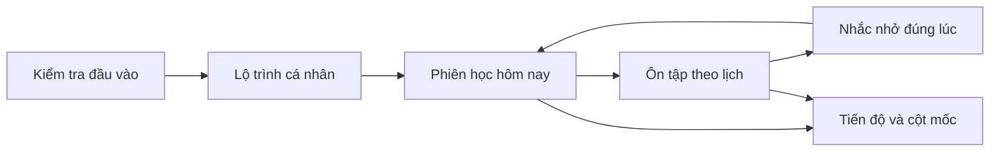
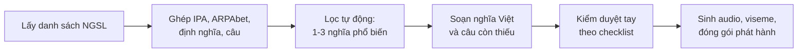
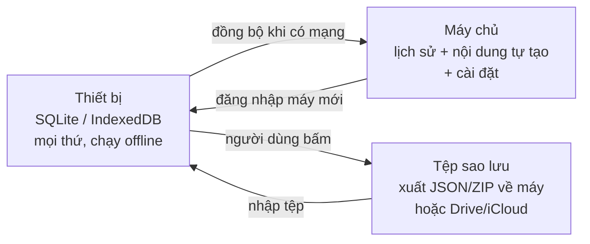

# Phân tích yêu cầu — Ứng dụng học từ vựng tiếng Anh

Sep 23, 2026 · @Hugh Nguyen

## 1. Tổng quan sản phẩm

Sản phẩm là ứng dụng học từ vựng tiếng Anh miễn phí cho người học Việt Nam, chạy trên web (React) và mobile (Flutter), lấy ghi nhớ dài hạn làm lõi và khẩu hình phát âm làm điểm khác biệt.

**Mục tiêu sản phẩm**

1. Người học nhớ được từ đã học sau 30 ngày với tỉ lệ đo được (mục tiêu ban đầu: ≥ 80% từ đã lên cấp "thành thạo" còn nhớ khi kiểm tra lại).
2. Người học quay lại hằng ngày mà không cần cơ chế ép buộc (mục tiêu tham vọng D7 ≥ 35%, D30 ≥ 15% — là giả định nội bộ, chưa có nguồn ngành; ngưỡng tối thiểu chấp nhận D30 ≥ 8%).
3. Người học nói được từ với khẩu hình đúng, không chỉ nhận ra nghĩa.

**Phạm vi phiên bản đầu**

| Trong phạm vi | Ngoài phạm vi |
| --- | --- |
| Từ vựng tiếng Anh cho người Việt, 5.000 từ phổ biến nhất (NGSL + NAWL + tần suất mở), phát hành theo đợt | Ngữ pháp, đọc hiểu, luyện nghe dài |
| Lộ trình cá nhân hoá theo vốn từ đầu vào | Khoá học theo giáo trình cụ thể (IELTS, TOEIC) |
| Ôn tập ngắt quãng, nhắc nhở đúng lúc | Chat AI, lớp học, giáo viên |
| Khẩu hình 2D cho từng từ và từng âm | Chấm điểm phát âm bằng nhận dạng giọng nói |
| Câu ví dụ gần gũi, có nghĩa tiếng Việt | Nội dung do người dùng tự tạo và chia sẻ công khai |

**Ràng buộc**

- Miễn phí hoàn toàn, không quảng cáo, nên chi phí vận hành phải tiến về 0 khi số người dùng tăng.
- Hai nền tảng, một đội nhỏ, nên nội dung, thuật toán và asset khẩu hình phải dùng chung được.
- Ngân sách bằng 0 ngoài máy tính sẵn có: dữ liệu nguồn phải miễn phí và có giấy phép dùng lại, giọng đọc sinh bằng TTS mã nguồn mở, nhân vật và khẩu hình tự vẽ bằng công cụ miễn phí.
- Người học chủ yếu dùng điện thoại, mạng không ổn định, nên phiên học phải chạy được offline.

## 2. Người dùng mục tiêu

Người dùng chính là người Việt từ 15 đến 35 tuổi, đã học tiếng Anh ở trường nhưng vốn từ chủ động yếu, muốn học đều đặn với thời gian ít.

| Persona | Bối cảnh | Nhu cầu chính | Nỗi đau hiện tại |
| --- | --- | --- | --- |
| Học sinh cấp 3 / sinh viên năm nhất | Học 10–15 phút trên điện thoại, buổi tối, hay bị phân tâm | Nhớ từ cho bài kiểm tra và giao tiếp cơ bản | Học xong quên, không biết bắt đầu từ từ nào |
| Người đi làm 25–35 tuổi | Học lúc đi xe, giờ nghỉ trưa; động lực dao động | Dùng được từ trong email, họp, nói chuyện | Không có thời gian dài; app hiện tại nhắc nhở gây khó chịu |
| Người mất gốc | Tự ti, sợ phát âm sai, ngại nói | Được hướng dẫn phát âm từng âm, nhìn thấy cách đặt môi lưỡi | Nghe audio nhưng không bắt chước được; không biết mình sai ở đâu |

**Đặc thù người học Việt Nam cần tính đến**

- Âm khó có hệ thống: âm cuối (/t/, /d/, /s/, /z/), cụm phụ âm (/str/, /spl/), /θ/ /ð/ /ʃ/ /ʒ/ /r/, và trọng âm từ. Khẩu hình cần ưu tiên các âm này.
- Quen học theo danh sách và dịch nghĩa, nên cần dẫn dắt sang học trong câu, không ép đổi đột ngột.
- Thích nhân vật, hình ảnh tươi, phản hồi có cảm xúc (MochiMochi thành công vì điều này).
- Nhạy cảm với cảm giác tội lỗi khi "gãy chuỗi"; nhiều người bỏ app sau lần gãy đầu tiên.

**Bối cảnh sử dụng chi phối thiết kế**

- Phiên học ngắn (3–10 phút), thường bị ngắt giữa chừng, nên mọi tiến độ phải lưu theo từng thẻ.
- Nhiều lúc không có mạng hoặc mạng chậm, nên nội dung ngày hôm nay phải tải trước.
- Dùng một tay, màn hình dọc; web chủ yếu cho học trên máy tính buổi tối và cho giáo viên/phụ huynh xem tiến độ.

## 3. Phân tích ứng dụng tham chiếu

WordUp mạnh về nội dung và cá nhân hoá, MochiMochi mạnh về cảm xúc và thói quen, qwerty-learner mạnh về sự đơn giản và mã nguồn mở; sản phẩm này nên lấy lõi của cả ba và lấp khoảng trống chung là phát âm.

| Tiêu chí | WordUp | MochiMochi | qwerty-learner (mã nguồn mở) |
| --- | --- | --- | --- |
| Kho từ | 25.000 từ xếp theo tần suất dùng trong phim/TV | 5.000+ từ theo 8 khoá học, chủ đề | Bộ từ theo kỳ thi (IELTS, TOEFL, CET) và từ lập trình |
| Lộ trình | Knowledge Map: kiểm tra đầu vào rồi tô dần bản đồ từ đã biết | Tuyến tính theo khoá, 5 cấp độ ghi nhớ cho mỗi từ | Theo chương, người dùng tự chọn |
| Ghi nhớ | SRS + 9 dạng bài (nhận nghĩa, chính tả, nghe, điền câu, phát âm) | SRS "thời điểm vàng", flashcard, audio thường và chậm | Gõ lại từ nhiều lần để tạo trí nhớ cơ bắp, mặc-viết cuối chương |
| Ngữ cảnh | Ví dụ từ phim, tin tức, trích dẫn thật | 1 ví dụ tự viết gần gũi, có nghĩa Việt | Không có câu ví dụ |
| Phát âm | Audio Anh-Mỹ/Anh-Anh, không hướng dẫn khẩu hình | Audio 2 tốc độ, không khẩu hình | Phiên âm + audio |
| Cuốn hút | Bản đồ tiến bộ, thử thách đa dạng, chat AI | Nhân vật Mochi/Michi, màu tươi, phiên 5–10 phút, thông báo đúng giờ | Thống kê tốc độ và độ chính xác |
| Mô hình | Freemium, Pro \~10 USD/tháng | Trả phí sau vài bài đầu | Miễn phí, tự host |
| Điểm yếu ghi nhận | Thiếu đánh giá phát âm; phát âm sai với từ đồng tự khác âm; có quảng cáo, đôi khi crash | Lag, thoát app; kho từ nhỏ; khoá học cứng | Chỉ phù hợp người thích gõ; không SRS, không ngữ cảnh |

**Điều cần ghi lại từ WordUp**

- Xếp từ theo tần suất, không theo chủ đề: người học chạm tới từ hữu ích nhất sớm nhất.
- Tiến độ là bản đồ tô dần, không phải phần trăm của tổng, nên cảm giác tiến bộ đến mỗi ngày.
- Mỗi từ là một trang giàu ngữ cảnh; nhiều ví dụ hơn một định nghĩa dài.

**Điều cần ghi lại từ MochiMochi**

- Đóng gói SRS thành khái niệm dễ hiểu ("thời điểm vàng", 5 cấp độ) thay vì lộ tham số thuật toán.
- Giới hạn phiên học và có điểm dừng rõ ràng; thông báo nói việc cần làm, không nói "đến giờ học".
- Nhân vật đồng hành tạo cảm giác có bạn học, phù hợp thị hiếu người Việt.

**Điều cần ghi lại từ qwerty-learner**

- Buộc người học tạo ra từ (gõ, nói) mạnh hơn nhận ra từ (chọn đáp án).
- Định dạng bộ từ JSON theo chương đơn giản, cộng đồng đóng góp được.

**Khoảng trống cả ba chưa lấp**: không app nào cho người học thấy môi, răng, lưỡi đặt thế nào khi phát âm từng âm và từng từ. Đây là điểm khác biệt chính của sản phẩm.

## 4. Cơ sở khoa học của ghi nhớ và động lực

Mọi yêu cầu chức năng ở phần sau đều bắt nguồn từ sáu nguyên lý ghi nhớ và năm nguyên lý động lực dưới đây; nguyên lý nào không dẫn tới một yêu cầu cụ thể thì không đưa vào.

**Nguyên lý ghi nhớ**

| Nguyên lý | Nội dung | Hệ quả thiết kế |
| --- | --- | --- |
| Chủ động nhớ lại (active recall) | Cố gắng lấy thông tin ra khỏi trí nhớ củng cố mạnh hơn đọc lại | Mọi dạng bài buộc người học tạo ra câu trả lời; trắc nghiệm chỉ dùng ở lần gặp đầu |
| Lặp lại ngắt quãng (spaced repetition) | Ôn đúng lúc sắp quên cho hiệu quả cao nhất với số lần ít nhất | Lịch ôn cho từng từ do thuật toán FSRS quyết định; người học tự chấm "quên / khó / dễ" |
| Xen kẽ (interleaving) | Trộn nội dung và dạng bài giúp phân biệt và nhớ lâu hơn học theo khối | Một phiên trộn từ mới, từ ôn và nhiều dạng bài; không học 20 từ mới liên tục |
| Mã hoá kép (dual coding) | Thông tin có cả kênh ngôn ngữ và kênh hình ảnh được nhớ tốt hơn | Mỗi từ có hình, audio, khẩu hình, câu; khẩu hình là kênh mã hoá thêm, không chỉ để dạy phát âm |
| Hiệu ứng sản sinh (production effect) | Nói to hoặc viết ra từ giúp nhớ hình thức từ tốt hơn đọc thầm | Dạng bài nói từ và gõ từ trong câu là dạng bài chính, không phải phụ |
| Xử lý sâu (elaboration) | Liên hệ từ với trải nghiệm bản thân ghi nhớ lâu hơn dịch nghĩa | Sau lần gặp đầu, hỏi một câu buộc người học dùng từ cho chính mình |

**Nguyên lý động lực**

| Nguyên lý | Nội dung | Hệ quả thiết kế |
| --- | --- | --- |
| Tiến bộ nhìn thấy được | Phần thưởng nhỏ, thường xuyên giữ hành vi tốt hơn phần thưởng lớn, hiếm | Bản đồ từ tô dần; cột mốc nhỏ có tên; không hiện "12% của 5.000 từ" |
| Điểm dừng rõ ràng | Cảm giác hoàn thành mỗi ngày quan trọng hơn thời lượng học | Phiên học có số thẻ cố định và màn hình "xong hôm nay" |
| Độ khó vừa tầm (flow) | Quá dễ gây chán, quá khó gây nản; vùng 80–90% đúng là vùng thoả mãn | FSRS tự điều tiết; phiên mở đầu bằng thẻ dễ, kết bằng thẻ dễ |
| Chuỗi có khoan dung | Streak cứng tạo tội lỗi khi gãy và dẫn tới bỏ hẳn | Cho phép 1–2 ngày nghỉ mỗi tuần không mất chuỗi; nghỉ dài không bị "phạt" bằng núi thẻ tồn |
| Quan hệ và tự chủ | Người học gắn bó với nhân vật, và với thứ họ được chọn | Nhân vật đồng hành phản hồi có cảm xúc; người học chọn mục tiêu/ngày và chủ đề ưu tiên |

**Nguyên lý dùng cho thông báo**: thông báo phải nêu việc cụ thể, chi phí cụ thể và lợi ích cụ thể ("5 từ sắp quên, 3 phút"), gửi vào khung giờ người học tự chọn, và tự giảm tần suất khi bị bỏ qua nhiều lần.

## 5. Yêu cầu chức năng

Bảy nhóm chức năng dưới đây tạo thành vòng lặp học: đánh giá đầu vào → lộ trình → phiên học → ôn tập → nhắc nhở → tiến độ, với khẩu hình xuyên suốt mỗi lần gặp từ.



Người học đi qua vòng lặp này mỗi ngày; khẩu hình xuất hiện trong mọi thẻ của phiên học và ôn tập.

**5.1 Kiểm tra đầu vào và lộ trình**

- FR-01: Bài kiểm tra 3–5 phút ước lượng vốn từ bằng cách hỏi "có biết từ này không" trên mẫu từ trải đều các dải tần suất, có từ bẫy (từ giả) để phát hiện đánh dấu bừa.
- FR-02: Kết quả tạo lộ trình: từ đã biết bị loại khỏi hàng đợi học; từ chưa biết xếp theo tần suất, có thể ưu tiên theo chủ đề người học chọn (công việc, du lịch, học thuật).
- FR-03: Người học chọn mục tiêu số từ mới mỗi ngày (5/10/15/20) và có thể đổi bất kỳ lúc nào; mặc định 10.
- FR-04: Lộ trình hiển thị dưới dạng bản đồ hoặc chuỗi cột mốc có tên (ví dụ "500 từ giao tiếp cơ bản"), không hiển thị phần trăm của tổng kho.

**5.2 Thẻ từ**

- FR-05: Mỗi thẻ có: từ, loại từ, phiên âm IPA (US, có thể bật UK), audio thường và chậm, nghĩa tiếng Việt ngắn, 1 định nghĩa tiếng Anh đơn giản, 2–3 câu ví dụ gần gũi kèm nghĩa Việt, hình minh hoạ, khẩu hình.
- FR-06: Câu ví dụ ưu tiên tình huống đời thường ở Việt Nam, độ dài 6–12 từ, chỉ dùng từ ở dải tần suất thấp hơn hoặc bằng từ đang học.
- FR-07: Từ đa nghĩa chỉ dạy 1–2 nghĩa phổ biến nhất ở lần đầu; nghĩa khác xuất hiện như thẻ riêng sau này.
- FR-08: Từ đồng tự khác âm (wind, read, live) là các mục riêng biệt với audio và khẩu hình riêng.

**5.3 Phiên học**

- FR-09: Phiên có số thẻ cố định (mặc định 10 từ mới + thẻ ôn đến hạn, tối đa 25 thẻ), thời lượng mục tiêu 5–10 phút, có màn hình kết thúc rõ ràng.
- FR-10: Lần gặp đầu của từ mới: xem thẻ đầy đủ, nghe, xem khẩu hình, nói theo, rồi làm ngay một bài nhận nghĩa.
- FR-11: Dạng bài (xếp theo độ khó tăng dần, trộn trong phiên): chọn nghĩa; nghe rồi chọn từ; điền từ vào câu có gợi ý chữ cái đầu; gõ từ khi nghe; gõ từ khi thấy nghĩa và câu; nói từ (ghi âm, người học tự so với mẫu); dùng từ trong một câu của mình.
- FR-12: Phiên bị ngắt giữa chừng thì tiến độ từng thẻ đã trả lời được giữ; mở lại tiếp tục từ thẻ chưa làm.
- FR-13: Thứ tự thẻ trong phiên: mở đầu bằng thẻ ôn dễ, xen kẽ từ mới và từ ôn, kết bằng thẻ dễ.

**5.4 Ôn tập và ghi nhớ**

- FR-14: Mỗi từ có trạng thái ghi nhớ riêng, lập lịch bằng FSRS; người học chấm sau mỗi thẻ ôn: Quên / Khó / Nhớ / Dễ.
- FR-15: Trạng thái hiển thị cho người học là 5 cấp: Mới, Đang học, Nhớ tạm, Nhớ chắc, Thành thạo; ánh xạ từ tham số FSRS, không lộ con số.
- FR-16: Từ bị chấm Quên nhiều lần được đánh dấu "từ khó" và xuất hiện thêm trong dạng bài dùng từ trong câu.
- FR-17: Sau kỳ nghỉ dài, thẻ tồn được rải ra nhiều ngày thay vì dồn hết vào ngày quay lại; ngày quay lại chỉ có số thẻ bình thường.
- FR-18: Thỉnh thoảng (ví dụ mỗi 2 tuần) kiểm tra ngẫu nhiên từ đã "Thành thạo" để đo tỉ lệ nhớ thật, dùng cho mục tiêu sản phẩm số 1.

**5.5 Khẩu hình phát âm**

- FR-19: Mỗi từ có hoạt hình 2D khẩu hình đồng bộ với audio, xem được bình thường và chậm, lặp lại được.
- FR-20: Người học chạm vào từng ký hiệu IPA trong phiên âm để xem khẩu hình tĩnh của âm đó, kèm mặt cắt nghiêng hiển thị lưỡi và răng, và một mẹo ngắn bằng tiếng Việt (ví dụ "/θ/: đặt đầu lưỡi giữa hai hàm răng rồi thổi hơi").
- FR-21: Các âm khó với người Việt được đánh dấu và có thêm so sánh cặp (/s/–/ʃ/, /θ/–/t/, /l/–/n/ cuối).
- FR-22: Trọng âm được thể hiện bằng hình (âm tiết nhấn to hơn) cùng lúc với khẩu hình.
- FR-23: Bài nói từ: người học ghi âm, nghe lại cạnh mẫu, tự chấm. Không chấm điểm tự động ở phiên bản đầu. FR-55: Dạy phát âm theo ba lớp: (1) video miệng thật cận cảnh tự quay cho 44 âm và \~30 từ mẫu — lớp chính để bắt chước; (2) hình miệng cận cảnh phóng to + mặt cắt nghiêng — để giải thích; (3) nhân vật hoạt hình — chỉ lip-sync khi đọc câu và tạo cảm xúc. Video là asset duy nhất không tải trước; offline hiện hai lớp còn lại.

**5.6 Nhắc nhở**

- FR-24: Người học chọn 1–2 khung giờ nhắc; app đề xuất giờ dựa trên lịch sử mở app.
- FR-25: Nội dung nhắc nêu số thẻ đến hạn và thời gian ước tính; không gửi khi không có thẻ đến hạn.
- FR-26: Bị bỏ qua 3 lần liên tiếp thì giảm còn 1 lần/ngày; bỏ qua 7 ngày thì hỏi lại người học có muốn nhận nữa không.

**5.7 Tiến độ và động lực**

- FR-27: Trang tiến độ hiển thị: số từ theo 5 cấp, cột mốc gần nhất, chuỗi ngày (có 2 ngày nghỉ/tuần không gãy chuỗi), số phút học tuần này.
- FR-28: Nhân vật đồng hành có 4–6 trạng thái cảm xúc theo kết quả phiên; không có trạng thái trách móc.
- FR-29: Cột mốc đạt được có màn hình chúc mừng và thẻ chia sẻ hình ảnh (tuỳ chọn).

**5.8 Tài khoản và đồng bộ**

- FR-30: Dùng được không cần tài khoản; tạo tài khoản để đồng bộ giữa web và mobile.
- FR-31: Xuất dữ liệu học của mình (CSV) và xoá tài khoản tự phục vụ.

**5.9 Hình ảnh và hành động gợi nhớ**

Mục tiêu: mỗi từ được mã hoá thêm bằng một hình ảnh hoặc một chuyển động có tình huống, để trí nhớ bám vào cảnh chứ không bám vào chữ. Nguyên lý: mã hoá kép, hiệu ứng ưu thế hình ảnh (picture superiority), phương pháp từ khoá (keyword mnemonic), và phản ứng vận động toàn thân (TPR).

| Loại từ | Cách thể hiện | Ví dụ | Nguồn asset |
| --- | --- | --- | --- |
| Danh từ cụ thể | Ảnh tĩnh có tình huống, không phải ảnh từ điển; vật thể trong bối cảnh đời thường Việt Nam | "umbrella": người che ô dưới mưa Sài Gòn, không phải cái ô trên nền trắng | Sinh AI theo phong cách đồng nhất, chọn lọc tay |
| Động từ, giới từ, trạng từ chỉ cách | Hoạt hình 1–2 giây do nhân vật phi hành gia thực hiện; lặp được | "climb": phi hành gia trèo lên vỏ trứng; "through": chui qua vòng | Rive, dùng lại rig nhân vật; \~250 động từ và giới từ phổ biến nhất |
| Tính từ, cảm xúc | Biểu cảm hoặc biến đổi của nhân vật, có cặp đối lập | "exhausted" vs "energetic": nhân vật gục xuống vs bật lên | Rive, 4–6 biểu cảm sẵn có + biến thể |
| Từ trừu tượng | Ẩn dụ hình ảnh một khung + câu chuyện một dòng | "reluctant": nhân vật bị kéo đi mà chân bám đất; "Mochi miễn cưỡng ra khỏi trứng vì trời lạnh" | Sinh AI hoặc vẽ; câu do biên soạn |
| Từ theo chủ đề | Một cảnh tổng chứa 8–12 vật; chạm vào vật để nghe từ và khẩu hình | Cảnh "bếp": kettle, stove, cutting board... | Một ảnh cảnh/chủ đề, vùng chạm định nghĩa bằng toạ độ |

**Yêu cầu chức năng**

- FR-32: Mỗi từ có ít nhất một trong ba: ảnh tình huống, hoạt hình hành động, hoặc ẩn dụ hình ảnh; ưu tiên hoạt hình cho động từ và giới từ vì đây là nhóm khó nhớ nhất bằng chữ.
- FR-33: Hoạt hình hành động phát ngay lần gặp đầu, cùng lúc với audio và khẩu hình; người học chạm để phát lại.
- FR-34: Với động từ, thẻ gợi người học làm động tác theo (TPR) bằng một dòng nhắc ("làm động tác trèo"); không bắt buộc, không kiểm tra.
- FR-35: Gợi ý từ khoá liên tưởng tiếng Việt cho từ khó, do biên soạn (không sinh tự động), kèm hình ảnh phi lý dễ nhớ; người học có thể sửa hoặc tự viết liên tưởng của mình.
- FR-36: Người học có thể thay ảnh của từ bằng ảnh tự chụp hoặc tự chọn từ thư viện app (hiệu ứng tự tạo — generation effect); ảnh tự chụp lưu trên thiết bị.
- FR-37: Dạng bài "nhìn hình, nói từ" và "xem hành động, gõ từ" được thêm vào danh sách dạng bài ở FR-11.
- FR-38: Cảnh chủ đề: chạm vật → phát từ, khẩu hình, nghĩa; học hết vật trong cảnh mở khoá cảnh kế trên bản đồ.

**Ràng buộc chi phí và công sức**

- Hoạt hình hành động dùng chung rig nhân vật trong Rive, mỗi hành động 15–30 phút dựng; 250 hành động ≈ 2–3 tuần.
- Ảnh tình huống sinh bằng Stable Diffusion cục bộ với cùng phong cách và seed; \~2.000 danh từ cụ thể, chọn 1 trong 4 ảnh sinh ra.
- Cảnh chủ đề: 30–40 cảnh cho 5.000 từ, mỗi cảnh một ảnh và một file toạ độ vùng chạm.
- Từ khoá liên tưởng chỉ soạn cho 300–500 từ khó nhất theo dữ liệu "quên nhiều" thu được từ người dùng, không soạn trước cho toàn kho.

**5.10 Bài tập thực hành và quiz cho từ đã học**

Mục tiêu: sau khi từ rời phiên học hằng ngày, người học vẫn gặp lại nó trong các bối cảnh mới và dạng thử thách mới, để chuyển từ "nhớ khi được hỏi" sang "dùng được khi cần". Mọi dạng dưới đây đều lấy từ kho từ đã học của chính người đó (cấp Nhớ tạm trở lên), nên không ai bị hỏi từ chưa gặp.

| Dạng | Cách chơi | Kích thích gì | Khi nào xuất hiện |
| --- | --- | --- | --- |
| Quiz nhanh 60 giây | 10 câu chọn nghĩa / nghe chọn từ, đếm giờ nhẹ, kết quả là số từ đúng | Tốc độ truy xuất, cảm giác thành thạo | Tự chọn bất kỳ lúc nào; gợi ý sau phiên nếu còn hứng |
| Điền đoạn văn | Đoạn 5–7 câu có 4–6 chỗ trống, chọn từ từ kho đã học; đoạn theo chủ đề cột mốc | Dùng từ trong ngữ cảnh dài hơn một câu | Mở khoá khi hoàn thành cột mốc |
| Nghe và chép | Nghe câu ngắn 6–10 từ, gõ lại; chấm theo từ, không theo cả câu | Nghe hiểu, chính tả, âm cuối | Thử thách tuần |
| Nói câu | Hiện tình huống tiếng Việt, người học nói câu tiếng Anh có dùng từ chỉ định, ghi âm, tự so với câu mẫu | Sản sinh, phát âm trong câu, nối âm | Thử thách tuần, tự chọn |
| Ghép cặp | 6 từ – 6 nghĩa/ảnh, kéo ghép; hoặc ghép từ với kết hợp từ đúng (make – a decision) | Phân biệt, kết hợp từ | Xen kẽ trong phiên ôn |
| Đặt câu của tôi | Viết một câu về đời mình với từ cho trước; app kiểm tra tối thiểu (có từ, đúng dạng, độ dài); câu được lưu làm ví dụ riêng | Tự tham chiếu, sinh ra | Từ lần ôn 5; câu này thay câu mẫu ở các lần ôn sau |
| Cảnh chủ đề | Cảnh tổng (bếp, sân bay): app đọc từ, chạm đúng vật; đảo chiều: chạm vật, nói từ | Nghe hiểu, gợi hình | Khi mở khoá cảnh |
| Ôn tổng hợp cuối tuần | 20 thẻ trộn mọi dạng, lấy từ tuần này và ngẫu nhiên từ các tuần trước | Xen kẽ, chống ảo tưởng thông thạo | Thứ bảy hoặc ngày người học chọn |
| Kiểm tra cột mốc | 15 câu trước khi đóng cột mốc; ≥ 12 đúng mới đóng; sai thì ôn lại từ sai rồi thi lại sau 1 ngày | Cảm giác chinh phục có điều kiện | Khi đủ từ của cột mốc |

**Yêu cầu chức năng**

- FR-39: Mọi dạng bài đều ghi kết quả về trạng thái FSRS của từ (đúng = ôn thành công, sai = đưa về hàng đợi gần), nên chơi quiz cũng là ôn, không tách rời.
- FR-40: Quiz và thử thách không có bảng xếp hạng với người khác; chỉ so với kỷ lục của chính mình.
- FR-41: Dạng bài trong phiên ôn được chọn theo cấp của từ: cấp thấp dùng dạng nhận ra, cấp cao dùng dạng sản sinh (nói, viết câu).
- FR-42: Câu người học tự viết (FR-35, Đặt câu của tôi) lưu cùng từ và có thể xuất kèm dữ liệu cá nhân.
- FR-43: Thử thách tuần có tên và huy hiệu (ví dụ "Người nghe âm cuối"); tối đa 1 thử thách/tuần được gợi ý, người học tự chọn nhận.

## 6. Yêu cầu dữ liệu

Toàn bộ dữ liệu nguồn đều miễn phí và dùng được thương mại; công sức lớn nhất nằm ở biên soạn và kiểm duyệt, không ở thu thập.

**6.1 Nguồn và giấy phép**

| Nhu cầu | Nguồn | Giấy phép | Nghĩa vụ | Lưu ý |
| --- | --- | --- | --- | --- |
| Danh sách từ và thứ tự học | NGSL 1.2 (2.809 từ) + NAWL (học thuật) + xếp hạng tần suất từ Wiktionary/kaikki để bù đủ 5.000 | CC-BY-SA | Ghi công | NGSL phủ \~92% văn bản phổ thông. Không dùng Oxford 3000/5000: thuộc bản quyền OUP, không có giấy phép mở |
| Phiên âm ARPAbet (US) | CMUdict | BSD | Giữ dòng ghi công | Có stress; là đầu vào cho khẩu hình |
| Phiên âm IPA (US, UK) | Wiktionary qua kaikki.org | CC-BY-SA | Ghi công; dữ liệu sửa lại phải mở cùng giấy phép | Không ảnh hưởng mã nguồn app |
| Định nghĩa, loại từ, đồng nghĩa | Wiktionary, WordNet | CC-BY-SA / WordNet | Ghi công | Wiktionary nhiều nghĩa cổ, cần lọc |
| Nghĩa tiếng Việt | Wiktionary tiếng Việt, Tatoeba; phần thiếu tự soạn | CC-BY-SA / CC-BY | Ghi công | Nghĩa tự soạn là tài sản của dự án |
| Câu ví dụ Anh–Việt | Tatoeba; phần thiếu tự soạn theo FR-06 | CC-BY | Ghi công | Tatoeba ít câu Việt cho từ hiếm |
| Audio | Chính: Kokoro/Piper chạy máy cá nhân. Tuỳ chọn: cloud TTS trong hạn mức miễn phí (Google, Azure, Polly) để so chất lượng. Bổ sung: Wikimedia Commons / Lingua Libre (giọng người thật) cho từ có âm khó | MIT / Apache | Không | Sinh từ trong câu ngắn rồi cắt, hoặc ép IPA qua SSML phoneme, để tránh lỗi đọc sai từ đồng tự khác âm như WordUp. Forvo tính phí; để sau |
| Timing phoneme cho khẩu hình | Montreal Forced Aligner (MIT) cho timing mức phoneme; Rhubarb chỉ dùng cho lip-sync nhân vật vì nó xuất 6–9 hình miệng, không xuất phoneme | MIT | Không | Chạy một lần khi build, không chạy runtime |
| Hình minh hoạ | Tự vẽ, hoặc sinh bằng AI có kiểm duyệt | Tự sở hữu | Không | Tránh ảnh stock có bản quyền |
| Nhân vật và 12 khẩu hình | Tự vẽ bằng công cụ miễn phí (xem 8.3), dựng trong Rive gói free | Tự sở hữu | Không | Chi phí bằng giờ công |

Khoản có thể tốn tiền: giọng người bản xứ (Forvo API), từ điển thương mại (Oxford, Cambridge), và công vẽ. Phiên bản đầu không dùng hai khoản đầu.

**6.2 Cấu trúc một mục từ (mức yêu cầu, chưa phải schema)**

| Trường | Bắt buộc | Nguồn |
| --- | --- | --- |
| Từ, loại từ, hạng tần suất | Có | NGSL |
| Phiên âm IPA US; UK tuỳ chọn | Có | Wiktionary / CMUdict |
| Chuỗi phoneme ARPAbet có stress | Có | CMUdict |
| Chuỗi viseme kèm mốc thời gian | Có | Sinh khi build |
| Audio thường, audio chậm | Có | TTS khi build |
| Nghĩa Việt ngắn (≤ 8 từ) | Có | Biên soạn |
| Định nghĩa Anh đơn giản | Có | Wiktionary, viết lại |
| 2–3 câu ví dụ + nghĩa Việt | Có | Tatoeba / biên soạn |
| Hình minh hoạ | Nên có | Tự tạo |
| Đồng nghĩa, trái nghĩa, họ từ | Tuỳ chọn | WordNet |
| Cờ "âm khó với người Việt" | Có | Quy tắc theo bảng âm |

**6.3 Quy trình biên soạn**



Bước D và E là nút thắt về công sức: 5.000 từ × 5 phút duyệt ≈ 420 giờ, cộng \~15.000 câu × 1 phút ≈ 250 giờ; chia 5 đợt 1.000 từ, phát hành 500 từ đầu trước và đo lại định mức sau 50 từ.

Tiêu chí chọn 1–3 nghĩa cho mỗi từ (bước C): ưu tiên nghĩa có trong danh sách nghĩa của NGSL/NAWL; nếu không có, xếp theo tần suất nghĩa của WordNet; LLM chấm điểm "phổ biến trong giao tiếp" 1–5 rồi người duyệt chốt; nghĩa thứ 2–3 chỉ giữ khi khác biệt rõ với nghĩa 1.

Kế hoạch câu ví dụ: mỗi từ cần 2–3 câu đúng FR-06; nguồn theo thứ tự Tatoeba (có nghĩa Việt) → LLM sinh theo mẫu (tình huống Việt Nam, 6–12 từ, chỉ dùng từ có hạng thấp hơn) → người duyệt sửa; checklist duyệt câu: đúng ngữ pháp, tự nhiên, không nhạy cảm, nghĩa Việt khớp, từ đang học ở đúng dạng.

**6.4 Tiêu chí chất lượng**

- Mỗi từ có ít nhất 1 câu ví dụ đúng tiêu chí FR-06 và được người có trình độ kiểm tra.
- Phiên âm khớp audio; kiểm tra tự động bằng cách so ARPAbet của CMUdict với phoneme TTS đã dùng. Một người có chuyên môn ngữ âm (giáo viên hoặc sinh viên sư phạm Anh, tình nguyện) duyệt 44 âm, 200 từ khó nhất và toàn bộ video miệng thật trước khi phát hành; ghi tên người duyệt và ngày trong manifest gói.
- Nghĩa Việt không dịch máy thô; câu ví dụ không chứa nội dung nhạy cảm.
- Mọi mục có trường nguồn và giấy phép để xuất trang ghi công tự động.

**6.5 Dữ liệu người học**

- Chỉ lưu những gì cần cho lập lịch và tiến độ: trạng thái từng từ, lịch sử trả lời (đúng/sai, dạng bài, thời gian), cài đặt nhắc nhở.
- Bản ghi âm giọng người học lưu trên thiết bị, không tải lên máy chủ ở phiên bản đầu.
- Không thu thập họ tên, ngày sinh, vị trí; tài khoản chỉ cần email hoặc đăng nhập bên thứ ba.

## 7. Yêu cầu phi chức năng

Vì sản phẩm miễn phí, yêu cầu quan trọng nhất là chi phí biên theo người dùng tiến về 0; các yêu cầu khác được đặt sao cho không mâu thuẫn với điều đó.

| Nhóm | Yêu cầu | Chỉ tiêu |
| --- | --- | --- |
| Chi phí | Nội dung tĩnh (từ, audio, viseme, hình) phân phối qua CDN; không xử lý audio hay khẩu hình trên máy chủ lúc runtime | Chi phí máy chủ/người dùng hoạt động < 0,01 USD/tháng ở 10.000 người dùng |
| Offline | Phiên học hôm nay và 7 ngày tới tải trước; làm bài, chấm và lập lịch chạy trên thiết bị | Học trọn phiên không mạng; đồng bộ khi có mạng |
| Hiệu năng | Mở app đến thẻ đầu tiên; chuyển thẻ; khẩu hình khớp audio | < 2 s trên máy tầm trung; < 150 ms; lệch < 50 ms trên web, < 80 ms trên Android cũ |
| Dung lượng | Gói nội dung 500 từ đầu kèm audio | < 30 MB (8 MB nội dung + audio một giọng cho từ và câu; tốc độ chậm bằng playbackRate, không sinh file riêng); tải theo đợt |
| Đồng bộ | Lịch sử trả lời là nguồn sự thật; trạng thái từ tính lại được từ lịch sử; xung đột giải quyết bằng gộp lịch sử theo thời gian | Không mất tiến độ khi dùng hai thiết bị |
| Dùng chung 2 nền tảng | Bộ nội dung, quy tắc lập lịch, asset khẩu hình dùng chung web và mobile | Một nguồn nội dung, một file hoạt hình |
| Khả năng tiếp cận | Chữ phóng to được, tương phản đủ, không phụ thuộc màu; phụ đề cho audio | Đạt WCAG AA cho phần web |
| Riêng tư | Dữ liệu tối thiểu; ghi âm ở thiết bị; xoá tài khoản tự phục vụ | Không dữ liệu định danh ngoài email |
| Mở rộng nội dung | Thêm đợt từ, thêm giọng UK, thêm bộ chủ đề mà không cần phát hành app | Nội dung là dữ liệu, không gắn vào mã |
| Đo lường | Sự kiện tối thiểu để đo mục tiêu sản phẩm: phiên bắt đầu/kết thúc, trả lời thẻ, kết quả kiểm tra ngẫu nhiên, thông báo mở/bỏ qua | Ẩn danh, có thể tắt |

Hai chỉ tiêu cần xác nhận với đội: ngưỡng dung lượng gói đầu (nay có 2 giọng nên audio tăng gấp đôi) và mức lệch khẩu hình chấp nhận được. Đo lường ẩn danh đã chốt bật mặc định.

## 8. Ưu tiên MVP, rủi ro và câu hỏi mở

MVP nên chứng minh được một điều duy nhất: người học nhớ từ sau 30 ngày và quay lại hằng ngày; khẩu hình vào giai đoạn 2 khi lõi đã chạy ổn.

**8.1 Ưu tiên**

| Ưu tiên | Phạm vi | Yêu cầu liên quan | Tiêu chí thành công |
| --- | --- | --- | --- |
| P0 — Lõi ghi nhớ | Kiểm tra đầu vào, lộ trình theo tần suất, thẻ từ đầy đủ (chưa khẩu hình động), 5 dạng bài cơ bản, FSRS + tự chấm, phiên có điểm dừng, nhắc nhở cơ bản, 500 từ đầu | FR-01→FR-17 (trừ khẩu hình), FR-24→FR-27 | Định nghĩa "xong": 500 từ đã duyệt, 5 dạng bài, khẩu hình tĩnh + mặt cắt cho 20 âm khó, video thật cho 44 âm, 1 giọng Nữ + 1 giọng Nam, sao lưu .zip, chạy offline trọn phiên. Đo: 100 người dùng thử; D7 ≥ 30%; kiểm tra lại 30 ngày ≥ 75% |
| P1 — Khẩu hình | Khẩu hình tĩnh từng âm + mặt cắt lưỡi, hoạt hình 2D theo viseme cho từng từ, cặp âm khó, bài nói từ tự chấm | FR-19→FR-23 | Người dùng thử xem khẩu hình ≥ 50% thẻ mới; phản hồi định tính |
| P2 — Động lực nâng cao | Nhân vật có cảm xúc, cột mốc và chia sẻ, kiểm tra ngẫu nhiên định kỳ, giọng UK, mở rộng 3.000 từ | FR-18, FR-28, FR-29 | D30 ≥ 15% |
| Sau | Chấm phát âm tự động, nội dung do người dùng tạo, chat AI | — | — |

**8.2 Rủi ro**

| Rủi ro | Mức | Dấu hiệu sớm | Giảm thiểu |
| --- | --- | --- | --- |
| Biên soạn 3.000 từ quá công sức, chất lượng không đều | Cao | Đợt 500 từ đầu chậm hơn 2× kế hoạch | Phát hành theo đợt; checklist kiểm duyệt; dùng LLM lọc sơ bộ rồi người duyệt |
| Khẩu hình 2D không đủ rõ để dạy âm khó | Trung | Người dùng thử không bắt chước được /θ/, /r/ | Thử 5 âm khó với 10 người trước khi vẽ đủ 12 khẩu hình; thêm mặt cắt nghiêng |
| Người học bỏ sau lần gãy chuỗi đầu tiên | Cao | Rớt retention đúng ngày sau khi bỏ lỡ | Ngày nghỉ có khoan dung; rải thẻ tồn; thông báo không trách móc |
| Thẻ tồn dồn ứ sau nghỉ dài | Trung | Ngày quay lại có > 50 thẻ đến hạn | FR-17; giới hạn thẻ ôn/ngày |
| Chi phí tăng theo người dùng | Trung | Hoá đơn máy chủ tăng tuyến tính | Nội dung tĩnh trên CDN; tính toán ở thiết bị |
| Chất lượng TTS gây học sai phát âm | Trung | Phản hồi về âm sai từ giáo viên | Đối chiếu phoneme TTS với CMUdict; nhóm từ nhạy cảm (đồng tự khác âm) duyệt tay |
| Giấy phép CC-BY-SA áp lên dữ liệu đã sửa | Thấp | Cần cấp phép lại | Tách phần dữ liệu tự soạn; xuất trang ghi công tự động |

**8.3 Quyết định đã chốt**

| Câu hỏi | Quyết định | Hệ quả |
| --- | --- | --- |
| Kho từ | 5.000 từ; xương sống NGSL 1.2 (2.809) + NAWL, bù bằng tần suất Wiktionary/kaikki; không dùng Oxford (bản quyền OUP) | Phát hành 5 đợt 1.000 từ theo tần suất; đợt 1 trước khi thử nghiệm |
| Giọng đọc | Anh-Mỹ; người học chọn giọng Nam hoặc Nữ | Sinh audio 2 giọng, một tốc độ, cho mỗi từ và câu; tốc độ chậm bằng playbackRate 0,75 trên thiết bị; viseme dùng chung vì phoneme giống nhau |
| Nhân vật đồng hành | Phi hành gia nhí nở từ vỏ trứng trên Mặt Trăng, nguyên bản, sinh bằng Stable Diffusion (xem 9.3) | Cần chuyển sang bản 2D phẳng có kính mở để lộ mặt; 4–6 biểu cảm, 12 khẩu hình, mặt cắt nghiêng cho lưỡi |
| Đo lường | Ẩn danh, bật mặc định, có nút tắt trong cài đặt | Không thu ID thiết bị; sự kiện gộp theo ngày |
| Ngân sách | Không có ngoài máy tính; toàn bộ bằng giờ công và công cụ miễn phí | Tự vẽ, tự sinh audio, tự biên soạn; không thuê ngoài |

**Giọng TTS mã nguồn mở đề xuất** (chạy trên máy cá nhân khi build, không tốn phí; cần nghe thử rồi chọn 1 giọng Nam + 1 giọng Nữ)

| Bộ | Giọng Nữ sáng, rõ | Giọng Nam rõ | Ưu / nhược |
| --- | --- | --- | --- |
| Kokoro-82M (Apache 2.0) | af\_heart, af\_bella, af\_sarah | am\_michael, am\_adam | Tự nhiên nhất trong nhóm mở, nhẹ, chạy CPU được; trả chuỗi phoneme nhưng chưa xác nhận có mốc thời gian mức phoneme — dùng MFA để lấy timing |
| Piper (MIT) | en\_US-amy-medium, en\_US-hfc\_female-medium, en\_US-lessac-high | en\_US-ryan-high, en\_US-hfc\_male-medium, en\_US-joe-medium | Rất nhanh, offline hoàn toàn; giọng hơi "máy" hơn Kokoro |

Đề xuất: dùng Kokoro làm giọng chính, Piper làm dự phòng; kiểm tra bắt buộc với danh sách từ đồng tự khác âm và từ có trọng âm bất thường.

**Công cụ tự vẽ nhân vật và khẩu hình** (miễn phí)

| Việc | Công cụ | Cách dùng |
| --- | --- | --- |
| Phác thảo ý tưởng nhân vật | Stable Diffusion chạy máy cá nhân, hoặc Krita | Sinh nhiều bản phác, chọn hướng; không dùng trực tiếp ảnh AI làm asset cuối |
| Vẽ vector nhân vật và 12 khẩu hình | Inkscape, hoặc Krita (vector layer) | Vẽ miệng thành lớp tách rời, mỗi viseme một lớp cùng vị trí |
| Mặt cắt nghiêng lưỡi/răng | Inkscape | Một bản khung cố định, đổi hình lưỡi theo âm |
| Dựng hoạt hình và state machine | Rive (gói free) | Nhập SVG, gắn 12 viseme vào một input số, xuất 1 file .riv dùng chung React và Flutter |
| Tham chiếu khẩu hình thật | Video phát âm IPA có giấy phép mở, gương và điện thoại tự quay | Vẽ theo thật rồi phóng đại vừa phải |

Thứ tự làm: vẽ 5 khẩu hình cho 5 âm khó nhất → thử với 10 người → mới vẽ đủ 12 và biểu cảm.

**8.4 Bước tiếp theo**

1. Nghe thử các giọng Kokoro/Piper ở 8.3 và chốt 1 giọng Nam, 1 giọng Nữ.
2. Thử nghiệm giấy: 10 người học làm 3 phiên bằng thẻ in và audio, đo cảm nhận độ dài phiên và dạng bài.
3. Thử 5 âm khó bằng khẩu hình vẽ tay tĩnh trước khi đầu tư hoạt hình.
4. Sau đó mới lập tài liệu kiến trúc: mô hình dữ liệu, pipeline nội dung, lập lịch trên thiết bị, đồng bộ, và pipeline khẩu hình.

## 9. Danh mục tài nguyên cần chuẩn bị

Có bảy nhóm tài nguyên phải sẵn sàng trước khi thiết kế kiến trúc; ba nhóm đầu (dữ liệu, nhân vật, giọng đọc) chiếm gần hết công sức.

**9.1 Bảng bóc tách**

| Nhóm | Cần chuẩn bị | Công cụ / nguồn | Đầu ra | Ước lượng công |
| --- | --- | --- | --- | --- |
| Dữ liệu từ | Danh sách 5.000 từ có hạng tần suất; IPA + ARPAbet; 1–3 nghĩa/từ; nghĩa Việt; định nghĩa Anh đơn giản; loại từ; cờ âm khó | NGSL, Oxford 5000, CMUdict, kaikki.org, WordNet, Wiktionary Việt | 1 bảng tổng (CSV/JSON), mỗi từ 1 dòng | Tự động 2–3 ngày; duyệt tay 5 phút/từ |
| Câu ví dụ | 2–3 câu/từ, 6–12 từ, đời thường Việt Nam, kèm nghĩa Việt; không dùng từ khó hơn từ đang học | Tatoeba trước; thiếu thì soạn bằng LLM theo mẫu rồi người duyệt | 10.000–15.000 câu | Lớn nhất; chia 5 đợt |
| Nhân vật đồng hành | Character sheet: mặt trước, 3/4, nghiêng; bảng màu; 4–6 biểu cảm; 12 khẩu hình; 1 mặt cắt nghiêng lưỡi/răng | Xem 9.2 | File SVG theo lớp + 1 file .riv | 2–4 tuần tự làm |
| Giọng đọc | Chọn 1 Nam + 1 Nữ; sinh audio từ và câu một tốc độ (chậm bằng playbackRate); chuẩn hoá âm lượng −16 LUFS; nén Opus 24 kbps | Kokoro hoặc Piper, ffmpeg | \~5.000 từ × 2 giọng + \~15.000 câu × 2 giọng | Máy chạy 1–2 ngày; nghe kiểm 5% mẫu |
| Timing khẩu hình | Mốc thời gian từng phoneme cho mỗi audio từ; ánh xạ ARPAbet → 12 viseme | Montreal Forced Aligner với mô hình english\_us\_arpa (xuất TextGrid mức từ và phone); bảng ánh xạ ARPAbet → viseme viết một lần | JSON viseme timeline/từ | 1–2 ngày |
| Nội dung âm khó | 15–20 âm khó với người Việt: mẹo tiếng Việt, cặp tối thiểu, ví dụ | Tự soạn, tham khảo tài liệu ngữ âm mở | 1 bảng | 2–3 ngày |
| Hình minh hoạ từ | Ảnh tình huống cho \~2.000 danh từ cụ thể; hoạt hình hành động Rive cho \~250 động từ/giới từ; 30–40 cảnh chủ đề có vùng chạm; ẩn dụ hình ảnh cho từ trừu tượng (xem 5.9) | Sinh AI theo phong cách đồng nhất, chọn lọc; hoặc icon set mở (Noun Project CC, Twemoji) | 1 ảnh vuông/từ, WebP | Ảnh: sinh 1 ngày, chọn 2–3 ngày; hoạt hình: 2–3 tuần; cảnh: 1–2 tuần |
| Pháp lý | Trang ghi công tự động; danh sách giấy phép từng nguồn; điều khoản sử dụng, chính sách riêng tư | Mẫu mở | 3 văn bản | 1 ngày |
| Thử nghiệm | 10 người học thử; bộ thẻ in 30 từ; bảng hỏi sau phiên | Tự tổ chức | Biên bản thử | 1 tuần |

Chưa cần ở giai đoạn này: icon/UI kit (làm khi thiết kế giao diện), gói ngôn ngữ giao diện, nội dung marketing.

**9.2 Nơi thiết kế nhân vật miễn phí**

| Cách | Công cụ | Khi nào phù hợp | Lưu ý |
| --- | --- | --- | --- |
| Sinh ảnh AI để tìm hướng | Bing Image Creator (miễn phí, DALL-E), Leonardo.ai (tín dụng miễn phí hằng ngày), Stable Diffusion chạy máy cá nhân với model anime từ Civitai | Bước phác thảo, chọn phong cách, 1–2 ngày | Ảnh AI khó giữ đồng nhất giữa các góc; chỉ dùng làm tham chiếu, không làm asset cuối |
| Dựng nhân vật anime 3D rồi xuất 2D | VRoid Studio (miễn phí, Pixiv) | Muốn có sẵn biểu cảm và khẩu hình miệng A/I/U/E/O, xoay mọi góc, chụp ra ảnh 2D đồng nhất | Nhanh nhất để có nhân vật nhất quán; phong cách anime rõ; cần vẽ thêm khẩu hình phụ âm |
| Vẽ vector thủ công | Inkscape, Krita | Muốn phong cách riêng, tách lớp miệng cho Rive | Tốn công nhất, chủ động nhất |
| Hoạt hình và state machine | Rive (gói free) | Bước cuối cho mọi cách trên | Nhập SVG/PNG theo lớp; 1 file dùng chung React + Flutter. Gói Free: không font tuỳ chỉnh, không share link; kiểm tra xem export có gắn logo Rive không |

Đề xuất với nhân vật đã chọn: giữ ảnh Stable Diffusion làm ảnh chủ đạo (màn hình chào, cột mốc) → vẽ lại bản 2D phẳng trong Inkscape với kính mở → vẽ 12 khẩu hình và mặt cắt lưỡi trên khuôn mặt đó → dựng Rive.

**9.3 Nhân vật đã chọn và prompt**

Nhân vật là phi hành gia nhí vừa nở từ vỏ trứng trên bề mặt Mặt Trăng, sinh bằng Stable Diffusion; ẩn dụ "mới nở, bắt đầu khám phá" hợp với người học từ đầu và với các cột mốc theo hành trình không gian.

&#91;image: Phi hành gia nhí nở từ trứng — ảnh gốc Stable Diffusion\]

**Ba điểm phải xử lý trước khi dùng làm nhân vật đồng hành**

| Vấn đề | Vì sao | Cách xử lý |
| --- | --- | --- |
| Kính mũ phản chiếu che kín mặt | Khẩu hình cần thấy môi, răng, lưỡi | Thiết kế trạng thái "kính mở": tấm kính lật lên, lộ khuôn mặt tròn đơn giản; kính đóng chỉ dùng ở màn hình trang trí |
| Phong cách 3D render ảnh thật | Rive cần lớp vector; ảnh AI không giữ đồng nhất giữa các góc và biểu cảm | Vẽ lại bản 2D phẳng trong Inkscape theo ảnh này (tỉ lệ đầu to, mũ tròn, bộ đồ trắng, vỏ trứng); ảnh gốc chỉ dùng làm hình chủ đạo tĩnh |
| Vỏ trứng che nửa thân | Khó thể hiện cử chỉ tay | Hai tư thế: trong trứng (nghỉ, chào) và đã ra khỏi trứng (học, chúc mừng); vỏ trứng thành vật phẩm/cột mốc |

**Prompt gốc để sinh lại và mở rộng bộ ảnh** (giữ cố định phần mô tả, đổi dòng cuối)

```markdown
Tiny chibi astronaut hatching from a cracked eggshell on the lunar surface,
small round white helmet with a reflective gold visor, white spacesuit with
blue and red chest badges, oversized head, cute proportions, soft studio
lighting, shallow depth of field, grey moon dust and small pebbles, dark starry
sky, 3D render, clay-like matte texture, high detail, no text, no logo.
Front view, centered, full body visible.
```

Biến thể cần sinh để làm tham chiếu vẽ lại, thay dòng cuối bằng:

- `Same character, visor lifted up, revealing a simple round friendly face with big dark eyes and a small mouth, neutral expression` (bản kính mở, quan trọng nhất)
- `Same character, visor lifted, cheerful smile with eyes closed` / `surprised, mouth open` / `sleepy inside the egg` / `standing outside the egg, waving` / `holding a small flag, celebrating`
- `Same character, visor lifted, side profile view` và `three-quarter view` (để vẽ mặt cắt và góc nghiêng)
- Khẩu hình tham chiếu: `Same character, visor lifted, close-up of the face, mouth shaping "ah" (wide open)`, rồi `"ee"`, `"oo"`, `"m" (lips closed)`, `"f"`, `"th"`

Negative prompt: `text, watermark, extra limbs, multiple characters, realistic human face, dark or scary, blurry`.

Mẹo giữ đồng nhất trong Stable Diffusion: cố định seed và model của ảnh gốc, dùng ảnh gốc làm img2img với denoise 0,35–0,5 hoặc IP-Adapter/ControlNet reference để đổi tư thế mà giữ nhân vật; ghi lại seed, model, CFG và sampler vào tài liệu để sinh lại được.

**9.4 Nhân vật cận mặt cho khẩu hình**

Khẩu hình cần một khuôn mặt cận cảnh, chính diện, miệng chiếm 25–35% chiều rộng khung; nên tách thành hai vai: phi hành gia là linh vật hành trình, còn khẩu hình dùng bản cận mặt của chính phi hành gia với kính mở, để giữ một nhân vật duy nhất.

| Vai | Khung hình | Xuất hiện ở | Yêu cầu hình |
| --- | --- | --- | --- |
| Linh vật (toàn thân, trong/ngoài trứng) | Toàn thân, nhỏ | Màn hình chào, kết thúc phiên, cột mốc, thông báo | 4–6 biểu cảm, 2 tư thế; không cần miệng chi tiết |
| Huấn luyện viên phát âm (cận mặt) | Bust, mặt chiếm ≥ 60% khung, chính diện | Thẻ từ, bài nói, trang âm khó | 12 khẩu hình, mắt/lông mày đơn giản để không làm phân tán; vành mũ làm khung tự nhiên cho khuôn mặt |
| Mặt cắt nghiêng | Đầu nhìn ngang, cắt dọc | Khi chạm vào ký hiệu IPA | Môi, răng, lưỡi, vòm miệng; cùng bảng màu; không cần giống nhân vật |

**Nguyên tắc vẽ khuôn mặt cận cho khẩu hình**

- Miệng to hơn tỉ lệ thật khoảng 1,5×; môi có viền rõ; răng trên và lưỡi là lớp riêng để bật/tắt theo âm.
- Mắt to tròn, không có chi tiết chuyển động khi đang phát âm (chỉ chớp nhẹ), để mắt người học hướng vào miệng.
- Nền phẳng một màu; không bóng đổ phức tạp; đường viền dày đều để nhìn rõ trên màn hình điện thoại.
- 12 khẩu hình vẽ trên cùng khung mặt, chỉ đổi lớp miệng; kiểm tra bằng cách phát nhanh 12 lớp liên tiếp phải mượt, không giật vị trí.

**Prompt cận mặt** (cùng nhân vật, dùng làm tham chiếu để vẽ lại vector)

```markdown
Close-up bust portrait of the same tiny chibi astronaut, front view, centered,
helmet visor lifted up, revealing a simple round friendly face: large round dark
eyes, tiny nose, clearly defined small mouth with soft pink lips, light skin,
helmet rim framing the face, white spacesuit collar. Flat 2D illustration,
thick clean outlines, soft cel shading, pastel palette, plain light background,
no text, no logo. Neutral expression, mouth closed.
```

Sinh tiếp cùng prompt, chỉ đổi câu cuối theo 6 khẩu hình tham chiếu: `mouth wide open saying "ah"` · `lips spread saying "ee"` · `lips rounded saying "oo"` · `lips pressed closed for "m"` · `upper teeth touching lower lip for "f"` · `tongue tip visible between teeth for "th"`. Sáu ảnh này chỉ để tham chiếu tỉ lệ; bản dùng thật vẽ lại trong Inkscape để đồng nhất tuyệt đối.

## 10. Phát hành lên store: dùng thử, phí và tuân thủ

iOS không có đường miễn phí từ Việt Nam; Android 25 USD một lần nhưng tài khoản cá nhân mới phải qua closed test 12 người × 14 ngày. Thứ tự phát hành: web PWA → Android → iOS khi có người dùng thật.

**10.1 Dùng thử và miễn phí**

|  | Apple | Google |
| --- | --- | --- |
| Thử trên máy mình | Apple ID thường + Xcode cài lên iPhone cá nhân, hết hạn 7 ngày, không phân phối | Cài APK trực tiếp, miễn phí, không giới hạn |
| Thử có người dùng | TestFlight, cần tài khoản 99 USD/năm | Sau 25 USD: internal (100 người), closed, open test |
| Miễn phí hoàn toàn | Chỉ tổ chức phi lợi nhuận, cơ sở giáo dục được công nhận, cơ quan nhà nước; không cho cá nhân hay doanh nghiệp một người; vùng đủ điều kiện không có Việt Nam | Không có miễn giảm |

**10.2 Yêu cầu closed test của Google Play**

- Áp dụng cho tài khoản cá nhân tạo sau 13/11/2023: ít nhất 12 tester đăng ký liên tục 14 ngày trước khi xin production access; Google kiểm tra mức dùng thật của tester. Tài khoản tổ chức (có D-U-N-S) được miễn.
- Gộp với bước thử nghiệm ở 8.4: tuyển 14–15 người, dùng chính bản MVP 500 từ.

**10.3 Tuân thủ**

| Yêu cầu | Apple | Google | Việc phải làm |
| --- | --- | --- | --- |
| Chính sách riêng tư | Link trong App Store Connect và trong app | Truy cập được trong app và link trong Play Console; nêu rõ thu thập, dùng, chia sẻ | Một văn bản dùng chung |
| Khai báo dữ liệu | App Privacy labels | Data Safety form bắt buộc, phải khớp chính sách | Kê: email, lịch sử học, sự kiện ẩn danh, SDK bên thứ ba |
| Xoá tài khoản | Guideline 5.1.1(v) | Phải có cách xoá và xoá toàn bộ dữ liệu, không chỉ đóng băng | FR-31 xoá thật, không soft-delete |
| Trẻ em | Kids category rất chặt | Families Policy + COPPA nếu đối tượng gồm trẻ em | Đặt đối tượng 13+, không vào Families/Kids |
| Quyền microphone | Phải có mô tả mục đích | Xin đúng ngữ cảnh | Xin khi bấm ghi âm, kèm lý do |
| Chức năng tối thiểu | Guideline 4.2, không placeholder | Tương tự | Không nộp bản có tính năng chưa hoàn thiện |
| Nội dung bên thứ ba | Phải có quyền dùng | Tương tự | Trang ghi công CC-BY-SA, CC-BY trong app |
| Luật Việt Nam | — | — | Kiểm tra Nghị định 13/2023 về bảo vệ dữ liệu cá nhân (chưa mở nguồn) |

Nguồn: [Apple fee waiver](https://developer.apple.com/support/fee-waiver), [Google Play testing requirements](https://support.google.com/googleplay/android-developer/answer/14151465?hl=en), [Google Play User Data policy](https://support.google.com/googleplay/android-developer/answer/10144311?hl=en).

## 11. Dữ liệu người dùng: lưu ở đâu, mất máy thì sao

Nguyên tắc: thiết bị là nơi học, máy chủ là bản sao; lịch sử trả lời là nguồn sự thật và mọi trạng thái khác tính lại được từ nó, nên xoá app hay đổi máy chỉ mất những gì chưa kịp đồng bộ.

**11.1 Dữ liệu người học gồm gì**

| Loại | Ví dụ | Kích thước ước tính | Có thể tính lại? |
| --- | --- | --- | --- |
| Lịch sử trả lời | mỗi lần trả lời: từ, dạng bài, kết quả, tự chấm, thời điểm, thời gian phản hồi | \~60 byte/dòng; 1 năm học đều ≈ 40.000 dòng ≈ 2–3 MB | Không — đây là gốc |
| Trạng thái từ (FSRS) | stability, difficulty, ngày đến hạn, cấp hiển thị | \~50 byte/từ | Có, từ lịch sử |
| Nội dung tự tạo | câu của tôi, ảnh của tôi, liên tưởng của tôi | câu: nhỏ; ảnh: 100–300 KB/ảnh | Không |
| Cài đặt | giọng, giờ nhắc, mục tiêu/ngày, chủ đề ưu tiên | vài KB | Không |
| Bản ghi âm | luyện nói | 50–100 KB/bản | Không, nhưng không cần giữ lâu |
| Thành tựu | cột mốc, âm đã thuần, thử thách đã xong | vài KB | Có, từ lịch sử |

**11.2 Ba lớp lưu trữ**



| Lớp | Vai trò | Giữ gì | Ghi chú |
| --- | --- | --- | --- |
| Thiết bị | Nơi học, nguồn dữ liệu nóng | Toàn bộ | Web dùng IndexedDB; Flutter dùng SQLite. Xoá app là mất lớp này |
| Máy chủ (có tài khoản) | Bản sao để đổi máy, dùng web + mobile song song | Lịch sử, trạng thái, nội dung tự tạo, cài đặt; ảnh tự chụp chỉ khi người dùng bật | Miễn phí ở quy mô nhỏ (Supabase/Firebase); \~3 MB/người/năm nên 500 MB đủ cho hàng chục nghìn người nếu chỉ lưu lịch sử |
| Tệp sao lưu thủ công | Cho người không muốn tài khoản; bảo hiểm khi máy chủ có sự cố | Mọi thứ, kể cả ảnh, dạng ZIP | Xuất/nhập trong Cài đặt; định dạng mở, có tài liệu |

**11.3 Các tình huống**

| Tình huống | Điều xảy ra | Yêu cầu |
| --- | --- | --- |
| Dùng không tài khoản, xoá app | Mất hết trừ khi đã xuất tệp | FR-44: sau 3 ngày học, nhắc một lần "tạo tài khoản hoặc xuất sao lưu để không mất tiến độ"; sau 14 ngày nhắc lần hai; không nhắc thêm |
| Có tài khoản, xoá app rồi cài lại | Đăng nhập → kéo lịch sử về → tính lại trạng thái → tiếp tục | FR-45: khôi phục xong trong < 10 giây với 1 năm dữ liệu; hiển thị "đã khôi phục N từ, M ngày học" |
| Đổi máy mới | Như trên; ảnh tự chụp chỉ về nếu đã bật đồng bộ ảnh | FR-46: cài đặt và giờ nhắc cũng khôi phục |
| Dùng web và điện thoại cùng ngày | Hai bên đều ghi lịch sử; gộp theo thời điểm, không có xung đột vì lịch sử chỉ thêm, không sửa | FR-47: trạng thái từ tính lại sau khi gộp; không mất lần trả lời nào |
| Mất mạng nhiều ngày | Học bình thường trên thiết bị; đồng bộ dồn khi có mạng | FR-48: hàng đợi đồng bộ bền, thử lại tự động |
| Máy chủ có sự cố hoặc dự án dừng | Người dùng vẫn có tệp sao lưu và app chạy offline | FR-49: định dạng sao lưu mở, có công cụ chuyển sang CSV/Anki |
| Quên mật khẩu | Đăng nhập bằng Google/Apple hoặc link email | FR-50: không lưu mật khẩu riêng ở phiên bản đầu; dùng đăng nhập bên thứ ba hoặc magic link |
| Muốn xoá hết | Xoá tài khoản trong app → xoá máy chủ ngay, xoá bản sao lưu trong 30 ngày | FR-31 đã có; tuân thủ mục 10.3 |

**11.4 Điều không lưu trên máy chủ**

- Bản ghi âm giọng người học (chỉ trên thiết bị, tự xoá sau 30 ngày).
- Ảnh tự chụp, trừ khi người dùng bật đồng bộ ảnh và hiểu dung lượng.
- Bất kỳ định danh nào ngoài email hoặc ID đăng nhập bên thứ ba.

## 12. Cổng mở rộng: ngữ pháp theo chủ điểm

Ngữ pháp là mô-đun thứ hai chạy trên cùng lõi (FSRS, phiên học, bản đồ, nhân vật), chia theo chủ điểm và mức độ, học qua ví dụ và dùng ngay chứ không qua quy tắc trước; nội dung tự soạn, chỉ tham khảo cấu trúc chủ điểm của các bộ sách phổ biến, không sao chép nội dung.

**12.1 Lấy gì từ Grammar in Use / Vocabulary in Use**

| Điều đáng học | Áp dụng | Lưu ý bản quyền |
| --- | --- | --- |
| Mỗi đơn vị một chủ điểm nhỏ, hai trang: giải thích bằng ví dụ + bài tập ngay | Một "chủ điểm" = 6–10 thẻ ví dụ + 10–15 câu bài tập, học trong 1–2 phiên | Cấu trúc và cách dạy là ý tưởng chung, dùng được; ví dụ và bài tập phải tự viết |
| Ba mức: Essential (A1–A2), Intermediate (B1–B2), Advanced (C1) | Ba lộ trình ngữ pháp song song, người học chọn theo kết quả kiểm tra đầu vào ngữ pháp | Danh sách chủ điểm theo CEFR là tri thức chung |
| Vocabulary in Use: từ theo chủ đề, dạy kèm kết hợp từ và tình huống | Cảnh chủ đề (5.9) và thẻ kết hợp từ (5.10) đã đi cùng hướng | Chọn chủ đề theo NGSL, không theo mục lục sách |
| Chỉ mục ngữ pháp để tra cứu | Trang tra cứu nhanh, mỗi chủ điểm một thẻ tóm tắt bằng ví dụ | — |

**12.2 Chủ điểm gợi ý theo mức (tự soạn)**

| Mức | Nhóm chủ điểm | Ví dụ chủ điểm |
| --- | --- | --- |
| Cơ bản | Thì hiện tại, quá khứ đơn, tương lai; danh từ đếm được; mạo từ; giới từ nơi chốn, thời gian; so sánh; câu hỏi | "there is / there are", "đang làm gì: present continuous", "đã làm: past simple với động từ bất quy tắc thường gặp" |
| Trung cấp | Hiện tại hoàn thành vs quá khứ; động từ khuyết thiếu; câu điều kiện 1–2; bị động; mệnh đề quan hệ; gerund/infinitive; câu tường thuật | "have done vs did", "if I had…", "the person who…" |
| Nâng cao | Điều kiện hỗn hợp; đảo ngữ; mệnh đề phân từ; liên kết văn bản; sắc thái khuyết thiếu | "Had I known…", "Having finished…" |

**12.3 Cách mô-đun ngữ pháp dùng lại lõi**

- Đơn vị lập lịch là "mẫu câu" (pattern) thay vì "từ": mỗi chủ điểm có 6–10 mẫu, mỗi mẫu là một mục FSRS riêng.
- Dạng bài: sắp xếp từ thành câu, chọn dạng đúng của động từ, sửa lỗi trong câu, nói câu theo tình huống, viết câu của tôi với mẫu cho trước.
- Ngữ pháp và từ vựng bổ trợ nhau: bài ngữ pháp chỉ dùng từ người học đã biết; thẻ từ vựng cấp cao gợi mẫu ngữ pháp liên quan (reluctant → reluctant to + V).
- Cùng bản đồ: cột mốc ngữ pháp là nhánh riêng trên bản đồ, mở khi người học đạt \~500 từ.
- Cùng nhân vật, cùng tiến độ, cùng thông báo.

**12.4 Yêu cầu để lõi sẵn sàng mở rộng (làm từ bây giờ, tốn ít)**

- FR-51: Mục học (item) có trường "loại": từ, mẫu câu, âm; lịch FSRS và lịch sử không phụ thuộc loại.
- FR-52: Dạng bài khai báo được áp cho loại nào; thêm dạng mới không cần sửa lõi phiên học.
- FR-53: Bản đồ có nhiều nhánh; nội dung nhánh là dữ liệu, không gắn vào mã.
- FR-54: Gói nội dung tải theo mô-đun; người chưa học ngữ pháp không tải gói ngữ pháp.

Thứ tự: từ vựng 500 từ (MVP) → khẩu hình → từ vựng 5.000 → ngữ pháp Cơ bản → Trung cấp.

## 13. Kiểm tra tuân thủ bên thứ ba trước khi lên store

Rủi ro vi phạm chính sách store đến từ ba lớp — thư viện mã (SDK), nội dung và asset, hành vi dữ liệu của app — và không có công cụ nào quét cả ba; quy trình dưới đây ghép công cụ có sẵn của Apple/Google với hai kiểm tra tự động trong CI và một checklist tay, chạy lại mỗi lần phát hành.

**13.1 Ba lớp rủi ro và cách kiểm**

| Lớp | Rủi ro điển hình | Công cụ / cách kiểm | Tự động? |
| --- | --- | --- | --- |
| SDK và thư viện | Thư viện thu dữ liệu ngầm (analytics, crash, quảng cáo); giấy phép không tương thích (GPL trong app store); SDK không có privacy manifest (Apple) | Apple: **Privacy manifest** (PrivacyInfo.xcprivacy) bắt buộc cho SDK trong danh sách của Apple; Xcode tạo **Privacy Report** từ toàn bộ dependency khi archive. Google: **Play SDK Index** cho biết SDK nào có vấn đề chính sách; **Pre-launch report** trong Play Console chạy app trên máy thật và báo quyền, lỗi, cảnh báo chính sách. Giấy phép: `license-checker` (npm), `flutter pub deps` + `flutter_oss_licenses` sinh trang ghi công; chặn GPL/AGPL/unknown trong CI | Phần lớn có |
| Nội dung và asset | Ảnh/audio/font không có giấy phép; dữ liệu CC-BY-SA thiếu ghi công; nhân vật giống IP có sẵn | Pipeline sinh **trang ghi công tự động** từ trường `license` của mọi bản ghi; asset không có trường nguồn → build thất bại. Font chỉ dùng Google Fonts (OFL). Nhân vật: đối chiếu tay với các linh vật phổ biến trước khi chốt | Một phần |
| Hành vi dữ liệu của app | Khai báo Data Safety / App Privacy không khớp thực tế; xin quyền không giải thích; không có xoá tài khoản; thu dữ liệu trẻ em | So **danh sách gọi mạng thực tế** (proxy như mitmproxy khi chạy app 30 phút) với khai báo; danh sách quyền trong manifest so với lý do trong UI; kiểm 5.1.1(v)/xoá tài khoản bằng test thủ công; đặt đối tượng 13+ | Một phần |

**13.2 Quy trình trong CI (chạy mỗi lần build phát hành)**

1. Sinh SBOM: `npm sbom` cho web, `flutter pub deps --json` cho mobile; lưu cùng bản build.
2. Quét giấy phép: cho phép MIT, Apache-2.0, BSD, ISC, MPL-2.0, OFL; chặn GPL, AGPL, SSPL, unknown; thư viện mới phải được duyệt tay.
3. Danh sách SDK cho phép (allowlist): Supabase SDK, Rive, drift/Dexie, just\_audio/Howler, FCM. Thêm SDK ngoài danh sách → CI thất bại cho tới khi cập nhật allowlist kèm ghi chú Data Safety.
4. Quét quyền: diff `AndroidManifest.xml` và `Info.plist` với danh sách quyền đã duyệt (mic, thông báo, mạng; không vị trí, không danh bạ, không đọc bộ nhớ ngoài).
5. Quét gọi mạng tĩnh: grep host trong mã; chỉ cho phép miền của mình, Supabase, Cloudflare, Google Fonts, FCM.
6. Kiểm asset: mọi bản ghi asset có `source` và `license`; trang ghi công sinh ra khớp danh sách nguồn ở mục 6.1.

**13.3 Checklist tay trước mỗi lần nộp**

- [ ] Xcode Privacy Report không còn SDK thiếu manifest; "required reason API" đều có lý do.
- [ ] Play Console: Data Safety form khớp với kết quả proxy 30 phút; Pre-launch report không cảnh báo chính sách.
- [ ] Chính sách riêng tư truy cập được trong app và có link ở cả hai console.
- [ ] Xoá tài khoản chạy thật: dữ liệu máy chủ biến mất, không chỉ ẩn.
- [ ] Quyền microphone chỉ hỏi khi bấm ghi âm, có câu giải thích.
- [ ] Không có màn hình placeholder, không có tính năng "sắp ra".
- [ ] Trang ghi công liệt kê NGSL, NAWL, CMUdict, Wiktionary, Tatoeba, WordNet, Kokoro, MFA, Rive, font.
- [ ] Đối tượng 13+; không tick Families/Kids.
- [ ] Ảnh chụp màn hình và mô tả store không hứa "1000 từ trong 30 ngày" hay chấm phát âm tự động.

**13.4 Thư viện dự kiến — đánh giá sơ bộ**

| Thư viện | Giấy phép | Thu dữ liệu? | Privacy manifest (Apple) | Nhận xét |
| --- | --- | --- | --- | --- |
| React, Vite, Dexie, Howler | MIT | Không | Không áp dụng (web) | An toàn |
| Flutter SDK, drift, just\_audio | BSD/MIT | Không | Không trong danh sách bắt buộc; kiểm lại khi archive | An toàn |
| supabase-js / supabase\_flutter | MIT | Gửi dữ liệu người dùng tới máy chủ của mình | Kiểm khi archive | Khai báo trong Data Safety: email, lịch sử học |
| rive / rive\_flutter | MIT | Không | Kiểm khi archive | Kiểm logo gói Free |
| firebase\_messaging (FCM) | Apache-2.0 | Token thiết bị | Google có manifest | Khai báo "device identifiers for notifications" |
| ts-fsrs, port Dart | MIT | Không | — | An toàn |
| Kokoro, MFA, SD | Apache/MIT/CreativeML | Chỉ dùng lúc build, không trong app | — | Không vào SBOM app |

Kết luận: với danh sách trên, không có SDK quảng cáo hay analytics bên thứ ba, nên rủi ro thực tế tập trung ở lớp **khai báo đúng** (Data Safety, App Privacy) và **ghi công nội dung**; hai kiểm tra tự động ở 13.2 (proxy so với khai báo, trang ghi công sinh từ dữ liệu) là chỗ đáng đầu tư nhất.

## 14. Bổ sung từ thiết kế kiến trúc

Sáu quyết định phát sinh khi thiết kế kiến trúc nhưng là yêu cầu sản phẩm, được ghi lại đây để tài liệu yêu cầu là nguồn duy nhất.

| # | Yêu cầu | Xuất xứ |
| --- | --- | --- |
| FR-56 | Người dùng có định danh ẩn danh theo thiết bị ngay lần đầu; khi tạo tài khoản, toàn bộ lịch sử ẩn danh được gắn vào tài khoản và đồng bộ, không mất gì | Kiến trúc 6.2 |
| FR-57 | "Ngày học" kết thúc lúc 04:00 sáng hôm sau theo giờ thiết bị; phiên chưa xong qua mốc đó hết hạn, thẻ chưa làm về hàng đợi | Kiến trúc 5.3 |
| FR-58 | Khi người học đủ 1.000 lượt ôn, app tối ưu tham số FSRS theo người đó ở nền, mỗi tuần một lần; kết quả đồng bộ được | Kiến trúc 5.2 |
| FR-59 | Chấm nhầm có thể hoàn tác trong 5 giây; hoàn tác là một sự kiện mới, lịch sử không bị xoá | Kiến trúc 5.1 |
| FR-60 | Ngưỡng 5 cấp hiển thị (FR-15): Mới = chưa ôn; Đang học = stability < 2 ngày; Nhớ tạm = 2–14; Nhớ chắc = 14–60; Thành thạo = > 60 ngày và ≥ 3 lần đúng liên tiếp; ngưỡng là hằng số trong bộ test vàng | Kiến trúc 5.2 |
| FR-61 | Thông báo ghi hai sự kiện: mở và bỏ qua; quy tắc giảm tần suất ở FR-26 tính trên các sự kiện này | Kiến trúc 8.1 |

Xoá tài khoản (FR-31, mục 11.3) được làm rõ: dữ liệu người dùng trên máy chủ (lịch sử, nội dung tự tạo, ảnh) xoá ngay trong một giao dịch; chỉ bản sao lưu cơ sở dữ liệu của nhà cung cấp hết hạn trong 30 ngày.

**Bổ sung: danh sách từ và chọn mục cho quiz** (từ kiến trúc §5.6)

| # | Yêu cầu |
| --- | --- |
| FR-62 | Mỗi từ được gắn 1–3 chủ đề trong bộ \~30 chủ đề; người học chọn tối đa 3 chủ đề ưu tiên và đổi được bất kỳ lúc nào; từ mới được ưu tiên theo thứ tự: danh sách của tôi đang bật → cột mốc hiện tại → chủ đề ưu tiên → tần suất |
| FR-63 | Người học tạo được "danh sách của tôi" (≤ 200 từ/danh sách) từ thẻ đang học hoặc tìm trong kho; bật ưu tiên học, dùng làm bộ lọc quiz, xuất/nhập cùng sao lưu |
| FR-64 | App có danh sách động tự tính: sắp quên, hay quên, mới tuần này, thành thạo, theo âm khó; dùng cho luyện tập và thử thách tuần |
| FR-65 | Quiz chọn từ bằng ngẫu nhiên có trọng số (ưu tiên đến hạn, hay quên, mới tuần này; giảm từ thành thạo và từ vừa xuất hiện), có thể lọc theo chủ đề hoặc danh sách; đáp án nhiễu lấy từ kho đã học của chính người đó, cùng loại từ, không đồng nghĩa với đáp án đúng |
