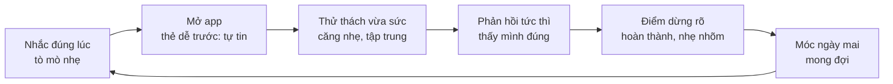

# Chiến lược động lực — tâm lý tự học và ham muốn chinh phục

Chiến lược xây trên ba nhu cầu tâm lý cần được thoả mãn để một người tự duy trì việc học (tự chủ, năng lực, kết nối — thuyết Tự quyết định của Deci & Ryan), được triển khai theo sáu giai đoạn của hành trình người học, mỗi giai đoạn có trạng thái tâm lý riêng, rủi ro bỏ cuộc riêng và cơ chế riêng.

## 1. Nguyên lý nền

| Nguyên lý | Nội dung | Nghĩa cho app này |
| --- | --- | --- |
| Tự chủ (autonomy) | Người ta gắn bó với việc họ chọn, không phải việc bị giao | Người học chọn mục tiêu, chủ đề, giọng, giờ học; app gợi ý, không ép |
| Năng lực (competence) | Động lực đến từ cảm giác "mình đang giỏi lên", không từ phần thưởng | Mọi phản hồi phải chỉ ra tiến bộ cụ thể ("bạn nói /θ/ đúng 4/5 lần, hôm qua 2/5") |
| Kết nối (relatedness) | Học một mình dễ bỏ; cảm giác có ai đó quan tâm giữ người học | Nhân vật đồng hành có "ký ức" về người học; sau này là nhóm bạn |
| Dòng chảy (flow) | Thử thách hơi cao hơn năng lực một chút, phản hồi tức thì, mục tiêu rõ | FSRS giữ tỉ lệ đúng 80–90%; phản hồi ngay từng thẻ |
| Hiệu ứng tiến độ được tặng (endowed progress) | Người ta hoàn thành mục tiêu nhanh hơn khi đã có sẵn một phần | Bài kiểm tra đầu vào "tặng" ngay 300–800 từ đã biết lên bản đồ |
| Goal gradient | Càng gần đích càng cố gắng | Cột mốc nhỏ, hiển thị "còn 12 từ nữa" thay vì "đã xong 88%" |
| Hiệu ứng Zeigarnik | Việc dang dở bám trong đầu | Kết phiên bằng một "móc" nhỏ: hé lộ từ thú vị của ngày mai |
| Ý định thực hiện (implementation intention) | "Tôi sẽ học lúc X tại Y" tăng gấp đôi khả năng làm | Hỏi câu này ngay onboarding; thông báo gắn vào đúng X |
| Thói quen dựa trên bản sắc | "Tôi là người học tiếng Anh mỗi ngày" bền hơn "tôi muốn giỏi tiếng Anh" | Ngôn ngữ trong app gọi người học theo vai ("nhà thám hiểm"), không theo điểm số |
| Phần thưởng bất ngờ, liều thấp | Bất ngờ nhỏ tạo hứng thú; lạm dụng thì thành cờ bạc | Thỉnh thoảng nhân vật tặng một "mảnh" trang trí; không hộp quà ngẫu nhiên, không đếm ngược |

Ranh giới đạo đức: không dùng tội lỗi, sợ mất, đếm ngược giả, hay so sánh hạ thấp. Người học quay lại vì thấy mình giỏi lên, không vì sợ mất chuỗi.

## 2. Vòng lặp tâm lý mỗi phiên

Mỗi mũi tên là một chuyển trạng thái cảm xúc; nếu một bước hỏng (thẻ đầu quá khó, không có điểm dừng), vòng lặp đứt và người học không quay lại.

## 3. Sáu giai đoạn của hành trình

**Giai đoạn 0 — Phút đầu tiên (onboarding, 5 phút)**

- Trạng thái: tò mò nhưng hoài nghi; đã từng bỏ nhiều app.
- Rủi ro: hỏi quá nhiều, bắt tạo tài khoản, không thấy giá trị ngay.
- Cơ chế: (1) bài kiểm tra đầu vào 3 phút, kết thúc bằng bản đồ đã tô sẵn "bạn đã biết 640 từ" (endowed progress); (2) một câu hỏi ý định: "Bạn sẽ học lúc nào? Ở đâu?"; (3) học ngay 3 từ đầu tiên, có khẩu hình, không cần tài khoản.
- Diễn biến tâm lý: hoài nghi → bất ngờ ("à, mình biết nhiều hơn tưởng") → cảm giác có xuất phát điểm → cam kết nhỏ.
- Đo: tỉ lệ hoàn thành onboarding, tỉ lệ học đủ 3 từ đầu.

**Giai đoạn 1 — Ba ngày đầu (những chiến thắng đầu tiên)**

- Trạng thái: hào hứng cao, kỹ năng thấp; dễ vỡ mộng nếu thấy khó.
- Rủi ro: thẻ ôn xuất hiện quá sớm gây cảm giác "quên rồi", mất tự tin.
- Cơ chế: ngày 2 chỉ ôn từ dễ nhất của ngày 1 (thiết kế để đúng ≥ 90%); nhân vật nói đúng điều vừa xảy ra ("bạn nhớ 'though' sau 1 ngày — đây là từ 70% người quên"); cột mốc đầu tiên ở ngày 3, không phải ngày 7.
- Diễn biến: hào hứng → nghi ngờ nhỏ ("liệu có nhớ không") → bằng chứng "có nhớ" → tự tin được xác nhận.
- Đo: D1, D3 retention; tỉ lệ đúng phiên ôn đầu tiên.

**Giai đoạn 2 — Tuần đầu (hình thành thói quen)**

- Trạng thái: cần lý do để quay lại mỗi ngày; hào hứng bắt đầu giảm.
- Rủi ro: ngày đầu tiên bỏ lỡ; thông báo gây khó chịu.
- Cơ chế: thông báo đúng giờ đã chọn, nội dung cụ thể ("5 từ sắp quên, 3 phút"); phiên có điểm dừng rõ và màn hình "xong hôm nay" kèm một dòng về tiến bộ đo được; móc Zeigarnik: hé lộ từ ngày mai; chuỗi ngày có 2 ngày nghỉ/tuần được nói rõ từ đầu.
- Diễn biến: "phải học" → "học nhanh thôi" → "xong rồi, nhẹ" → "mai có từ gì nhỉ". Mục tiêu là gắn hành vi vào giờ và chỗ cố định.
- Đo: D7; tỉ lệ mở từ thông báo; số phiên/tuần.

**Giai đoạn 3 — Tuần 2–4 (vùng trũng)**

- Trạng thái: mới mẻ hết, thẻ ôn tăng, tiến bộ khó cảm nhận. Đây là nơi đa số app mất người dùng.
- Rủi ro: núi thẻ tồn sau một lần nghỉ; cảm giác giẫm chân.
- Cơ chế: (1) đổi nhịp: mỗi tuần một "thử thách" tự chọn (nói 10 từ khó, đặt 5 câu) với phần thưởng là huy hiệu có tên âm ("người thuần phục /θ/"); (2) báo cáo tuần so sánh với chính mình, không với người khác; (3) rải thẻ tồn, ngày quay lại luôn nhẹ; (4) thỉnh thoảng đưa lại từ đã thành thạo để người học thấy "cái này mình từng không biết"; (5) mở khoang mới trên bản đồ (chủ đề mới) khi đạt cột mốc.
- Diễn biến: chán nhẹ → có mục tiêu nhỏ tự chọn → chinh phục → tự hào có tên gọi → nhìn lại thấy đường đã đi.
- Đo: D14, D30; tỉ lệ nhận thử thách tuần; tỉ lệ quay lại sau khi nghỉ ≥ 3 ngày.

**Giai đoạn 4 — Tháng 2 trở đi (bản sắc)**

- Trạng thái: học đã thành thói quen; cần ý nghĩa lớn hơn phiên học.
- Cơ chế: hiển thị tổng hợp có ý nghĩa thực ("bạn đọc được 92% một bài báo phổ thông" — tính từ NGSL coverage); cho phép đóng góp (đề xuất câu ví dụ, báo lỗi) — người đóng góp gắn bó gấp nhiều lần; kiểm tra ngẫu nhiên từ đã thành thạo để khẳng định "nhớ thật".
- Diễn biến: thói quen → nhìn thấy kết quả đời thật → "tôi là người dùng được tiếng Anh" → muốn giúp người khác.
- Đo: D60, D90; số đóng góp nội dung.

**Giai đoạn 5 — Ngữt và quay lại**

- Trạng thái: bỏ 1–4 tuần vì cuộc sống; thấy có lỗi, ngại mở.
- Rủi ro lớn nhất: mở app thấy 200 thẻ tồn và chuỗi bị gãy → xoá app.
- Cơ chế: thông báo quay lại không trách ("Chào mừng trở lại. 8 từ đủ cho hôm nay"); ngày quay lại chỉ có thẻ dễ và ít; bản đồ giữ nguyên những gì đã tô (không "phai"); thông báo tự giảm dần rồi dừng, không dồn dập.
- Diễn biến: tội lỗi → nhẹ nhõm vì không bị phạt → thắng nhỏ ngay → quay về vòng lặp.
- Đo: tỉ lệ quay lại sau nghỉ 7 và 30 ngày; tỉ lệ hoàn thành phiên quay lại.

## 4. Khẩu hình trong chiến lược động lực

Phát âm là nơi người Việt tự ti nhất, nên cũng là nơi cảm giác chinh phục mạnh nhất. Thiết kế: mỗi âm khó là một "thử thách đặt tên", có trước/sau do chính người học ghi âm và tự nghe lại; tiến bộ được lưu thành "bộ sưu tập âm đã thuần". Không chấm điểm tự động ở giai đoạn đầu, nên không có cảm giác bị phán xét.

## 5. Vai trò của nhân vật

| Việc nhân vật làm | Việc nhân vật không làm |
| --- | --- |
| Nhớ điều người học đã làm ("hôm qua bạn nói 'three' rất rõ") | Buồn, trách, "nhớ bạn" khi người học nghỉ |
| Thể hiện bất ngờ, vui thật khi người học vượt âm khó | Khen chung chung mọi thứ |
| Cùng "nở" và trưởng thành theo cột mốc (vỏ trứng → ra ngoài → cắm cờ) | Đòi hỏi, đếm ngược, doạ mất |

## 6. Kiểm chứng chiến lược

| Giả thuyết | Cách thử | Ngưỡng chấp nhận |
| --- | --- | --- |
| Bản đồ tô sẵn tăng hoàn thành onboarding | A/B: có/không hiện số từ đã biết | +15% hoàn thành |
| Ngày 2 chỉ ôn từ dễ tăng D3 | A/B: ôn dễ vs ôn theo lịch thuần | +10% D3 |
| Chuỗi có ngày nghỉ giữ người tốt hơn chuỗi cứng | A/B | +10% quay lại sau lần bỏ đầu |
| Thử thách tuần giảm rớt ở tuần 2–4 | Theo dõi D14/D30 trước và sau khi bật | +5 điểm D30 |
| Thông báo nêu số từ và phút tăng tỉ lệ mở | A/B nội dung thông báo | +20% mở |

Tất cả ngưỡng là giả định để có điểm dừng khi đánh giá, không phải số liệu ngành.
