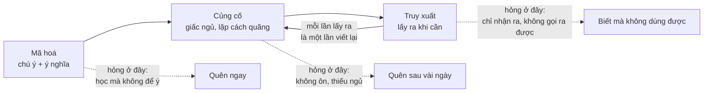

# Khoa học ghi nhớ và hành vi học — vận dụng cho học từ vựng

Não nhớ lâu những gì được mã hoá sâu, khác biệt, có cảm xúc, liên quan đến bản thân, được lấy ra nhiều lần cách quãng và được củng cố qua giấc ngủ; mỗi tính chất này ứng với một quyết định thiết kế cụ thể trong app. Mức bằng chứng được ghi rõ ở từng dòng để không đầu tư nhầm vào điều chưa chắc.

## 1. Trí nhớ hoạt động thế nào — ba cửa ải

Ba điểm hỏng ứng với ba triệu chứng người học Việt Nam hay gặp: học danh sách rồi quên ngay; học rồi vài ngày sau trống rỗng; đọc hiểu được nhưng không nói ra được.

| Cửa ải | Điều não cần | App đáp ứng bằng |
| --- | --- | --- |
| Mã hoá | Chú ý trọn vẹn vài giây; gắn ý nghĩa vào thứ đã biết | Một từ một màn hình, không danh sách; câu ví dụ gần gũi; hình tình huống; câu hỏi "bạn dùng từ này khi nào" |
| Củng cố | Lặp lại đúng lúc sắp quên; ngủ đủ sau khi học | FSRS; gợi ý học từ mới vào buổi tối, ôn vào sáng (củng cố qua giấc ngủ — bằng chứng mạnh) |
| Truy xuất | Phải tự lấy ra từ trí nhớ, có chút khó khăn | Dạng bài gõ, nói, điền câu; trắc nghiệm chỉ ở lần đầu |

## 2. Điều gì làm một ký ức "gây ấn tượng"

| Cơ chế | Giải thích ngắn | Bằng chứng | Vận dụng cho từ vựng |
| --- | --- | --- | --- |
| Hiệu ứng kiểm tra (testing effect) | Cố nhớ ra củng cố mạnh hơn đọc lại gấp nhiều lần | Mạnh, hàng trăm nghiên cứu | Toàn bộ ôn tập là tự gọi ra, không hiện lại thẻ |
| Khoảng cách (spacing) | Ôn cách quãng tăng dần bền hơn ôn dồn | Mạnh | FSRS; không cho "cày" 100 từ một buổi |
| Khó khăn mong muốn (desirable difficulty) | Hơi khó khi học → nhớ lâu; quá dễ → ảo tưởng đã biết | Mạnh | Gợi ý chữ cái đầu thay vì cả từ; đợi 2 giây trước khi hiện đáp án |
| Sinh ra (generation effect) | Thứ mình tự tạo nhớ hơn thứ được đưa | Mạnh | Người học tự đặt câu, tự chọn ảnh, tự viết liên tưởng |
| Khác biệt (von Restorff) | Cái nổi bật giữa cái giống nhau được nhớ | Mạnh | Không dùng một phong cách ảnh cho mọi từ; từ khó được "làm lạ" có chủ ý |
| Cảm xúc | Hạnh nhân đánh dấu ký ức có cảm xúc để ưu tiên lưu | Mạnh với cảm xúc vừa phải; sợ hãi làm giảm học | Hài hước, bất ngờ, dễ thương; không áp lực, không chê |
| Tự tham chiếu (self-reference) | Gắn với bản thân → nhớ tốt hơn gắn với người khác | Mạnh | Câu hỏi "từ này trong đời bạn là gì"; ví dụ có tên, thành phố, thói quen người học |
| Thân thể (embodied cognition) | Làm động tác khi học động từ kích hoạt vùng vận động, tăng nhớ | Trung bình–mạnh (TPR, gesture studies) | Nhắc làm động tác cho động từ; khẩu hình cũng là vận động |
| Đa giác quan | Nghe + nhìn + nói cùng lúc tạo nhiều đường truy xuất | Trung bình–mạnh | Thẻ từ gồm chữ, ảnh, audio, khẩu hình, phát âm theo |
| Kể chuyện | Não lưu chuỗi nhân quả tốt hơn sự kiện rời | Trung bình | 5–8 từ mới trong một đoạn truyện ngắn của phi hành gia |
| Bối cảnh (context-dependent) | Nhớ tốt hơn khi bối cảnh ôn giống bối cảnh dùng | Trung bình | Câu ví dụ đặt trong tình huống người học sẽ gặp thật (đi làm, đi chợ, nhắn tin) |
| Mới lạ (novelty) | Dopamine tăng khi gặp cái mới, mở "cửa sổ học" | Trung bình | Đổi dạng bài, đổi cảnh; không lặp một khuôn |
| Phương pháp từ khoá | Liên tưởng âm L1 + hình ảnh phi lý | Mạnh ngắn hạn, yếu dần nếu không ôn | Chỉ dùng cho từ khó, kết hợp SRS |

## 3. Giới hạn của não mà app phải tôn trọng

- **Trí nhớ làm việc \~4 ± 1 mục**: một thẻ chỉ dạy một điều; nghĩa phụ, từ đồng nghĩa để sau.
- **Chú ý bền vững trên điện thoại ngắn**: phiên 5–10 phút không phải thỏa hiệp mà là tối ưu.
- **Tải nhận thức ngoại lai**: giao diện rối, hiệu ứng thừa, chữ nhỏ đều lấy mất tài nguyên lẽ ra dành cho từ; nhân vật đứng yên khi đang học, chỉ cử động khi phản hồi.
- **Giao thoa**: học hai từ giống nhau cùng lúc (affect/effect, borrow/lend) gây lẫn lâu dài; tách xa trong lịch học, chỉ đối chiếu khi cả hai đã ổn.
- **Ảo tưởng thông thạo**: nhận ra từ trên màn hình không có nghĩa là gọi ra được; app đo bằng gọi ra, không đo bằng "đã xem".
- **Đường cong quên**: phần lớn mất trong 24 giờ đầu; lần ôn đầu tiên phải trong ngày hoặc sáng hôm sau.

## 4. Riêng cho học ngôn ngữ

**Biết một từ là biết nhiều thứ** (Nation): hình thức (âm, chữ), nghĩa (khái niệm, liên tưởng), cách dùng (ngữ pháp, kết hợp từ, sắc thái). App phải dạy dần từng lớp, không dồn một lần:

| Lần gặp | Lớp dạy | Dạng bài |
| --- | --- | --- |
| 1 | Âm + nghĩa chính + hình | Xem, nghe, nói theo, chọn nghĩa |
| 2–3 | Chữ viết, phát âm chủ động | Nghe gõ, nói từ |
| 4–6 | Dùng trong câu, kết hợp từ thường gặp | Điền câu, chọn cụm đúng |
| 7+ | Nghĩa phụ, sắc thái, tự tạo câu | Đặt câu của mình |

**Tiếp nhận trước, sản sinh sau, nhưng không đợi quá lâu**: nhận ra từ dễ hơn gọi ra từ 2–3 lần; app đẩy sang sản sinh ngay từ lần gặp thứ 2 vì đó là mục tiêu thực của người học.

**Vòng lặp âm vị (phonological loop)**: từ được giữ trong trí nhớ làm việc dưới dạng âm, không phải chữ; người phát âm sai lưu bản sai và khó sửa. Đây là lý do khẩu hình và nói theo phải có ngay lần gặp đầu, trước cả chữ viết.

**Nhận thấy (noticing)**: chỉ học được cái mình để ý; đánh dấu trọng âm, âm cuối, cụm từ bằng màu và hình để ép sự chú ý vào đúng chỗ.

**Chuyển di từ tiếng Việt**: tiếng Việt đơn âm tiết, không nối âm, âm cuối không bật hơi, không có trọng âm từ; nên người học nuốt âm cuối, đọc đều các âm tiết, không nối âm. App xử lý bằng: hiển thị âm tiết nhấn to hơn, khẩu hình âm cuối được phóng đại, bài nói cụm 2–3 từ có nối âm từ tuần 2.

**Kết hợp từ (collocation)**: não lưu "make a decision" như một khối; dạy cụm thay vì từ đơn từ lần gặp thứ 4 trở đi.

## 5. Hành vi học thực tế trên điện thoại

| Hành vi quan sát được | Hệ quả cho não | Thiết kế đáp ứng |
| --- | --- | --- |
| Học xô đẩy giữa việc khác, bị ngắt liên tục | Mã hoá nông, dễ trôi | Mỗi thẻ tự đủ nghĩa; lưu sau từng thẻ; không có "mạch" bị hỏng khi ngắt |
| Lướt nhanh, bấm cho xong | Ảo tưởng thông thạo | Bắt buộc hành động (gõ, nói) trước khi qua thẻ; không có nút "biết rồi" ở thẻ mới |
| Học dồn cuối tuần | Không có spacing, mệt | Giới hạn từ mới/ngày; thẻ tồn rải ra |
| Tránh việc khó (bỏ qua bài nói) | Không bao giờ sản sinh được | Bài nói ngắn, không chấm điểm, là bước trong luồng chứ không tách riêng |
| Thích thấy số tăng | Dễ đổi mục tiêu từ "nhớ" sang "điểm" | Chỉ số hiển thị là số từ gọi ra được, không phải điểm trò chơi |
| Học trước khi ngủ | Củng cố tốt nhất | Gợi ý khung giờ tối cho từ mới; ôn buổi sáng |

## 6. Những điều phổ biến nhưng bằng chứng yếu — không đầu tư

- "Phong cách học" (thị giác/thính giác): không có bằng chứng; mọi người đều hưởng lợi từ đa giác quan.
- Học trong lúc ngủ bằng audio: không học được từ mới.
- "1000 từ trong 30 ngày": khả thi về nhận ra, không khả thi về dùng được; không hứa điều này.
- Nhạc nền, "sóng não": không có tác dụng đo được lên ghi nhớ từ.

## 7. Tóm tắt thành quy tắc thiết kế

1. Một thẻ, một điều, có hình, có âm, có việc phải làm.
2. Gọi ra trước khi được xem lại; hơi khó là đúng.
3. Lần ôn đầu trong 24 giờ; sau đó để FSRS quyết.
4. Nói trước khi viết; khẩu hình ở lần gặp đầu.
5. Gắn từ vào đời người học: câu của họ, ảnh của họ, tình huống của họ.
6. Mỗi từ một điểm khác biệt; từ khó được làm lạ có chủ ý.
7. Cảm xúc dương, không áp lực; bất ngờ nhỏ, không phạt.
8. Đo bằng gọi ra sau 30 ngày, không đo bằng số thẻ đã lướt.
