# Thiết kế kiến trúc — Ứng dụng học từ vựng tiếng Anh

Sep 24, 2026 · @Hugh Nguyen

## 1. Tổng quan và nguyên tắc kiến trúc

Kiến trúc là **local-first**: toàn bộ việc học (dựng phiên, chấm, lập lịch FSRS, phát audio và khẩu hình) chạy trên thiết bị với nội dung tĩnh tải trước; máy chủ chỉ giữ bản sao lịch sử để đổi máy và dùng nhiều thiết bị. Điều này thoả đồng thời ba ràng buộc của tài liệu yêu cầu: offline (NFR mục 7), chi phí biên tiến về 0, và một nguồn nội dung dùng chung cho React lẫn Flutter.

**Năm nguyên tắc**

| # | Nguyên tắc | Hệ quả cụ thể |
| --- | --- | --- |
| 1 | Nội dung là dữ liệu tĩnh, bất biến theo phiên bản | Gói nội dung build một lần, phát qua CDN, không có API nội dung; app cũ vẫn chạy với gói cũ |
| 2 | Lịch sử trả lời là nguồn sự thật, chỉ thêm không sửa | Mọi trạng thái (FSRS, cấp, cột mốc, huy hiệu) là hàm của lịch sử; đồng bộ là gộp tập hợp, không có xung đột |
| 3 | Tính toán ở thiết bị | Không có máy chủ lập lịch; máy chủ không biết FSRS |
| 4 | Hai app, một lõi logic | Quy tắc FSRS, dựng phiên, ánh xạ cấp, tiêu chí cột mốc được đặc tả một lần và kiểm bằng bộ test vàng dùng chung |
| 5 | Dữ liệu tối thiểu, xoá được | Máy chủ chỉ có email/ID đăng nhập, lịch sử, nội dung tự tạo, cài đặt |

**Sơ đồ tổng thể**

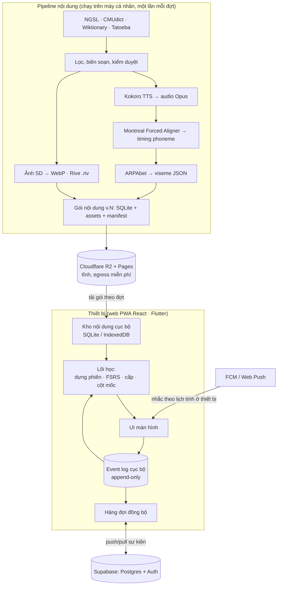

Điểm mấu chốt trong sơ đồ: mũi tên từ CDN xuống thiết bị là một chiều và tĩnh; mũi tên hai chiều duy nhất là hàng đợi sự kiện, và nó chỉ chở lịch sử, nội dung tự tạo và cài đặt.

**Ranh giới trách nhiệm**

| Thành phần | Chịu trách nhiệm | Không chịu trách nhiệm |
| --- | --- | --- |
| Pipeline nội dung | Đúng đắn của từ, câu, audio, viseme; đóng gói, đánh phiên bản | Bất kỳ dữ liệu người dùng nào |
| CDN | Phát gói và asset | Logic |
| Lõi học trên thiết bị | Dựng phiên, FSRS, cấp, cột mốc, quiz, khôi phục trạng thái từ lịch sử | Lưu trữ bền ngoài thiết bị |
| Máy chủ | Xác thực, lưu và trả lịch sử theo con trỏ, xoá tài khoản | Lập lịch, chấm, nội dung |
| Thông báo | Giao thông báo đúng giờ với nội dung do thiết bị tính sẵn | Quyết định gửi gì |

## 2. Công nghệ và lý do chọn

Mỗi lựa chọn được chấm theo bốn tiêu chí lấy từ tài liệu yêu cầu: chi phí 0, chạy offline, dùng chung web/mobile, và đội nhỏ bảo trì được; phương án bị loại ghi kèm lý do để sau này không phải cân nhắc lại.

| Lớp | Chọn | Vì sao | Đã loại |
| --- | --- | --- | --- |
| Web | React + TypeScript + Vite, PWA (service worker) | Anh đã chọn React; PWA cho offline và cài lên màn hình chính, ra mắt 0 đồng trước khi lên store | Next.js: SSR không cần cho app học; thêm máy chủ |
| Mobile | Flutter (Dart) | Anh đã chọn; một mã nguồn cho Android/iOS; Rive có runtime Flutter chính thức | React Native: giữ cùng ngôn ngữ với web nhưng Rive/animation kém ổn định hơn; Flutter Web thay React: giao diện web kém tự nhiên, SEO không cần nên không phải lý do |
| Lõi logic dùng chung | Đặc tả + bộ test vàng (JSON): 200 kịch bản FSRS, dựng phiên, cấp; cài đặt hai lần bằng `ts-fsrs` (web) và port Dart | Cùng một kết quả trên hai nền tảng mà không kéo runtime lạ; test vàng bắt lệch ngay | WASM chung cho cả hai: Flutter mobile gọi WASM phức tạp; Dart→JS: giao diện React khó dùng |
| Lập lịch | FSRS (open-spaced-repetition), tham số mặc định, tối ưu tham số theo người dùng khi đủ 1.000 lượt | Chính xác hơn SM-2, mã nguồn mở, có thư viện TS và Dart | SM-2: đơn giản nhưng lịch kém tối ưu; tự nghĩ thuật toán: không có bằng chứng |
| Lưu trữ thiết bị | Flutter: SQLite qua `drift`; Web: IndexedDB qua `Dexie`; cùng một lược đồ logic | Truy vấn hàng đợi "đến hạn" nhanh trên 5.000 mục; giao dịch; bền khi thoát đột ngột | localStorage: giới hạn \~5 MB, không truy vấn; WatermelonDB: thêm lớp không cần |
| Gói nội dung | SQLite tĩnh (một file mỗi đợt 1.000 từ) + assets rời + manifest JSON có hash | SQLite đọc được trên cả hai nền tảng (web qua `sql.js`/OPFS hoặc chuyển vào IndexedDB lúc nhập); bất biến nên cache vĩnh viễn | API nội dung: tốn máy chủ, hỏng khi offline |
| Audio | Opus 24 kbps trong WebM (web) / OGG (Flutter); tốc độ chậm bằng playbackRate | \~9 KB/câu; đúng kết luận rà soát Đ2 | AAC: dung lượng lớn hơn; hai file cho hai tốc độ: gấp đôi lưu trữ |
| Khẩu hình | Rive: một file .riv, input số `viseme` 0–11, `mouthOpen`; timeline JSON điều khiển | Runtime MIT trên cả hai nền tảng; state machine cho biểu cảm | Lottie: khó điều khiển theo thời gian thực; sprite PNG: nặng, không mượt |
| Backend | Supabase: Postgres + Auth (Google, Apple, magic link) + REST; không dùng Realtime, không dùng Edge Functions ở MVP | Gói miễn phí đủ (500 MB, 50k MAU); Postgres cho phép truy vấn sự kiện theo con trỏ; Auth có sẵn 3 cách đăng nhập | Firebase: Firestore tính tiền theo lượt đọc, khó gộp sự kiện rẻ; tự host: tốn vận hành. Rủi ro Supabase tạm dừng khi 1 tuần không hoạt động → cron ping miễn phí hoặc chuyển Cloudflare D1 |
| Hạ tầng tĩnh | Cloudflare Pages (web) + R2 (gói và assets) | Egress 0 đồng là điều kiện để 5.000 từ × audio không tốn tiền | GitHub Pages cho assets: giới hạn 1 GB và băng thông mềm |
| Thông báo | FCM (Android, web push), APNs qua FCM (iOS khi có) | Miễn phí; lịch nhắc và nội dung do thiết bị tính rồi đặt lịch cục bộ (local notification), FCM chỉ cho web | OneSignal: thêm SDK bên thứ ba thu dữ liệu |
| Đo lường | Sự kiện ẩn danh gộp theo ngày, ghi vào Postgres cùng dự án; bảng riêng | Không SDK thứ ba; tắt được | GA4/Mixpanel: gửi dữ liệu ra ngoài, khó tuân thủ Data Safety |
| Pipeline nội dung | Python: pandas, kaikki, cmudict, Kokoro, MFA, ffmpeg, cairosvg | Chạy trên máy cá nhân; mọi thứ mã nguồn mở | — |

**Điều cố tình không có trong kiến trúc**

- Không có máy chủ ứng dụng tuỳ biến (Node/Go): mọi thứ máy chủ cần là Auth + bảng sự kiện, Supabase đã cho sẵn qua REST và RLS.
- Không có nhận dạng giọng nói ở MVP (tài liệu yêu cầu loại trừ).
- Không có LLM lúc runtime; LLM chỉ dùng trong pipeline biên soạn.
- Không có microservice: một app, một cơ sở dữ liệu người dùng, một CDN.

## 3. User flow

Bốn luồng bao phủ toàn bộ vòng đời: lần đầu, hằng ngày, luyện thêm, và đổi máy; mỗi hộp là một màn hình trong mockup, mỗi nhánh là một quyết định của lõi học.

**3.1 Lần đầu mở app**

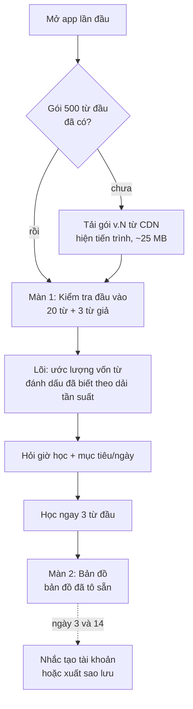

Không có bước đăng nhập trong luồng này: định danh cục bộ (UUID thiết bị) được tạo ở bước A và chỉ liên kết với tài khoản khi người dùng chọn (mục 6.2).

**3.2 Phiên học hằng ngày**

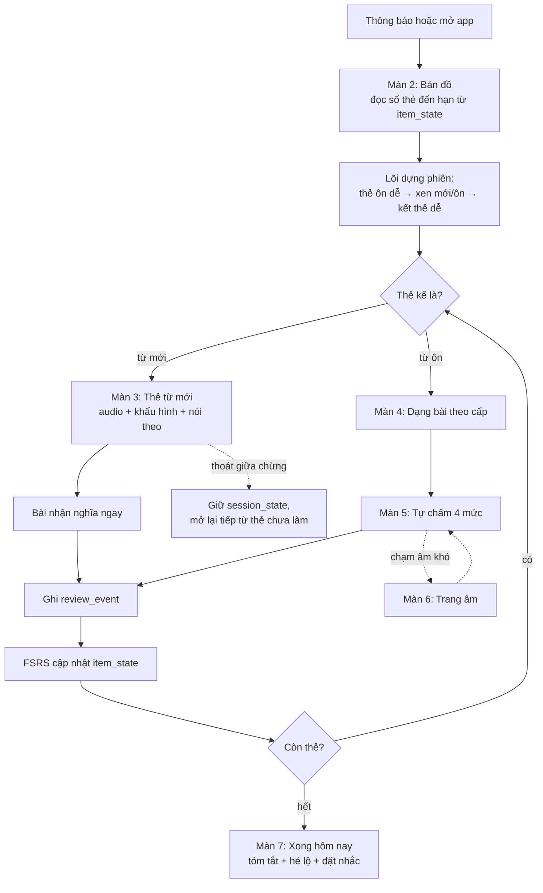

**3.3 Luyện tập và quiz**

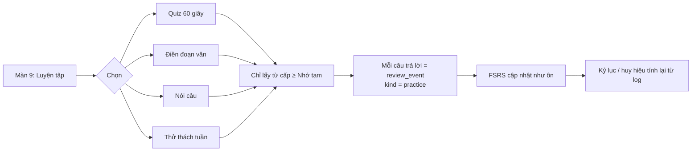

**3.4 Đổi máy hoặc cài lại**

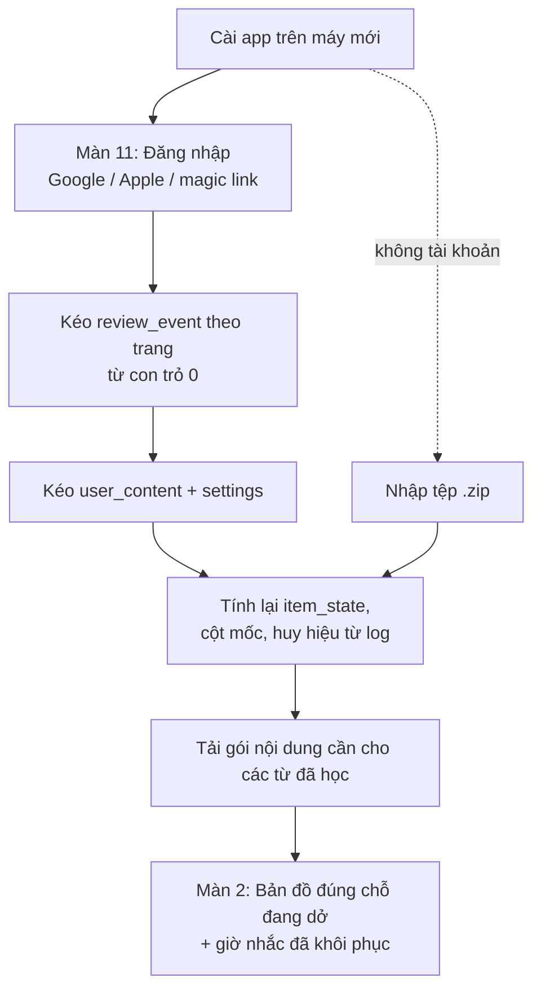

Bước E là lý do lịch sử phải là nguồn sự thật: máy mới không cần tin bất kỳ trạng thái nào từ máy cũ, chỉ cần lịch sử và cùng một lõi.

## 4. Data flow theo từng màn hình

Mỗi màn hình được mô tả bằng ba câu hỏi: đọc gì từ đâu, ghi gì vào đâu, và điểm nào chạm mạng. Quy ước: **Kho nội dung** = SQLite/IndexedDB nội dung tĩnh; **Event log** = bảng review\_event cục bộ; **State** = bảng item\_state dẫn xuất; **Sync** = hàng đợi đồng bộ; **CDN** = tải asset tĩnh.

| Màn | Đọc | Ghi | Chạm mạng |
| --- | --- | --- | --- |
| 1 Kiểm tra đầu vào | Kho nội dung: 20 từ mẫu theo dải tần suất + 3 từ giả | Event log: `placement_answer` ×20; sau khi xong: `placement_result` (ước lượng) | Không (gói đầu đã tải) |
| 2 Bản đồ | State: đếm đến hạn, cấp; Event log: streak, cột mốc; Settings: giờ học | Không | Không; đồng bộ chạy nền nếu có mạng |
| 3 Thẻ từ mới | Kho nội dung: word, sense, examples, image, viseme timeline; CDN/cache: audio | Event log: `exposure` (đã xem), `speak_attempt` (đã nói theo, không có điểm) | Audio: cache trước theo phiên; thiếu thì tải lẻ từ CDN |
| 4 Bài luyện | Kho nội dung: câu thứ hai của từ; State: cấp để chọn dạng bài | Event log: `answer` (dạng bài, đúng/sai, số gợi ý dùng, ms) | Không |
| 5 Tự chấm | State: khoảng cách dự đoán cho 4 nút (FSRS tính trước) | Event log: `review` (grade 1–4) → State cập nhật ngay | Không |
| 6 Trang âm | Kho nội dung: sound, minimal pairs, mẹo; CDN: video miệng thật | Event log: `sound_practice`, `sound_claim` (tự khai thuần); ghi âm → file cục bộ | Video thật: stream từ CDN, cache sau lần đầu |
| 7 Xong hôm nay | Event log của phiên: tổng hợp; State: hé lộ từ kế | Event log: `session_end`; Notification: đặt lịch cục bộ | Không |
| 8 Tiến độ | State: phân bố cấp; Event log: phút học, kiểm tra ngẫu nhiên | Không | Không |
| 9–10 Luyện tập / Quiz | State: từ cấp ≥ Nhớ tạm; Event log: kỷ lục | Event log: `answer` kind=practice; `challenge_progress` | Không |
| 11 Dữ liệu | Sync: con trỏ, thời điểm cuối; Settings | Settings; xuất tệp; nhập tệp → Event log (gộp) | Đăng nhập, push/pull, xoá tài khoản |
| 12 Ngữ pháp | Kho nội dung: pattern, câu, chip nhiễu; State của pattern | Event log: `answer`, `review` với item\_type=pattern | Không |

**4.1 Màn 3 — Thẻ từ mới: điểm luân chuyển chi tiết**

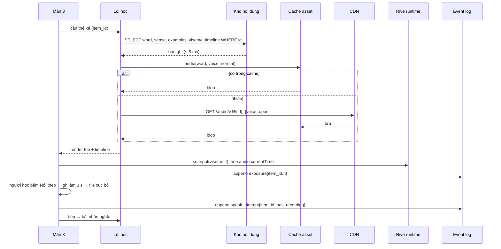

Đồng bộ khẩu hình: UI đọc `audio.currentTime` mỗi frame (requestAnimationFrame / Ticker) và tra timeline bằng tìm kiếm nhị phân trên mảng mốc thời gian; độ lệch mục tiêu < 50 ms (NFR) đạt được vì không có mạng trong vòng lặp này.

**4.2 Màn 5 — Tự chấm: ghi sự kiện và cập nhật trạng thái**

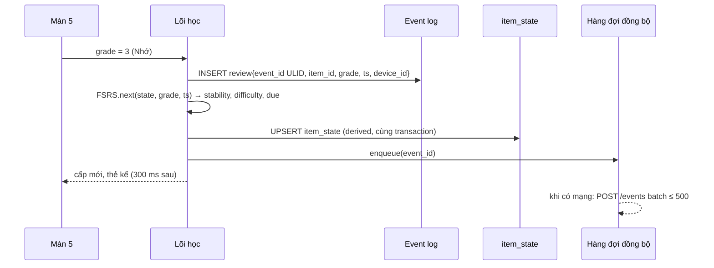

Event log và item\_state được ghi trong **một giao dịch**; nếu app bị tắt giữa chừng, hoặc cả hai có, hoặc cả hai không, nên trạng thái không bao giờ lệch lịch sử.

**4.3 Màn 11 — Đồng bộ hai chiều**

```mermaid
sequenceDiagram
  participant App as Thiết bị A
  participant SV as Supabase
  participant B as Thiết bị B
  App->>SV: POST events[] (idempotent theo event_id)
  SV-->>App: server_seq cao nhất đã nhận
  App->>SV: GET events?after=server_seq_cursor
  SV-->>App: sự kiện của thiết bị khác (B)
  App->>App: gộp vào log (bỏ trùng event_id)
  App->>App: tính lại item_state cho các item bị chạm
  Note over App,B: Không có xung đột: log chỉ thêm; thứ tự theo ts; cùng item từ hai máy → replay theo ts
```

**4.4 Màn 2 — Bản đồ: đọc nhanh nhờ dẫn xuất sẵn**

Bản đồ không quét event log. Nó đọc bốn bộ đếm được lõi cập nhật tăng dần sau mỗi sự kiện: `due_today`, `new_available`, `hard_sounds_pending`, `streak`. Tổng thời gian mở app đến bản đồ < 2 s (NFR) vì chỉ có vài truy vấn chỉ mục.

**4.5 Màn 6 — Trang âm và video thật**

Video miệng thật là asset duy nhất không tải trước (dung lượng): stream lần đầu từ CDN, cache sau đó; khi offline hiện hai lớp còn lại (miệng cận cảnh, mặt cắt) và nút video xám kèm chú thích. Ghi âm người học không rời thiết bị (mục 11.4 tài liệu yêu cầu).

## 5. Kiến trúc xử lý dữ liệu

Bốn bộ xử lý chạy trên thiết bị (event log, FSRS, dựng phiên, đồng bộ) và một chạy lúc build (pipeline nội dung); tất cả đều thuần túy theo nghĩa: cùng đầu vào cho cùng đầu ra, nên kiểm được bằng test vàng trên cả hai nền tảng.

**5.1 Event log — mô hình sự kiện**

| Trường | Kiểu | Ghi chú |
| --- | --- | --- |
| event\_id | ULID (26 ký tự) | Sinh ở thiết bị; sắp xếp được theo thời gian; khoá chống trùng khi đồng bộ |
| user\_id | UUID | Rỗng khi chưa có tài khoản; điền khi liên kết |
| device\_id | UUID | Để thống kê và gỡ lỗi, không dùng cho định danh |
| ts | epoch ms | Giờ thiết bị; lệch giờ được chấp nhận vì FSRS chịu lệch vài phút |
| type | enum | placement\_answer, placement\_result, exposure, speak\_attempt, answer, review, review\_undo, spot\_check, sound\_practice, sound\_claim, session\_start, session\_end, challenge\_progress, notification\_opened, notification\_ignored, setting\_changed, content\_created, list\_changed |
| item\_type | enum | word, pattern, sound |
| item\_id | text | Ổn định qua các phiên bản gói (khoá tự nhiên: `w:reluctant#1`) |
| payload | JSON nhỏ | grade, exercise\_kind, correct, hints\_used, latency\_ms, session\_id |
| server\_seq | bigint | Chỉ máy chủ gán, tăng đơn điệu; con trỏ đồng bộ |

Quy tắc: sự kiện không bao giờ sửa hay xoá (trừ xoá tài khoản); "undo" là một sự kiện mới. Dung lượng ≈ 60–80 byte/sự kiện, đúng ước lượng 2–3 MB/người/năm trong tài liệu yêu cầu.

**5.2 FSRS và trạng thái dẫn xuất**

- `item_state(item_id) = fold(FSRS, events where item_id order by ts)`; lưu kết quả để không tính lại mỗi lần đọc; tính lại từng item khi nhận sự kiện mới cho item đó (từ đồng bộ hoặc nhập tệp).
- Ánh xạ cấp hiển thị (FR-15): Mới = chưa có review; Đang học = stability < 2 ngày; Nhớ tạm = 2–14; Nhớ chắc = 14–60; Thành thạo = > 60 và ≥ 3 lần review đúng liên tiếp. Ngưỡng là hằng số đặc tả, nằm trong bộ test vàng.
- Tối ưu tham số FSRS theo người dùng: chạy trên thiết bị khi log ≥ 1.000 review, mỗi tuần một lần, ở nền; kết quả là sự kiện `setting_changed{fsrs_params}` nên cũng đồng bộ và tái lập được.

**5.3 Dựng phiên (session builder)**

```mermaid
flowchart LR
  A[Đầu vào: due list, new quota,<br/>giới hạn 25, lịch sử 7 ngày] --> B[Chọn ôn: due sắp theo<br/>stability tăng dần]
  B --> C{Trở lại sau nghỉ?}
  C -- có --> D[Rải: chỉ lấy min(due, quota_ôn);<br/>phần còn lại dời đều 3–5 ngày]
  C -- không --> E
  D --> E[Chọn mới: theo hạng tần suất<br/>+ chủ đề ưu tiên, bỏ từ đã biết]
  E --> F[Xếp thứ tự: 2 ôn dễ → xen mới/ôn<br/>tỉ lệ 1:2 → 2 ôn dễ cuối]
  F --> G[Gán dạng bài theo cấp<br/>và xen kẽ dạng]
  G --> H[session_state: danh sách thẻ,<br/>con trỏ, lưu bền]
```

Đầu ra là danh sách thẻ bất biến cho phiên; thoát và mở lại đọc `session_state` từ đĩa (FR-12). Session hết hạn lúc 04:00 sáng hôm sau để một ngày mới dựng phiên mới.

**5.4 Đồng bộ**

- Push: batch ≤ 500 sự kiện, `INSERT … ON CONFLICT (event_id) DO NOTHING`; máy chủ trả `server_seq` lớn nhất.
- Pull: `GET events?user=me&after=cursor&limit=1000`, lặp đến hết; lưu cursor sau mỗi trang.
- Liên kết tài khoản: khi đăng nhập lần đầu trên thiết bị đã có log ẩn danh, mọi sự kiện cục bộ được gán `user_id` rồi push; không mất gì.
- Nhập tệp .zip: gộp như pull, cùng khoá `event_id`.
- Không có xung đột theo thiết kế; trường hợp duy nhất cần quy tắc là hai thiết bị cùng đặt `setting_changed` — lấy ts lớn hơn.

**5.5 Pipeline nội dung (build-time)**

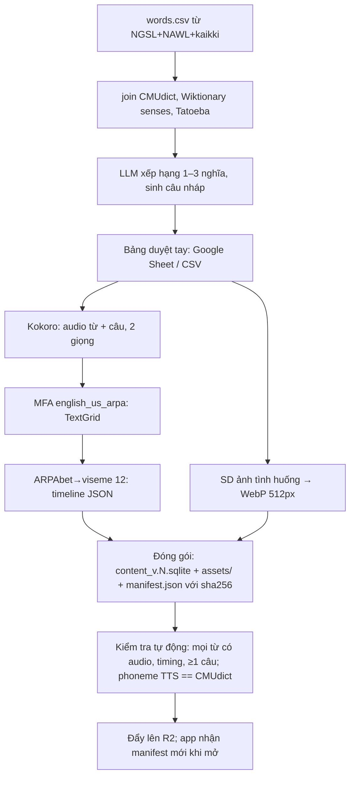

Gói theo đợt 1.000 từ; manifest liệt kê gói, phiên bản, kích thước, hash. App tải gói cần thiết theo tiến độ, không tải cả 5.000 từ.

**5.6 Quản lý danh sách từ và chọn mục cho quiz**

Danh sách từ là một khái niệm riêng, tách khỏi gói nội dung: gói chứa từ và nhãn, danh sách là cách nhìn vào gói; nhờ vậy thêm chủ đề hay danh sách người dùng không cần build lại gói.

| Loại danh sách | Nguồn | Ai tạo | Dùng ở |
| --- | --- | --- | --- |
| Cột mốc (milestone) | MILESTONE\_ITEM trong gói; 15–20 từ, xếp theo tần suất trong nhánh | Biên soạn | Bản đồ, hàng đợi từ mới mặc định, kiểm tra cột mốc |
| Chủ đề (topic) | WORD\_TOPIC nhiều-nhiều; một từ thuộc 1–3 chủ đề (đi chợ, công việc, du lịch, học thuật…); \~30 chủ đề cho 5.000 từ | Biên soạn (gợi ý bằng LLM, người duyệt chốt) | Ưu tiên chọn từ mới (FR-02), lọc quiz, cảnh chủ đề |
| Danh sách động | Tính từ item\_state + log: "sắp quên", "hay quên" (lapses ≥ 2), "mới tuần này", "thành thạo", "âm khó /θ/" | Lõi, tự động | Luyện tập, thử thách tuần |
| Danh sách của tôi | USER\_LIST + USER\_LIST\_ITEM; người học gom từ (từ thẻ, từ tìm kiếm trong gói); ≤ 200 từ/danh sách | Người học | Học ưu tiên, quiz theo danh sách, xuất/nhập |
| Danh sách chia sẻ (sau) | Xuất danh sách của tôi thành mã; người khác nhập | Người học | Ngoài MVP |

**Hàng đợi từ mới** (bổ sung cho §5.3): `next_new(n)` chọn theo thứ tự ưu tiên: (1) từ trong "danh sách của tôi" đang bật ưu tiên; (2) từ của cột mốc hiện tại; (3) từ có chủ đề người học chọn, hạng thấp nhất; (4) từ còn lại theo hạng. Loại từ known và từ đồng tự khác âm của từ vừa học trong 3 ngày. Tất cả là hàm thuần, có test vàng.

**Chọn mục cho quiz** — không ngẫu nhiên đều, mà ngẫu nhiên có trọng số để quiz vừa ôn vừa vui:

| Yếu tố | Trọng số | Lý do |
| --- | --- | --- |
| Đến hạn hoặc sắp đến hạn (due ≤ 2 ngày) | ×3 | Quiz cũng là ôn (FR-39) |
| Hay quên (lapses ≥ 2) | ×2 | Từ khó cần gặp nhiều hơn |
| Mới học tuần này | ×1,5 | Củng cố sớm |
| Thành thạo | ×0,5 | Vẫn xuất hiện để chống ảo tưởng, nhưng ít |
| Vừa xuất hiện trong 2 quiz gần nhất | ×0,2 | Tránh lặp |
| Lọc theo chủ đề/danh sách (nếu người học chọn) | chỉ giữ từ khớp | Tự chủ |

Chọn bằng lấy mẫu có trọng số không hoàn lại; seed ghi vào `session_start{kind:quiz,seed}` để tái lập khi gỡ lỗi. Quiz chỉ lấy từ cấp ≥ Nhớ tạm (FR-40, TC-QZ-04).

**Sinh đáp án nhiễu (distractor)** cho chọn nghĩa / nghe chọn từ: 3 nhiễu lấy từ kho đã học của chính người đó theo ưu tiên: cùng loại từ và cùng chủ đề → cùng loại từ, hạng gần (±500) → từ có âm gần (cùng viseme mở đầu hoặc cùng vần) cho dạng nghe; loại đáp án đồng nghĩa với đáp án đúng (WordNet synset). Nhiễu cho ngữ pháp là lỗi điển hình soạn sẵn trong PATTERN.distractors\_json.

**Bảng bổ sung vào 7.1 và 7.2**: WORD\_TOPIC(item\_id, topic\_id, weight), TOPIC(topic\_id, name\_vi, order, icon); USER\_LIST(list\_id, user\_id, name, priority\_on, created\_ts), USER\_LIST\_ITEM(list\_id, item\_id, added\_ts) — hai bảng người dùng đồng bộ qua sự kiện `list_changed`.

## 6. Caching và quản lý phiên

Cache chia bốn tầng theo tuổi thọ dữ liệu; phiên chia hai nghĩa tách bạch — phiên xác thực (ai đang dùng) và phiên học (đang học tới đâu) — và không tầng nào chạm mạng trong lúc người học đang trả lời thẻ.

**6.1 Bốn tầng cache**

| Tầng | Chứa | Nơi | Tuổi thọ / vô hiệu | Kích thước mục tiêu |
| --- | --- | --- | --- | --- |
| Gói nội dung | SQLite nội dung theo đợt, viseme JSON, .riv | Web: OPFS hoặc nhập vào IndexedDB; Flutter: file app dir | Bất biến theo phiên bản; thay khi manifest có gói mới; giữ gói cũ đến khi gói mới nhập xong | 6–8 MB/đợt 1.000 từ (không kể audio) |
| Asset theo nhu cầu | Audio từ và câu (giọng đã chọn), ảnh WebP, video miệng thật | Web: Cache API qua service worker; Flutter: file cache có LRU | Cache-first; URL có hash nên không hết hạn; LRU 300 MB trên mobile, 500 MB web | Audio 1.000 từ + 3.000 câu ≈ 30 MB/giọng |
| Tải trước phiên | Audio + ảnh của thẻ trong `session_state` hôm nay và 7 ngày tới | Cùng tầng trên, đánh dấu pinned | Giải pin khi phiên qua; chạy khi có Wi-Fi hoặc theo cài đặt | < 5 MB/ngày |
| Bộ nhớ trong | Thẻ hiện tại và 2 thẻ kế đã giải mã; bộ đếm bản đồ | RAM | Xoá khi rời phiên | nhỏ |

Quy tắc vô hiệu hoá duy nhất: **tên tệp mang hash nội dung**, nên không có TTL, không có ETag; đổi nội dung = tệp mới. Manifest là thứ duy nhất được kiểm tra mới khi mở app (một GET nhỏ, bỏ qua khi offline).

**6.2 Phiên xác thực**

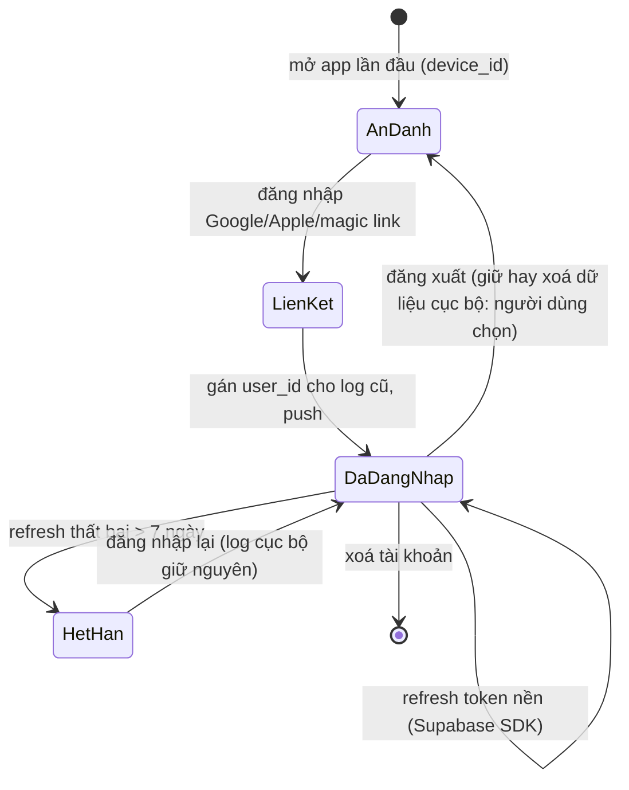

- Token: access ngắn (1 giờ) + refresh do Supabase Auth quản lý; lưu ở secure storage (Keychain/Keystore) trên Flutter, IndexedDB trên web (không cookie bên thứ ba).
- Mọi truy vấn máy chủ qua RLS: `user_id = auth.uid()`; không có API tuỳ biến nên không có bề mặt tấn công thêm.
- Trạng thái HetHan không chặn học: lõi vẫn chạy, chỉ hàng đợi đồng bộ dừng.

**6.3 Phiên học**

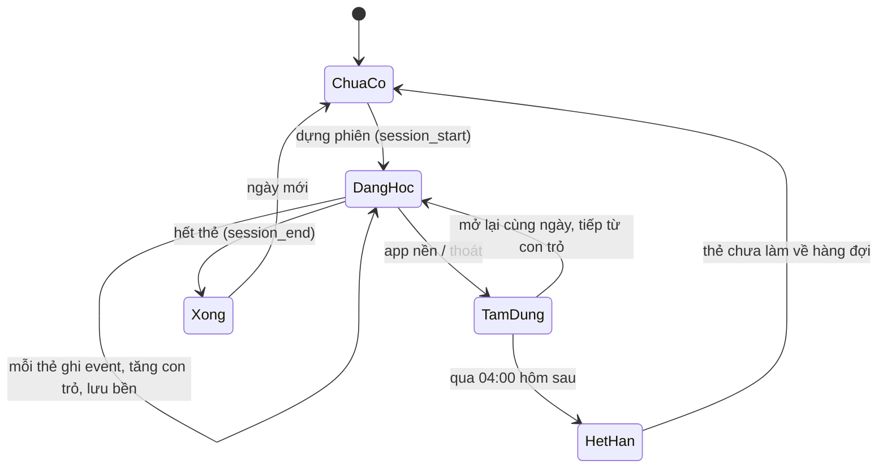

- `session_state` là một bản ghi: id, ngày, danh sách item + dạng bài, con trỏ, bắt đầu lúc; ghi sau mỗi thẻ (FR-12).
- Quiz và thử thách là phiên phụ, cùng máy trạng thái nhưng không chặn phiên chính.
- Thông báo được đặt lịch cục bộ ngay khi phiên kết thúc và khi app mở, dựa trên `due` sớm nhất và giờ người dùng chọn (FR-24→26); nội dung thông báo tính sẵn ("5 từ, 3 phút").

## 7. Thiết kế cơ sở dữ liệu

Hai cơ sở dữ liệu tách biệt: **nội dung** (chỉ đọc, đóng gói, giống hệt trên mọi thiết bị) và **người dùng** (đọc/ghi, cục bộ và bản sao máy chủ); chúng chỉ nối nhau qua `item_id` dạng chuỗi ổn định, nên nâng phiên bản nội dung không bao giờ phá dữ liệu người dùng.

**7.1 Cơ sở dữ liệu nội dung (SQLite, mỗi gói một tệp)**

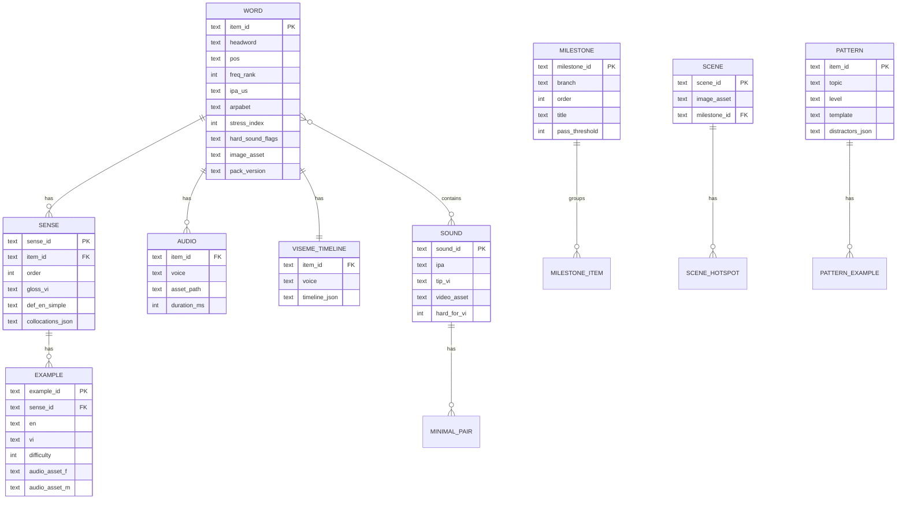

- Chỉ mục: `WORD(freq_rank)`, `WORD(pack_version)`, `EXAMPLE(sense_id, difficulty)`, `SOUND(hard_for_vi)`.
- `item_id` tự nhiên (`w:reluctant#1`, `p:past_simple#3`, `s:th`) để tồn tại qua phiên bản gói và để log người dùng đọc được không cần tra.
- Gói không chứa asset nhị phân; cột \*\_asset là đường dẫn có hash trên CDN. Bảng ACTION\_CLIP(item\_id, rive\_artboard, rive\_state, duration\_ms) cho hoạt hình hành động của động từ/giới từ (FR-33); một .riv chứa nhiều artboard hành động, tra theo item\_id.

**7.2 Cơ sở dữ liệu người dùng (thiết bị: SQLite/IndexedDB; máy chủ: Postgres)**

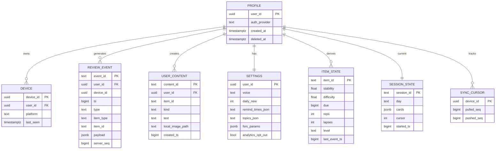

| Bảng | Ở thiết bị | Ở máy chủ | Ghi chú |
| --- | --- | --- | --- |
| REVIEW\_EVENT | Có | Có | Bảng duy nhất tăng theo thời gian; máy chủ có index `(user_id, server_seq)` và unique `(event_id)`; partition theo tháng khi > 50 triệu dòng |
| ITEM\_STATE | Có | Không | Dẫn xuất; máy chủ không cần biết FSRS |
| SESSION\_STATE | Có | Không | Chỉ có nghĩa trên một thiết bị trong một ngày |
| USER\_CONTENT | Có | Có (text); ảnh chỉ khi bật đồng bộ ảnh → Supabase Storage |  |
| SETTINGS | Có | Có | Đồng bộ qua sự kiện `setting_changed`, bảng này là bản chiếu |
| Bộ đếm bản đồ (due\_today, streak…) | Có (bảng nhỏ) | Không | Cập nhật tăng dần sau mỗi sự kiện |
| ANALYTICS\_DAILY | Không | Có | user\_id băm một chiều + ngày + 6 bộ đếm; xoá khi opt-out |

- RLS Postgres: mọi bảng người dùng `using (user_id = auth.uid())`; ANALYTICS\_DAILY không có user\_id thô.
- Xoá tài khoản: `một giao dịch xoá cứng REVIEW_EVENT, USER_CONTENT, SETTINGS, DEVICE và ảnh Storage ngay lập tức; PROFILE giữ deleted_at 30 ngày chỉ để chặn tạo lại lạm dụng, không có dữ liệu học; bản sao lưu DB của nhà cung cấp hết hạn theo chu kỳ của họ. Khớp mục 11.3 và 14 tài liệu yêu cầu`.
- Ước lượng máy chủ: 10.000 người dùng hoạt động × 3 MB/năm ≈ 30 GB/năm ở kịch bản cao — vượt gói miễn phí sau \~2 tháng nếu tất cả đều đăng nhập; thực tế tỉ lệ tạo tài khoản \~30% và người dùng ít hoạt động, nên gói miễn phí kéo được năm đầu; sau đó chuyển Cloudflare D1 hoặc nén sự kiện theo tháng.

**7.3 Định dạng tệp sao lưu (.zip)**

`manifest.json` (phiên bản, user\_id băm, số sự kiện), `events.ndjson` (một sự kiện/dòng), `user_content.ndjson`, `settings.json`, `images/` (tuỳ chọn). Định dạng mở, tài liệu hoá; công cụ chuyển sang CSV/Anki đọc `events.ndjson` là đủ.

## 8. Đối chiếu với tài liệu yêu cầu

Đối chiếu 54 yêu cầu chức năng và 10 yêu cầu phi chức năng của tài liệu [Phân tích yêu cầu](https://claude.ai/code/artifact/259cf93b-e5d0-4226-9333-d62b6d92a296) với thiết kế này: sau vòng rà soát đồng nhất, 61 FR (kể cả FR-55→61 bổ sung) đều có thành phần chịu trách nhiệm; 2 NFR đã điều chỉnh chỉ tiêu trong tài liệu yêu cầu; các điểm thiết kế đi xa hơn yêu cầu đã được ghi ngược vào mục 14 của tài liệu yêu cầu.

**8.1 Ma trận FR → thành phần**

| Nhóm FR | Thành phần chịu trách nhiệm | Mục | Trạng thái |
| --- | --- | --- | --- |
| FR-01→04 Kiểm tra đầu vào, lộ trình | Lõi: placement estimator; Kho nội dung freq\_rank; MILESTONE | 3.1, 7.1 | Đủ |
| FR-05→08 Thẻ từ | WORD/SENSE/EXAMPLE/AUDIO/VISEME; cache asset | 4.1, 7.1 | Đủ; FR-08 đồng tự khác âm → hai item\_id riêng (`w:wind#1`, `w:wind#2`) |
| FR-09→13 Phiên học | Session builder; session\_state | 5.3, 6.3 | Đủ |
| FR-14→18 Ôn tập FSRS | Event log; item\_state; ánh xạ cấp; rải thẻ tồn; kiểm tra ngẫu nhiên | 5.1, 5.2, 5.3 | Đủ; `sự kiện spot_check đã có trong` enum 5.1 |
| FR-19→23 Khẩu hình | VISEME\_TIMELINE; Rive; SOUND; video CDN; ghi âm cục bộ | 4.1, 4.5 | Đủ |
| FR-24→26 Nhắc nhở | Lịch cục bộ tính từ due + settings; giảm tần suất theo sự kiện `notification_opened/ignored` | 6.3 | **Đủ; notification\_opened/ignored đã có trong enum 5.1 (FR-61)** |
| FR-27→29 Tiến độ, nhân vật, cột mốc | Bộ đếm dẫn xuất; MILESTONE; Rive state machine biểu cảm | 4.4, 7.2 | Đủ |
| FR-30→31 Tài khoản, xuất/xoá | Supabase Auth; tệp .zip; deleted\_at + job | 6.2, 7.3 | Đủ |
| FR-32→38 Hình ảnh, hành động, cảnh | WORD.image\_asset; Rive action clips; SCENE/SCENE\_HOTSPOT; USER\_CONTENT kind=image | 7.1, 7.2 | Đủ; `**bảng ACTION_CLIP đã thêm ở`** 7.1 |
| FR-39→43 Quiz, thử thách | Event type answer kind=practice; challenge\_progress | 3.3, 5.1 | Đủ |
| FR-44→50 Sao lưu, đổi máy, đồng bộ | Sync push/pull; liên kết tài khoản; .zip | 3.4, 5.4 | Đủ |
| FR-51→54 Cổng ngữ pháp | item\_type enum; PATTERN; nhánh trên MILESTONE.branch; gói theo mô-đun | 5.1, 7.1 | Đủ |

**8.2 NFR → thiết kế**

| NFR | Thiết kế đáp ứng | Nhận xét |
| --- | --- | --- |
| Chi phí biên → 0 | Nội dung tĩnh trên R2 không egress; tính toán ở thiết bị; máy chủ chỉ có sự kiện | Đạt ở quy mô 10k; mục 7.2 chỉ ra điểm phải chuyển D1 hoặc nén khi lịch sử máy chủ vượt 500 MB |
| Offline trọn phiên | Local-first; tải trước 7 ngày | Đạt; ngoại lệ có chủ ý: video miệng thật |
| Mở app → thẻ đầu < 2 s | Bộ đếm dẫn xuất; session\_state lưu bền; không chờ mạng | Đạt |
| Chuyển thẻ < 150 ms | Thẻ kế đã giải mã trong RAM; ghi log + FSRS trong cùng transaction nhỏ | Đạt; cần đo trên máy Android tầm trung |
| Lệch khẩu hình < 50 ms | Tra timeline theo audio.currentTime mỗi frame | Đạt trên web; Flutter cần dùng `just_audio` position stream — chỉ tiêu 50 ms có thể phải nới lên 80 ms trên Android cũ → **điều chỉnh chỉ tiêu** |
| Gói 500 từ < 30 MB | 8 MB nội dung + 15 MB audio một giọng cho từ và câu | Đạt sau sửa Đ2 (tốc độ chậm bằng playbackRate) |
| Không mất tiến độ hai thiết bị | Event log gộp theo event\_id | Đạt theo thiết kế |
| Dùng chung 2 nền tảng | Một gói nội dung; một .riv; đặc tả + test vàng | Đạt, với chi phí cài lõi hai lần |
| WCAG AA web | Thuộc UI, không thuộc kiến trúc | Ngoài phạm vi tài liệu này |
| Đo lường ẩn danh, tắt được | ANALYTICS\_DAILY băm một chiều; cờ opt-out | Đạt; cần ghi vào Data Safety form (mục 10.3 tài liệu yêu cầu) |

**8.3 Thiết kế đi xa hơn yêu cầu — đã ghi ngược vào tài liệu yêu cầu, mục 14 (FR-56→61)**

1. Định danh ẩn danh theo thiết bị trước khi có tài khoản, và cơ chế liên kết log ẩn danh vào tài khoản (mục 6.2) — tài liệu yêu cầu chỉ nói "dùng được không cần tài khoản".
2. Phiên học hết hạn lúc 04:00 hôm sau (mục 5.3) — tài liệu yêu cầu chưa định nghĩa "ngày".
3. Tối ưu tham số FSRS theo người dùng khi ≥ 1.000 lượt (mục 5.2) — chưa có trong FR.
4. Undo là sự kiện mới, không xoá sự kiện (mục 5.1) — tài liệu yêu cầu chưa nói tới thao tác "chấm nhầm".

**8.4 Rủi ro kỹ thuật còn lại**

| Rủi ro | Ảnh hưởng | Giảm thiểu |
| --- | --- | --- |
| Hai bản cài lõi (TS, Dart) lệch nhau | Lịch ôn khác nhau giữa web và mobile cho cùng người | Test vàng 200 kịch bản chạy trong CI cho cả hai; khoá phiên bản thuật toán trong `setting_changed{fsrs_version}` |
| IndexedDB bị trình duyệt dọn khi thiếu dung lượng | Mất log chưa đồng bộ trên web | Xin `navigator.storage.persist()`; nhắc tạo tài khoản sớm trên web hơn mobile |
| Supabase tạm dừng dự án | Đồng bộ thất bại vài giờ | Ping định kỳ miễn phí; app vẫn học được; hàng đợi bền |
| Rive gói Free có logo trên export | Nhân vật mang logo bên thứ ba | Kiểm tra sớm; dự phòng SVG + CSS animation cho 12 khẩu hình |
| Timing MFA sai ở từ có phoneme không khớp TTS | Khẩu hình lệch âm | Kiểm tự động phoneme TTS == CMUdict trong pipeline (5.5) |
