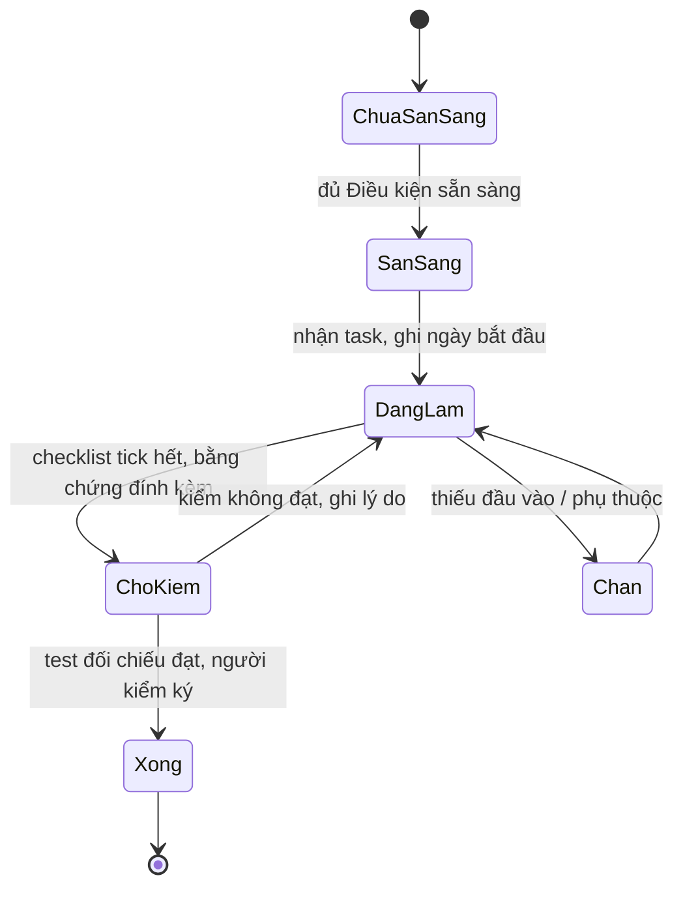
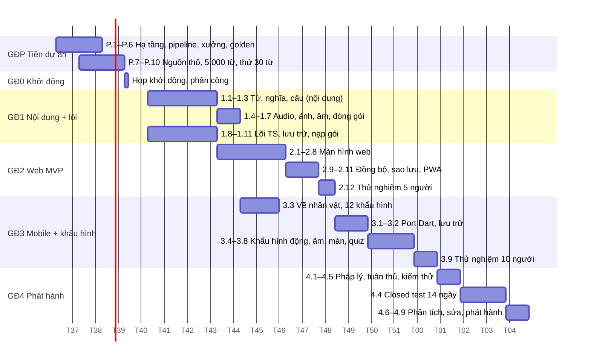
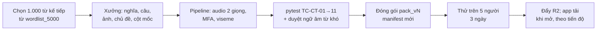

# Kế hoạch dự án — Ứng dụng học từ vựng tiếng Anh

Sep 24, 2026 · @Hugh Nguyen

## 1. Tổng quan kế hoạch

Kế hoạch chia giai đoạn P (tiền dự án, 3 tuần) + 5 giai đoạn, 51 task, ước 131 ngày-người; với 1 người toàn thời gian là \~6 tháng, với 2 người là \~3,5 tháng vì nội dung và mã chạy song song. Mỗi task đối chiếu với FR/NFR trong [tài liệu yêu cầu](https://claude.ai/code/artifact/259cf93b-e5d0-4226-9333-d62b6d92a296), mục trong [kiến trúc](https://claude.ai/code/artifact/6dbeb426-c2d8-402b-b91d-6bed77d6bb16), test trong [tài liệu kiểm thử](https://claude.ai/code/artifact/649814bf-f778-4508-96e9-9e18ae6c4954) và màn hình trong [mockup](https://claude.ai/artifact/BJJpsvciECNVUK4VocwWUq).

**Giả định nguồn lực**

| Giả định | Giá trị | Nếu khác |
| --- | --- | --- |
| Người làm | 1 người kỹ thuật (anh) + 1 người nội dung bán thời gian (tình nguyện/đồng đội) | Không có người nội dung → giai đoạn 1 kéo dài gấp đôi |
| Ngày làm việc | 5 ngày/tuần, 6 giờ hiệu quả | Bán thời gian 3 ngày/tuần → nhân lịch 1,7 |
| Máy | 1 laptop có GPU tầm trung để chạy Kokoro, MFA, Stable Diffusion | Không GPU → Kokoro chạy CPU chậm 5×, SD dùng dịch vụ miễn phí |
| Ngân sách | 0 ngoài Google Play 25 USD ở giai đoạn 4 | — |
| Người thử | 15 người quen, đủ closed test Google | Thiếu → giai đoạn 4 chờ |

**Cột mốc**

| Cột mốc | Điều kiện đạt | Tuần (2 người) | Tuần (1 người) |
| --- | --- | --- | --- |
| M0 Sẵn sàng | Họp khởi động, phân công, bảng theo dõi mở; M-1 (giai đoạn P: hạ tầng, pipeline đầu-cuối 30 từ, xưởng nội dung, nguồn thô, 5.000 từ chốt) đã đạt 3 tuần trước đó | 1 | 1 |
| M1 Lõi + 500 từ | Test vàng đạt trên TS; gói pack\_v1 500 từ qua TC-CT-01→10 | 5 | 9 |
| M2 Web MVP | Web chạy trọn luồng 8 màn, offline, sao lưu .zip; TC P0 web đạt | 9 | 16 |
| M3 Mobile + khẩu hình | Flutter chạy cùng luồng; Rive 12 khẩu hình; trang âm với video thật; test vàng Dart khớp TS | 13 | 22 |
| M4 Phát hành | 15 người thử 14 ngày; tuân thủ CP-01→13; web công khai + Android production | 15 | 25 |

**Nguyên tắc lập lịch**

- Hạ tầng, pipeline, xưởng nội dung và dữ liệu thô làm xong ở giai đoạn P, trước ngày khởi động; ngày khởi động bắt đầu bằng biên soạn nội dung và viết lõi, không có việc cài đặt. Nội dung chạy suốt vì là nút thắt lớn nhất (rà soát mục 3).
- Không viết UI trước khi lõi qua test vàng; không viết Flutter trước khi web MVP dùng được với người thật.
- Mỗi giai đoạn kết thúc bằng một buổi thử nghiệm với ≥ 5 người, kết quả ghi vào bảng theo dõi mục 8.

## 2. Quy trình một task

Mọi task đi qua sáu trạng thái và chỉ được đóng khi có bằng chứng kiểm tra ghi lại được; "xong" nghĩa là người khác mở bằng chứng ra xem là tin được, không cần hỏi người làm.



**Điều kiện sẵn sàng (Definition of Ready)**

- Task có: mục tiêu một câu, checklist bước, ước lượng, tham chiếu FR/kiến trúc/test, danh sách bằng chứng cần nộp.
- Phụ thuộc đã Xong hoặc có bản tạm dùng được.
- Người làm đọc lại mục tài liệu được tham chiếu trước khi bắt đầu.

**Điều kiện hoàn thành (Definition of Done)**

- Checklist tick hết; mỗi bước có ghi chú "kết quả" một dòng.
- Test đối chiếu đạt: test tự động có link lần chạy; test tay có bảng kết quả với input/output thật.
- Bằng chứng đính kèm: link commit/PR, ảnh chụp màn hình hoặc file đầu ra, số đo nếu là NFR.
- Tài liệu liên quan cập nhật nếu task làm thay đổi quyết định (ghi rõ mục nào).
- Người thứ hai kiểm (nếu chỉ có một người: tự kiểm sau ≥ 12 giờ, ghi rõ "tự kiểm").

**Mẫu ghi nhận kết quả (điền cho mỗi task, lưu cùng bảng theo dõi mục 8)**

```markdown
## <ID> <Tên task>
Bắt đầu: <ngày>   Kết thúc: <ngày>   Công thực tế: <ngày-người> (ước: <n>)
Tham chiếu: FR-xx, Kiến trúc §x.y, Test TC-xx-nn, Mockup màn n

### Checklist
- [x] Bước 1 — kết quả: <một dòng: cái gì được tạo ra, ở đâu>
- [x] Bước 2 — kết quả: ...

### Kiểm tra
| Test | Cách chạy | Input | Output thật | Đạt? |
| TC-xx-nn | `npm test -- fsrs` | golden/fsrs.json | 200/200 khớp | Đạt |

### Bằng chứng
- Commit/PR: <link>
- Ảnh/file: <link>
- Số đo: <nếu có>

### Giải thích
Quyết định đã đưa ra trong task, vì sao; điều gì khác với kế hoạch; tài liệu nào đã cập nhật.

### Người kiểm: <tên>  Ngày: <ngày>  Kết luận: Xong / Làm lại (lý do)
```

**Quy ước ước lượng**: đơn vị ngày-người (nđ); task > 5 nđ phải chia nhỏ; ước lượng ghi cả "ước" và "thực tế" để hiệu chỉnh các giai đoạn sau.

## 3P. Giai đoạn P — Chuẩn bị trước khi khởi động dự án (3 tuần, 14 nđ)

Hạ tầng và dữ liệu từ vựng thô phải sẵn sàng **trước ngày khởi động**, để tuần 1 của dự án bắt đầu bằng việc làm sản phẩm chứ không phải cài đặt và tải dữ liệu. Giai đoạn này gom các task hạ tầng cũ 0.1–0.6 và task dữ liệu 1.1, thêm bước tải và chuẩn hoá nguồn thô; kết thúc bằng cột mốc M-1 "Sẵn sàng khởi động".

**3P.1 Hạ tầng**

| ID | Task | Làm gì | Checklist | Công | Đối chiếu | Bằng chứng kết quả |
| --- | --- | --- | --- | --- | --- | --- |
| P.1 | Repo, CI, quét giấy phép | (thay 0.1) Monorepo, GitHub Actions, allowlist giấy phép, bảo vệ nhánh | ☐ Cấu trúc `content/ core-spec/ web/ mobile/ golden/ tools/` ☐ CI chạy Vitest, flutter test, pytest rỗng ☐ license-checker + flutter\_oss\_licenses ☐ Nhánh main bảo vệ | 1,5 | Kiến trúc §2; Yêu cầu §13.2; TC-CP-01/02 | Link repo, CI xanh |
| P.2 | Máy chủ, CDN, web tĩnh | (thay 0.4) Supabase (Auth 3 cách, bảng, RLS), R2 bucket, Pages site; cron ping chống tạm dừng | ☐ Bảng review\_event, profile, user\_content, settings ☐ RLS `user_id = auth.uid()` ☐ R2 public-read ☐ Pages deploy trang trống ☐ GitHub Action ping Supabase mỗi 3 ngày | 1,5 | Kiến trúc §2, §7.2; TC-AU-04 | Ảnh dashboard; link Pages; TC-AU-04 sơ bộ |
| P.3 | Môi trường pipeline | (thay 0.2) Python env: kaikki, cmudict, Kokoro, MFA, ffmpeg, cairosvg, Stable Diffusion cục bộ | ☐ Kokoro sinh 5 từ × 2 giọng ☐ MFA căn 5 từ ☐ ffmpeg Opus ☐ SD sinh 1 ảnh thử ☐ Ghi thời gian/từ | 1,5 | Kiến trúc §5.5 | 5 audio, 5 TextGrid, 1 ảnh, bảng thời gian |
| P.4 | Chốt giọng đọc | (thay 0.3) Nghe thử 5 giọng, 3 người chấm, chọn 1 Nữ + 1 Nam | ☐ 25 mẫu × 5 giọng ☐ Bảng điểm ☐ Ghi vào Yêu cầu §8.3 | 0,5 | Yêu cầu §8.3 | Bảng điểm, quyết định |
| P.5 | Xưởng nội dung | (thay 0.6) Công cụ duyệt cục bộ theo mục 4.3 | ☐ Đọc/ghi CSV, phím tắt, nghe/xem, link nguồn ☐ Hàng đợi duyệt lần 2 ☐ Đo giây/từ | 3 | Mục 4.3; Yêu cầu §6.3, §6.4 | Video 10 từ; số đo |
| P.6 | Đặc tả lõi và test vàng | (thay 0.5) Đặc tả 4 module + golden JSON, review chéo | ☐ Đặc tả FSRS, cấp, dựng phiên, placement ☐ 200 + 8 + 3 kịch bản ☐ Review | 1,5 | Kiến trúc §5.2, §5.3; Test §2.4, §3 | File golden có ngày review |

**3P.2 Dữ liệu từ vựng thô**

| ID | Task | Làm gì | Checklist | Công | Đối chiếu | Bằng chứng kết quả |
| --- | --- | --- | --- | --- | --- | --- |
| P.7 | Tải và ghi nhận nguồn | Tải NGSL 1.2, NAWL, CMUdict, kaikki English JSONL, Tatoeba (eng, vie, links), WordNet; lưu bản gốc + hash + ngày + giấy phép | ☐ 6 nguồn tải về `content/raw/` ☐ `SOURCES.md`: URL, ngày, hash, giấy phép, điều kiện ghi công ☐ Mở file kiểm giấy phép thật (Wiktionary CC-BY-SA 4.0, Tatoeba CC-BY 2.0 FR, CMUdict BSD) ☐ Cập nhật tab Bằng chứng xác thực cho 2 nguồn chưa mở | 1 | Yêu cầu §6.1, §13; tab Bằng chứng xác thực | `SOURCES.md`; ảnh trang giấy phép |
| P.8 | Chuẩn hoá và ghép nguồn | Script ghép: mỗi headword → hạng NGSL/NAWL, pos, ARPAbet, IPA US/UK, danh sách nghĩa kaikki, câu Tatoeba có bản Việt; xuất `lexicon_raw.sqlite` | ☐ Chuẩn hoá chính tả, tách đồng tự khác âm theo CMUdict (2 dòng) ☐ Ghép kaikki theo headword + pos ☐ Ghép Tatoeba theo từ xuất hiện đúng dạng ☐ Thống kê phủ: % từ có IPA, có ≥ 1 nghĩa, có ≥ 1 câu Việt | 2 | Kiến trúc §5.5; Yêu cầu §6.2 | `lexicon_raw.sqlite`; báo cáo phủ |
| P.9 | Danh sách 5.000 từ và đợt | (thay 1.1) Xếp 5.000 từ theo tần suất, chia 5 đợt, gắn cờ 20 âm khó, cột mốc và chủ đề cho đợt 1 | ☐ 2.809 NGSL + NAWL + bù kaikki đến 5.000 ☐ Cờ âm khó theo ARPAbet ☐ Đợt 1 = 500 từ, 3 cột mốc có tên ☐ 30 từ giả cho placement (TC-CT-09) | 1,5 | Yêu cầu FR-02, §8.3; Test TC-CT-09 | `wordlist_5000.csv`, `pack1_words.csv` |
| P.10 | Thử pipeline đầu-cuối trên 30 từ | Chạy toàn bộ pipeline + xưởng + pytest trên `pack_test_v1` (30 từ của tài liệu kiểm thử) | ☐ 30 từ qua P.8 → nghĩa → câu → audio → MFA → viseme → ảnh → đóng gói ☐ pytest TC-CT-01→10 ☐ Đo tổng phút/từ | 0,5 | Test §2.1, §6.1 | `pack_test_v1` trên R2; log pytest; số đo |

**Điều kiện đóng giai đoạn P (M-1 Sẵn sàng khởi động):** CI xanh; Supabase/R2/Pages có địa chỉ; pipeline chạy đầu-cuối trên 30 từ với pytest 10/10; xưởng nội dung dùng được; `SOURCES.md` đầy đủ; danh sách 5.000 từ và đợt 1 chốt; giọng chốt; golden có review.

Các task 0.1–0.6 và 1.1 ở mục 3 và 4 dưới đây được thay bằng P.1–P.9; giữ nguyên bảng để tra ID cũ, không làm lại.

## 3. Giai đoạn 0 — Khởi động (tuần 1, 1 nđ) — task 0.1–0.6 đã chuyển sang giai đoạn P

Tuần 1 chỉ còn một việc: họp khởi động — xác nhận M-1 đạt, phân công dòng nội dung và dòng kỹ thuật, mở bảng theo dõi. Bảng dưới giữ để tra ID cũ; công thực tế ghi ở P.1–P.6.

| ID | Task | Làm gì | Checklist | Công | Đối chiếu | Bằng chứng kết quả |
| --- | --- | --- | --- | --- | --- | --- |
| 0.1 | Dựng repo và CI | Monorepo `content/`, `core-spec/`, `web/`, `mobile/`, `golden/`; GitHub Actions chạy lint, test, quét giấy phép | ☐ Tạo repo, cấu trúc thư mục ☐ Vitest và flutter test chạy rỗng qua CI ☐ `license-checker` + `flutter_oss_licenses` chạy, allowlist giấy phép ☐ Bảo vệ nhánh main | 1,5 | Kiến trúc §2; Yêu cầu §13.2; TC-CP-01/02 | Link repo, link lần chạy CI xanh đầu tiên, ảnh bảng allowlist |
| 0.2 | Cài pipeline nội dung | Python env với kaikki, cmudict, Kokoro, MFA, ffmpeg, cairosvg; chạy thử 5 từ | ☐ Kokoro sinh audio "hello" 2 giọng ☐ MFA căn 5 từ, xuất TextGrid ☐ ffmpeg → Opus 24 kbps ☐ Đo thời gian/từ để ước giai đoạn 1 | 1,5 | Kiến trúc §5.5; Yêu cầu §6.1, §8.3 | 5 file audio, 5 TextGrid, bảng thời gian đo được |
| 0.3 | Chốt giọng đọc | Nghe thử af\_heart/af\_bella/af\_sarah và am\_michael/am\_adam trên 20 từ + 5 câu, chọn 1 Nữ + 1 Nam | ☐ Sinh 25 mẫu × 5 giọng ☐ 3 người nghe chấm rõ/tự nhiên 1–5 ☐ Ghi quyết định vào Yêu cầu §8.3 | 0,5 | Yêu cầu §8.3, bước 8.4.1 | Bảng điểm, quyết định ghi trong tài liệu |
| 0.4 | Tạo Supabase, R2, Pages | Dự án Supabase (Auth: Google, Apple, magic link), bucket R2, site Pages; cấu hình RLS khung | ☐ Supabase project + bảng review\_event, profile, user\_content, settings ☐ RLS `user_id = auth.uid()` ☐ R2 bucket public-read, tên tệp có hash ☐ Pages deploy trang trống | 1 | Kiến trúc §2, §7.2; Test TC-AU-04 | Ảnh dashboard, link Pages, kết quả TC-AU-04 sơ bộ |
| 0.5 | Viết đặc tả lõi và bộ test vàng | Đặc tả FSRS mặc định, ánh xạ cấp, dựng phiên, placement bằng văn bản + sinh `golden/*.json` từ ts-fsrs | ☐ Đặc tả 4 module trong `core-spec/` ☐ Sinh 200 kịch bản FSRS ☐ 8 kịch bản dựng phiên (SB-01→06 + 2) ☐ 3 kịch bản placement ☐ Review chéo bởi người thứ hai | 1,5 | Kiến trúc §5.2, §5.3; Test §2.4, §3; Yêu cầu FR-60 | File golden, đặc tả có ngày và người review |

**Điều kiện đóng giai đoạn 0 (M0):** CI xanh; pipeline sinh được audio + timing; giọng đã chốt; máy chủ và CDN có địa chỉ; file golden tồn tại và được review.

## 4. Giai đoạn 1 — Nội dung 500 từ và lõi học (tuần 1–4, 32 nđ; task 1.1 đã chuyển thành P.9)

Hai dòng công việc song song: nội dung (1.1–1.7, người nội dung + pipeline) và lõi học (1.8–1.11, kỹ thuật). Cả hai gặp nhau ở M1: gói `pack_v1` qua kiểm tra pipeline và lõi qua test vàng.

**4.1 Dòng nội dung**

| ID | Task | Làm gì | Checklist | Công | Đối chiếu | Bằng chứng kết quả |
| --- | --- | --- | --- | --- | --- | --- |
| 1.1 | Danh sách từ đợt 1 | 500 từ đầu theo NGSL 1.2, gắn freq\_rank, pos, cờ âm khó, cột mốc m1–m3 | ☐ Lấy NGSL, lọc 500 hạng đầu ☐ Gắn CMUdict ARPAbet, IPA kaikki ☐ Gắn cờ âm khó theo bảng 20 âm ☐ Chia 3 cột mốc có tên (Chào hỏi, Gia đình, Đi chợ đi ăn) | 2 | Yêu cầu FR-02, §6.1, §6.2; Kiến trúc §7.1 | `words_pack1.csv` 500 dòng, 0 dòng thiếu IPA |
| 1.2 | Nghĩa và định nghĩa | 1–3 nghĩa/từ theo tiêu chí §6.3; nghĩa Việt ≤ 8 từ; định nghĩa Anh đơn giản | ☐ LLM xếp hạng nghĩa từ kaikki ☐ Người duyệt chốt nghĩa, viết nghĩa Việt ☐ Định nghĩa Anh viết lại ≤ 12 từ ☐ Đo thời gian/từ sau 50 từ đầu, cập nhật ước lượng | 6 | Yêu cầu FR-05, FR-07, §6.3 T4 | `senses_pack1.csv`; bảng định mức đo được |
| 1.3 | Câu ví dụ | 2 câu/từ (1.000 câu), tình huống Việt Nam, 6–12 từ, kèm nghĩa Việt | ☐ Lấy Tatoeba có bản Việt ☐ LLM sinh câu thiếu theo mẫu §6.3 ☐ Duyệt theo checklist 5 mục ☐ Kiểm tự động độ dài và hạng từ (TC-CT-06) | 8 | Yêu cầu FR-06, §6.3 T5; Test TC-CT-06 | `examples_pack1.csv`; log TC-CT-06 đạt |
| 1.4 | Audio và timing | Sinh audio 2 giọng cho 500 từ + 1.000 câu; MFA căn; ánh xạ viseme | ☐ Kokoro batch ☐ Chuẩn −16 LUFS, Opus ☐ MFA TextGrid ☐ ARPAbet→viseme JSON ☐ So phoneme với CMUdict, xuất mismatch.csv, duyệt tay | 2 | Kiến trúc §5.5; Test TC-CT-02→05 | 3.000 file audio, 1.000 timeline, mismatch.csv ≤ 2% |
| 1.5 | Ảnh tình huống | Ảnh cho \~200 danh từ cụ thể trong đợt 1, cùng phong cách và seed | ☐ Prompt mẫu + seed cố định ☐ Sinh 4 ảnh/từ, chọn 1 ☐ WebP 512 px ☐ Ghi source=self, license=own | 3 | Yêu cầu FR-32, §5.9, §9.1 | Thư mục ảnh + bảng chọn |
| 1.6 | Nội dung 20 âm khó | Mẹo tiếng Việt, cặp tối thiểu, ví dụ cho 20 âm; quay video miệng thật cho 44 âm + 30 từ | ☐ Viết mẹo và cặp ☐ Quay 1 buổi, cắt 3 s/âm, nén 480p ☐ Người duyệt ngữ âm xem toàn bộ, ký | 3 | Yêu cầu FR-20→22, FR-55, §6.4 T2 | `sounds.csv`, 74 clip, biên bản duyệt có tên |
| 1.7 | Đóng gói pack\_v1 | SQLite nội dung + manifest có hash; đẩy R2; chạy pytest pipeline | ☐ Script đóng gói ☐ TC-CT-01→10 đạt ☐ Trang ghi công sinh tự động ☐ Upload R2, manifest công khai | 2 | Kiến trúc §5.5, §7.1; Test §6.1; Yêu cầu §13 | Log pytest 10/10; link manifest; kích thước gói |

**4.2 Dòng lõi học**

| ID | Task | Làm gì | Checklist | Công | Đối chiếu | Bằng chứng kết quả |
| --- | --- | --- | --- | --- | --- | --- |
| 1.8 | Lõi TS: FSRS + cấp | Gói `core-ts`: bọc ts-fsrs, ánh xạ 5 cấp, rebuild state từ log | ☐ `fsrs.next`, `fsrs.preview` ☐ `level.of` theo FR-60 ☐ `state.rebuild` idempotent ☐ Chạy TC-FS-01→05 | 2 | Kiến trúc §5.1, §5.2; Test §3.2 | Vitest 200/200 golden |
| 1.9 | Lõi TS: dựng phiên + placement | `session.build`, `assignExercise`, `placement.estimate` | ☐ Thứ tự dễ–xen–dễ ☐ Rải thẻ tồn ☐ Loại từ known ☐ Xen dạng bài ☐ Tách đồng tự khác âm ☐ TC-SB-01→06, TC-PL-01→03 | 3 | Kiến trúc §5.3; Test §3.1, §3.3; Yêu cầu FR-09→13, FR-17 | Vitest xanh; file kết quả để so với Dart sau |
| 1.10 | Mô hình sự kiện và lưu trữ web | Dexie schema: review\_event, item\_state, session\_state, settings, bộ đếm; ghi log + state trong một transaction | ☐ Schema và index ☐ append event + upsert state atomic ☐ Bộ đếm bản đồ cập nhật tăng dần ☐ TC-GR-03, TC-SB-07/08 với fake-indexeddb | 2 | Kiến trúc §4.2, §5.1, §7.2 | Test tích hợp xanh |
| 1.11 | Nạp gói nội dung trên web | Tải manifest, tải gói theo hash, nhập vào IndexedDB hoặc OPFS; cache asset qua service worker | ☐ Đọc manifest, so hash ☐ Nhập 500 từ < 10 s ☐ Service worker cache-first cho audio/ảnh ☐ Tải trước phiên 7 ngày ☐ TC-CD-08 | 3 | Kiến trúc §6.1; Test TC-CD-08, TC-NF-04 | Số đo thời gian nhập, dung lượng cache |

**4.3 Công cụ làm dữ liệu và kế hoạch kiểm tra dữ liệu**

Cần một công cụ duyệt nội dung riêng, vì 670 giờ duyệt của giai đoạn 1–3 là chi phí lớn nhất dự án: một công cụ tối giản làm trong 3 ngày, nếu chỉ tăng tốc duyệt 20%, tiết kiệm \~130 giờ; Google Sheets đủ cho bảng từ và nghĩa nhưng không xem được ảnh, nghe audio và khẩu hình cạnh nhau, là chỗ duyệt chậm nhất.

| ID | Task | Làm gì | Checklist | Công | Đối chiếu | Bằng chứng kết quả |
| --- | --- | --- | --- | --- | --- | --- |
| 0.6 | Xưởng nội dung (content workbench) | App web cục bộ (React, đọc/ghi CSV/SQLite trong repo): mỗi màn một từ, hiện nghĩa ứng viên, câu ứng viên, 4 ảnh ứng viên, nút nghe 2 giọng, khẩu hình tĩnh, nguồn và giấy phép; phím tắt duyệt/sửa/loại; ghi người duyệt và thời điểm | ☐ Đọc pipeline output, ghi `review_status` từng trường ☐ Phím: J/K chuyển từ, 1–4 chọn ảnh, A duyệt, E sửa, X loại ☐ Hiện link nguồn kaikki/Tatoeba và cờ giấy phép ☐ Hàng đợi "cần duyệt lần 2" cho bản ghi bị sửa ☐ Xuất lại CSV cho pipeline ☐ Đo thời gian/từ tự động | 3 | Yêu cầu §6.3, §6.4, §13.1; Kiến trúc §5.5 | Video 2 phút duyệt 10 từ; số đo giây/từ |

**Kế hoạch kiểm tra dữ liệu** (áp cho mọi đợt, chạy trong xưởng nội dung và pytest)

| Lớp kiểm | Kiểm cái gì | Cách | Tiêu chí đạt | Ghi nhận |
| --- | --- | --- | --- | --- |
| Xác minh nguồn | Mỗi bản ghi nghĩa, câu, phiên âm, ảnh có `source` (URL hoặc "self") và `license` trong allowlist | Tự động (pytest TC-CT-07) + xưởng hiện link nguồn để người duyệt bấm kiểm 1 trong 20 bản ghi | 100% có nguồn; mẫu 5% mở link đúng nội dung | Cột `source_checked_by`, ngày |
| Nghĩa và định nghĩa | Nghĩa Việt đúng, ngắn, phổ biến; định nghĩa Anh đơn giản, không lặp từ đang học | Người duyệt 1 duyệt hết; người duyệt 2 duyệt ngẫu nhiên 20%; bất đồng → cả hai xem lại | Bất đồng ≤ 5% ở mẫu 20%; nếu > 5% duyệt lại 100% | `review_status`, tên 2 người duyệt |
| Câu ví dụ | 5 mục checklist §6.3: ngữ pháp, tự nhiên, không nhạy cảm, nghĩa Việt khớp, dạng từ đúng; độ dài và hạng từ | Tự động độ dài/hạng (TC-CT-06) + người duyệt 100% | 0 câu vi phạm tự động; người duyệt tick 5/5 | Tick từng mục trong xưởng |
| Phiên âm và audio | IPA khớp CMUdict; audio đúng từ, đúng trọng âm, đồng tự khác âm đúng biến thể | Tự động so phoneme (TC-CT-04/05) + người duyệt ngữ âm nghe 100% từ khó và 5% ngẫu nhiên | mismatch ≤ 2% đã duyệt tay; 0 lỗi ở từ khó | `audio_checked_by` |
| Ảnh minh hoạ | Đúng nghĩa, đúng bối cảnh Việt Nam, không chữ, không IP, phong cách đồng nhất | Người duyệt chọn 1/4 hoặc loại cả 4 (sinh lại); người thứ hai lướt 10% | ≥ 90% từ có ảnh đạt sau 2 vòng sinh | Chỉ số ảnh chọn, lý do loại |
| Khẩu hình và mặt cắt | Timeline hợp lệ (TC-CT-03); hình mặt cắt đúng vị trí lưỡi cho 20 âm | Tự động + người duyệt ngữ âm xem 20 hình | Ký duyệt 20/20 | Biên bản duyệt ngữ âm |
| Từ khoá liên tưởng | Chỉ cho từ "quên nhiều" theo dữ liệu thật; không phản cảm | Người duyệt 100% | — | `review_status` |
| Nhất quán chéo | Cùng từ không có 2 nghĩa trùng; câu không dùng từ ngoài kho + 500 từ đầu; ảnh không dùng cho 2 từ | Tự động (pytest) | 0 vi phạm | Log pytest |

Quy trình cho mỗi bản ghi: pipeline sinh → người duyệt 1 trong xưởng (đạt / sửa / loại) → bản ghi bị sửa vào hàng đợi duyệt lần 2 → pytest toàn gói → đóng gói. Mỗi bản ghi mang `source`, `license`, `review_status`, `reviewed_by`, `reviewed_at`; gói chỉ nhận bản ghi `approved`. Định mức mục tiêu sau khi có xưởng: 3 phút/từ (nghĩa + ảnh + audio) và 40 giây/câu; đo lại ở 50 từ đầu và ghi vào 1.2.

**4.4 Danh sách từ và động cơ quiz (bổ sung, 7 nđ)**

| ID | Task | Làm gì | Checklist | Công | Đối chiếu | Bằng chứng kết quả |
| --- | --- | --- | --- | --- | --- | --- |
| 1.12 | Gắn chủ đề cho từ | Bộ \~30 chủ đề tiếng Việt; LLM gợi ý 1–3 chủ đề/từ, người duyệt chốt trong xưởng; WORD\_TOPIC vào gói | ☐ Danh sách chủ đề có thứ tự và icon ☐ Gợi ý LLM ☐ Duyệt 500 từ đợt 1 ☐ TC-CT-11 | 2 | FR-62; Kiến trúc §5.6, §7.1 | `topics.csv`, `word_topic.csv`; pytest |
| 1.13 | Lõi: hàng đợi từ mới và chọn quiz | `next_new`, `quiz.pick` có trọng số và seed, `quiz.distractors`; thêm vào golden | ☐ 4 mức ưu tiên FR-62 ☐ Trọng số theo bảng §5.6 ☐ Nhiễu cùng loại từ, loại đồng nghĩa (WordNet) ☐ TC-SB-09/10, TC-QZ-06→08 vàng ☐ Port Dart ở 3.1 | 3 | FR-62, FR-65; Kiến trúc §5.6 | Vitest golden; file kết quả để so Dart |
| 2.13 | Danh sách của tôi và danh sách động | USER\_LIST trên web: tạo, thêm từ thẻ, bật ưu tiên, lọc quiz; danh sách động ở màn Luyện tập; đồng bộ `list_changed` | ☐ CRUD danh sách ≤ 200 từ ☐ Nút "thêm vào danh sách" trên thẻ ☐ Bộ lọc chủ đề/danh sách ở quiz ☐ 5 danh sách động ☐ TC-LS-01→03, TC-QZ-09 | 2 | FR-63, FR-64; Kiến trúc §5.6, §7.2 | TC đạt; ảnh màn |

Mobile dùng lại lõi Dart (3.1) và thêm màn danh sách trong 3.6; không thêm task riêng.

**Điều kiện đóng giai đoạn 1 (M1):** pack\_v1 trên R2 qua 10/10 pytest; lõi TS qua toàn bộ test vàng; người duyệt ngữ âm đã ký; định mức nội dung đo được để lập lịch đợt 2.

## 5. Giai đoạn 2 — Web PWA MVP (tuần 6–9, 30 nđ)

Mục tiêu: một người thật học được trọn vòng lặp hằng ngày trên web, offline, có sao lưu; khẩu hình ở giai đoạn này là hình tĩnh, hoạt hình Rive để giai đoạn 3.

| ID | Task | Làm gì | Checklist | Công | Đối chiếu | Bằng chứng kết quả |
| --- | --- | --- | --- | --- | --- | --- |
| 2.1 | Khung app, thiết kế hệ thống | Vite + React + TS; token màu/chữ theo mockup; layout mobile-first + hai cột desktop; điều hướng | ☐ Token: kem, mực, san hô, bạc hà, xanh đêm; Fredoka/Nunito ☐ Thành phần nút chính/phụ, thanh tiến độ, chip IPA ☐ Route 15 màn ☐ axe 0 lỗi nghiêm trọng trên khung | 2 | Thiết kế UI/UX §3; Mockup | Storybook hoặc trang demo thành phần; ảnh chụp |
| 2.2 | Màn 1 Kiểm tra đầu vào + onboarding | 20 từ + từ giả, kết quả bản đồ tô sẵn, hỏi giờ học và mục tiêu, học 3 từ đầu | ☐ Nối `placement.estimate` ☐ Màn kết quả "bạn đã biết N từ" ☐ Câu hỏi giờ/mục tiêu lưu settings ☐ TC-PL-04 | 2 | FR-01→04, FR-56; Kiến trúc §3.1; Mockup màn 1 | Video 1 phút luồng onboarding; TC-PL-04 đạt |
| 2.3 | Màn 2 Bản đồ | Bản đồ cột mốc, thẻ Hôm nay với 3 con số và phút ước tính, streak có ngày nghỉ | ☐ Đọc bộ đếm dẫn xuất ☐ Cột mốc đã qua/đang/khoá ☐ Streak 2 ngày nghỉ/tuần ☐ Trạng thái quay lại sau nghỉ (TC-DN-03) | 2 | FR-04, FR-27; Kiến trúc §4.4; Mockup màn 2, Web 1 | Ảnh 3 trạng thái; TC-DN-03, TC-PG-02 đạt |
| 2.4 | Màn 3 Thẻ từ mới (khẩu hình tĩnh) | Từ, IPA chạm được, audio thường/chậm, khẩu hình tĩnh theo âm tiết nhấn, ảnh, câu, hộp âm khó, nói theo | ☐ Tự phát audio ☐ playbackRate 0,75 ☐ Chạm IPA → sheet khẩu hình tĩnh + mẹo ☐ Ghi âm 3 s cục bộ ☐ Đồng tự khác âm đúng audio ☐ TC-CD-01→07 | 3 | FR-05→08, FR-19→20, FR-23; Kiến trúc §4.1; Mockup màn 3, Web 2 | TC-CD đạt; ảnh sheet IPA |
| 2.5 | Màn 4 Bài luyện (5 dạng) | choose\_meaning, listen\_choose, fill\_sentence, listen\_type, type\_from\_meaning; gợi ý chữ cái; gần đúng | ☐ 5 dạng theo cấp ☐ Gợi ý tối đa 2, hạ trần tự chấm ☐ Levenshtein ≤ 1 → gần đúng ☐ TC-EX-01→04 | 3 | FR-11, FR-41; Kiến trúc §5.3; Mockup màn 4 | TC-EX đạt |
| 2.6 | Màn 5 Tự chấm + hoàn tác | 4 nút với khoảng cách preview, cấp hiển thị, hoàn tác 5 s | ☐ `fsrs.preview` cho 4 nút ☐ Ghi review + state atomic ☐ Hoàn tác = review\_undo ☐ Tự chuyển thẻ 300 ms ☐ TC-GR-01/02/04/05 | 2 | FR-14→16, FR-59; Kiến trúc §4.2; Mockup màn 5 | TC-GR đạt; log mẫu 3 sự kiện hoàn tác |
| 2.7 | Màn 7 Xong hôm nay + thông báo web | Tóm tắt, hé lộ ngày mai, đặt nhắc; web push qua FCM; giảm tần suất khi bỏ qua | ☐ Tổng hợp từ log phiên ☐ Hé lộ = từ mới đầu tiên mai ☐ FCM web push đăng ký ☐ Sự kiện opened/ignored + quy tắc FR-26 ☐ TC-DN-01/02/04 | 2 | FR-24→26, FR-29, FR-61; Kiến trúc §6.3; Mockup màn 7 | TC-DN đạt; ảnh thông báo thật |
| 2.8 | Màn 8 Tiến độ | Thanh 5 cấp, lịch tuần, bộ sưu tập âm, % hiểu, biểu đồ 14 ngày (web) | ☐ Phân bố cấp từ item\_state ☐ % hiểu từ coverage NGSL ☐ Biểu đồ phút học ☐ TC-PG-01→03 | 2 | FR-27; Mockup màn 8, Web 3 | TC-PG đạt |
| 2.9 | Tài khoản, đồng bộ, liên kết ẩn danh | Supabase Auth 3 cách; hàng đợi push/pull theo server\_seq; gán user\_id cho log ẩn danh | ☐ Đăng nhập 3 cách ☐ Push batch idempotent ☐ Pull phân trang có cursor ☐ Liên kết ẩn danh ☐ Backoff khi 5xx ☐ TC-SY-01→08, TC-AU-01→03/06 | 4 | FR-30, FR-44→48, FR-56; Kiến trúc §5.4, §6.2 | TC-SY, TC-AU đạt trên mock; SY-01→04 trên Supabase thật |
| 2.10 | Màn 11 Dữ liệu: xuất/nhập .zip, xoá tài khoản | Định dạng sao lưu §7.3; nhập có xem trước; xoá cứng máy chủ; nhắc sao lưu ngày 3/14 | ☐ Xuất zip ☐ Nhập gộp theo event\_id ☐ Xem trước N từ/M ngày ☐ Xoá tài khoản 2 bước ☐ TC-BK-01→04/07, TC-AU-05 | 3 | FR-31, FR-44, FR-49; Kiến trúc §7.2, §7.3; Mockup màn 11 | TC-BK, TC-AU-05 đạt; file zip mẫu |
| 2.11 | PWA offline + hiệu năng | Service worker, manifest PWA, tải trước, persist storage; đo NF-01/02/04/05 | ☐ Cài lên màn hình chính ☐ Chế độ máy bay trọn phiên ☐ `storage.persist()` ☐ Đo p90 mở app, chuyển thẻ | 2 | NFR §7; Kiến trúc §6.1; Test TC-NF-01/02/04/05/11 | Bảng số đo thật |
| 2.12 | Thử nghiệm giai đoạn 2 | 5 người dùng web 5 ngày; ghi lỗi và cảm nhận phiên | ☐ Tuyển 5 người ☐ Bảng hỏi sau phiên ☐ Tổng hợp lỗi P0/P1 ☐ Cập nhật tài liệu yêu cầu nếu đổi quyết định | 3 | Yêu cầu §8.4 bước 2 | Biên bản thử, danh sách lỗi có ID |

**Điều kiện đóng giai đoạn 2 (M2):** 5 người hoàn thành ≥ 4/5 phiên; mọi TC P0 web đạt; số đo NF-01/02/04/05 trong ngưỡng; web công khai trên Pages (không quảng bá).

## 6. Giai đoạn 3 — Flutter, khẩu hình động, luyện tập (tuần 10–13, 32 nđ)

Mục tiêu: mobile chạy cùng luồng và cho cùng lịch ôn với web; khẩu hình động và trang âm đủ ba lớp; các dạng luyện tập và quiz có mặt trên cả hai nền tảng.

| ID | Task | Làm gì | Checklist | Công | Đối chiếu | Bằng chứng kết quả |
| --- | --- | --- | --- | --- | --- | --- |
| 3.1 | Port lõi sang Dart | `core_dart`: FSRS, cấp, rebuild, dựng phiên, placement; chạy cùng golden | ☐ Port 4 module ☐ `flutter test` với golden ☐ Script so file kết quả TS–Dart, sai lệch 0 ☐ CI chạy cả hai | 4 | Kiến trúc §2 lõi dùng chung, §8.4; Test §3, checklist "Khớp TS–Dart" | CI: 15/15 Dart, diff = 0 |
| 3.2 | Lưu trữ và nạp gói trên Flutter | drift schema như Dexie; nạp SQLite gói trực tiếp; cache asset LRU 300 MB | ☐ Schema + index ☐ Transaction log+state ☐ Nạp pack\_v1 < 10 s ☐ LRU + pinned tải trước ☐ TC-GR-03, TC-SB-07/08, TC-CD-08 trên mobile | 3 | Kiến trúc §6.1, §7.2 | Test tích hợp xanh; số đo nạp |
| 3.3 | Vẽ nhân vật và 12 khẩu hình | Bản 2D phẳng phi hành gia kính mở, 12 khẩu hình, 6 biểu cảm, mặt cắt nghiêng cho 20 âm; dựng Rive | ☐ Vẽ vector Inkscape từ SVG nháp ☐ 12 lớp miệng cùng khung ☐ State machine `viseme` 0–11, `mood` 0–5 ☐ Xuất .riv, kiểm logo gói Free ☐ 10 người xem 5 âm khó, ≥ 7 bắt chước được | 5 | Yêu cầu FR-19→22, FR-28, §9.2→9.4; Kiến trúc §2 Rive; Test TC-CP-12 | File .riv; ảnh 12 khẩu hình; biên bản thử 10 người |
| 3.4 | Khẩu hình đồng bộ audio (web + Flutter) | Điều khiển Rive theo `currentTime`/position stream; tìm nhị phân timeline; chậm 0,75× | ☐ Web: rAF + Rive canvas ☐ Flutter: just\_audio position + rive ☐ Đo lệch 20 từ, p90 < 50 ms web, < 80 ms Android ☐ Thay khẩu hình tĩnh ở màn 3 bằng Rive | 3 | Kiến trúc §4.1; NFR lệch; Test TC-NF-03 | Video ghi màn hình + bảng đo |
| 3.5 | Màn 6 Trang âm khó (ba lớp) | Miệng cận, mặt cắt, video thật từ CDN; cặp dễ nhầm; ghi âm; thuần phục + spot\_check | ☐ Ba lớp + chậm 0,5× ☐ Video cache sau lần đầu, offline xám ☐ Cặp nghe–chọn ☐ sound\_claim + lịch kiểm 14 ngày ☐ TC-SD-01→05 | 3 | FR-20→22, FR-55, FR-18; Mockup màn 6 | TC-SD đạt |
| 3.6 | Flutter: 8 màn lõi | Dựng lại màn 1–5, 7, 8, 11 theo mockup, dùng lõi Dart và thành phần chung | ☐ 8 màn theo mockup ☐ Thông báo cục bộ (flutter\_local\_notifications) + FCM Android ☐ Mic quyền tại chỗ ☐ Chạy lại toàn bộ TC E2E bằng Patrol | 6 | Mockup màn 1–8, 11; Test §4, §5 | Patrol xanh; video luồng đầy đủ |
| 3.7 | Hình ảnh và hành động gợi nhớ | Hoạt hình hành động Rive cho 60 động từ/giới từ phổ biến nhất đợt 1; TPR nhắc; đổi ảnh của tôi; liên tưởng của tôi | ☐ 60 clip ACTION\_CLIP ☐ Dòng nhắc làm động tác ☐ Chụp/chọn ảnh lưu cục bộ ☐ Nhập liên tưởng tự viết ☐ Test tay 10 từ | 4 | FR-32→36; Kiến trúc §7.1 ACTION\_CLIP; Yêu cầu §5.9 | Ảnh 60 clip; TC tay ghi kết quả |
| 3.8 | Màn 9–10 Luyện tập và quiz | Trung tâm luyện tập, quiz 60 s, ghép cặp, điền đoạn văn, thử thách tuần; ghi kind=practice | ☐ Chỉ từ cấp ≥ Nhớ tạm ☐ Quiz dừng vẫn ghi ☐ Kỷ lục cá nhân ☐ Thử thách tự chọn, huy hiệu ☐ TC-QZ-01→05 | 3 | FR-39→43; Mockup màn 9–10; Kiến trúc §3.3 | TC-QZ đạt cả hai nền tảng |
| 3.9 | Thử nghiệm giai đoạn 3 | 10 người, 5 web + 5 Android APK, 7 ngày; đo lệch lịch giữa người dùng hai thiết bị | ☐ Phát APK trực tiếp ☐ 2 người dùng cả web + mobile ☐ So item\_state hai bên (TC-SY-03) ☐ Bảng hỏi khẩu hình | 1 | Yêu cầu §8.4; Test TC-SY-03 | Biên bản; diff state = 0 |

**Điều kiện đóng giai đoạn 3 (M3):** diff TS–Dart = 0; lệch khẩu hình trong ngưỡng; 10 người thử hoàn thành; mọi TC P0 đạt trên cả hai nền tảng.

## 7. Giai đoạn 4 — Thử nghiệm, tuân thủ, phát hành (tuần 14–15 + 14 ngày closed test, 16 nđ)

Mục tiêu: qua closed test Google với 15 người trong 14 ngày, qua toàn bộ kiểm tra tuân thủ, phát hành web công khai và Android production; iOS để sau khi có người dùng thật.

| ID | Task | Làm gì | Checklist | Công | Đối chiếu | Bằng chứng kết quả |
| --- | --- | --- | --- | --- | --- | --- |
| 4.1 | Văn bản pháp lý và trang ghi công | Chính sách riêng tư, điều khoản, trang ghi công sinh tự động; link trong app và console | ☐ Chính sách riêng tư tiếng Việt + Anh ☐ Trang ghi công từ pipeline ☐ Link mở được không cần đăng nhập ☐ TC-CP-09/10 | 1 | Yêu cầu §10.3, §13; Test TC-CP-09/10 | Link 3 trang; ảnh trong app |
| 4.2 | Kiểm tra tuân thủ tự động | Chạy SBOM, giấy phép, allowlist SDK, quyền, host mạng trong CI phát hành | ☐ TC-CP-01→04 xanh ☐ Báo cáo lưu cùng build | 0,5 | Yêu cầu §13.2; Test §7 | Link CI + báo cáo |
| 4.3 | Kiểm tra tuân thủ tay | Proxy 30 phút, Data Safety form, Play Pre-launch report, xoá tài khoản thật, nội dung store | ☐ mitmproxy: host ⊆ allowlist, không email trong URL ☐ Data Safety khớp ☐ Pre-launch 0 cảnh báo ☐ TC-CP-05/07/08/11/12 | 2 | Yêu cầu §10.3, §13.3; Test TC-CP-05→13 | Bảng host proxy; ảnh Data Safety; report |
| 4.4 | Tài khoản Google Play + closed test | Đăng ký 25 USD, tạo app, AAB, tuyển 15 tester, chạy 14 ngày | ☐ Tài khoản, xác minh danh tính ☐ AAB nội bộ ☐ 15 tester đăng ký ☐ Theo dõi 14 ngày liên tục ☐ Xin production access | 2 | Yêu cầu §10.1, §10.2; Test TC-CP-13 | Ảnh Play Console đủ điều kiện |
| 4.5 | Kiểm thử phát hành đầy đủ | Chạy toàn bộ checklist mục 8 tài liệu kiểm thử trên web + Android; đo NF | ☐ 111 test theo bảng ☐ Số đo NF điền bảng ☐ P0 100%, P1 ≤ 3 ☐ Ký quyết định phát hành | 3 | Tài liệu kiểm thử §8 | Checklist đã điền, có tên và ngày |
| 4.6 | Phân tích thử nghiệm 14 ngày | D7, tỉ lệ hoàn thành phiên, tỉ lệ mở thông báo, kiểm tra lại 30 ngày với nhóm giai đoạn 2 | ☐ Truy vấn ANALYTICS\_DAILY ☐ So với mục tiêu §1 và §8.1 tài liệu yêu cầu ☐ Danh sách sửa trước phát hành | 1,5 | Yêu cầu §1 mục tiêu, §8.1; Chiến lược động lực §6 | Báo cáo 1 trang có số |
| 4.7 | Sửa lỗi từ thử nghiệm | Sửa P0/P1 phát hiện ở 4.5 và 4.6 | ☐ Mỗi lỗi có ID, test tái hiện, commit ☐ Chạy lại test liên quan | 3 | — | Danh sách lỗi đóng |
| 4.8 | Phát hành | Web công khai (tên miền hoặc subdomain Pages), Android production, trang giới thiệu; kế hoạch đợt nội dung 2 | ☐ Web tag v1.0 ☐ Android production ☐ Trang giới thiệu không hứa quá ☐ Khởi động đợt 2 theo mục 9 với định mức đo được ở 1.2 | 1 | Yêu cầu §10, §8.1 P1/P2 | Link store, link web, kế hoạch đợt 2 |
| 4.9 | Hồi cứu và cập nhật tài liệu | So ước lượng với thực tế 44 task; cập nhật yêu cầu/kiến trúc/kiểm thử theo quyết định đã đổi | ☐ Bảng ước–thực ☐ Danh sách quyết định đổi và mục tài liệu đã sửa ☐ Bài học 5 dòng | 1 | Tất cả | Biên bản hồi cứu |

**Điều kiện đóng giai đoạn 4 (M4):** Play Console cấp production; checklist phát hành ký; web và Android công khai; báo cáo thử nghiệm 14 ngày có số.

## 8. Lịch, phụ thuộc, rủi ro, bảng theo dõi

Lịch dưới đây theo giả định 2 người; dòng nội dung chạy liên tục từ tuần 2 và là đường găng.

**8.1 Lịch (2 người)**



**8.2 Phụ thuộc quan trọng**

| Task | Phụ thuộc | Nếu chậm |
| --- | --- | --- |
| 1.4 Audio/timing | P.3 pipeline, P.4 giọng, P.5 xưởng, P.8 lexicon\_raw, 1.3 câu | Web MVP dùng audio tạm của 100 từ đầu |
| 2.4 Thẻ từ | 1.7 gói, 1.11 nạp gói | Dùng pack\_test\_v1 30 từ để phát triển |
| 3.1 Port Dart | P.6 golden, 1.8–1.9 xong | Không bắt đầu Flutter trước |
| 3.4 Khẩu hình động | 3.3 .riv, 1.4 timeline | Giữ khẩu hình tĩnh, lùi Rive sang sau phát hành |
| 4.4 Closed test | 3.6 Flutter, 15 tester | Phát hành web trước, Android sau |

**8.3 Rủi ro lịch**

| Rủi ro | Xác suất | Ảnh hưởng | Dấu hiệu sớm | Ứng phó |
| --- | --- | --- | --- | --- |
| Định mức nội dung thấp hơn ước (5 phút/từ, 1 phút/câu) | Cao | GĐ1 kéo dài 2× | Đo ở 1.2 sau 50 từ | Giảm đợt 1 xuống 300 từ; MVP vẫn chạy |
| Khẩu hình 2D không đủ rõ | Trung | 3.3 làm lại | Thử 5 âm với 10 người (3.3) | Ưu tiên video thật (FR-55), khẩu hình chỉ minh hoạ |
| Không đủ 15 tester 14 ngày | Trung | Android chậm ≥ 2 tuần | Tuyển từ tuần 12 | Phát hành web trước |
| Rive Free gắn logo | Thấp | Đổi cách hoạt hình | Kiểm ở 3.3 | SVG + CSS/Flutter animation cho 12 khẩu hình |
| Một người làm cả hai dòng | Cao | Lịch ×1,7 | Không có người nội dung tuần 2 | Dùng cột "1 người" ở mục 1; mở nhận đóng góp câu ví dụ |

**8.4 Bảng theo dõi (cập nhật mỗi tuần; mỗi task Xong phải có link bản ghi theo mẫu mục 2)**

| ID | Task | Ước (nđ) | Thực (nđ) | Trạng thái | Bắt đầu | Kết thúc | Test đối chiếu | Kết quả test | Bằng chứng | Người kiểm |
| --- | --- | --- | --- | --- | --- | --- | --- | --- | --- | --- |
| 0.1 | Repo và CI | 1,5 |  | Chưa |  |  | CP-01/02 |  |  |  |
| 0.2 | Pipeline nội dung | 1,5 |  | Chưa |  |  | — |  |  |  |
| 0.3 | Chốt giọng | 0,5 |  | Chưa |  |  | — |  |  |  |
| 0.4 | Supabase, R2, Pages | 1 |  | Chưa |  |  | AU-04 |  |  |  |
| 0.5 | Đặc tả + golden | 1,5 |  | Chưa |  |  | — |  |  |  |
| 1.1 | Danh sách 500 từ | 2 |  | Chưa |  |  | CT-01 |  |  |  |
| 1.2 | Nghĩa, định nghĩa | 6 |  | Chưa |  |  | CT-01 |  |  |  |
| 1.3 | Câu ví dụ | 8 |  | Chưa |  |  | CT-06 |  |  |  |
| 1.4 | Audio, timing | 2 |  | Chưa |  |  | CT-02→05 |  |  |  |
| 1.5 | Ảnh tình huống | 3 |  | Chưa |  |  | CT-07 |  |  |  |
| 1.6 | 20 âm + video | 3 |  | Chưa |  |  | — (duyệt ngữ âm) |  |  |  |
| 1.7 | Đóng gói pack\_v1 | 2 |  | Chưa |  |  | CT-01→10 |  |  |  |
| 1.8 | Lõi TS FSRS | 2 |  | Chưa |  |  | FS-01→05 |  |  |  |
| 1.9 | Lõi TS phiên, placement | 3 |  | Chưa |  |  | SB-01→06, PL-01→03 |  |  |  |
| 1.10 | Lưu trữ web | 2 |  | Chưa |  |  | GR-03, SB-07/08 |  |  |  |
| 1.11 | Nạp gói web | 3 |  | Chưa |  |  | CD-08, NF-04 |  |  |  |
| 2.1 | Khung app | 2 |  | Chưa |  |  | NF-10 |  |  |  |
| 2.2 | Màn 1 | 2 |  | Chưa |  |  | PL-04 |  |  |  |
| 2.3 | Màn 2 | 2 |  | Chưa |  |  | DN-03, PG-02 |  |  |  |
| 2.4 | Màn 3 | 3 |  | Chưa |  |  | CD-01→07 |  |  |  |
| 2.5 | Màn 4 | 3 |  | Chưa |  |  | EX-01→04 |  |  |  |
| 2.6 | Màn 5 | 2 |  | Chưa |  |  | GR-01/02/04/05 |  |  |  |
| 2.7 | Màn 7 + thông báo | 2 |  | Chưa |  |  | DN-01/02/04 |  |  |  |
| 2.8 | Màn 8 | 2 |  | Chưa |  |  | PG-01→03 |  |  |  |
| 2.9 | Tài khoản, đồng bộ | 4 |  | Chưa |  |  | SY-01→08, AU-01→03/06 |  |  |  |
| 2.10 | Sao lưu, xoá | 3 |  | Chưa |  |  | BK-01→04/07, AU-05 |  |  |  |
| 2.11 | PWA, hiệu năng | 2 |  | Chưa |  |  | NF-01/02/04/05/11 |  |  |  |
| 2.12 | Thử nghiệm 5 người | 3 |  | Chưa |  |  | — |  |  |  |
| 3.1 | Port Dart | 4 |  | Chưa |  |  | golden Dart, diff |  |  |  |
| 3.2 | Lưu trữ Flutter | 3 |  | Chưa |  |  | GR-03, SB-07/08, CD-08 |  |  |  |
| 3.3 | Nhân vật, 12 khẩu hình | 5 |  | Chưa |  |  | CP-12 |  |  |  |
| 3.4 | Khẩu hình đồng bộ | 3 |  | Chưa |  |  | NF-03 |  |  |  |
| 3.5 | Màn 6 | 3 |  | Chưa |  |  | SD-01→05 |  |  |  |
| 3.6 | Flutter 8 màn | 6 |  | Chưa |  |  | E2E Patrol |  |  |  |
| 3.7 | Hình ảnh, hành động | 4 |  | Chưa |  |  | tay |  |  |  |
| 3.8 | Luyện tập, quiz | 3 |  | Chưa |  |  | QZ-01→05 |  |  |  |
| 3.9 | Thử nghiệm 10 người | 1 |  | Chưa |  |  | SY-03 |  |  |  |
| 4.1 | Pháp lý, ghi công | 1 |  | Chưa |  |  | CP-09/10 |  |  |  |
| 4.2 | Tuân thủ tự động | 0,5 |  | Chưa |  |  | CP-01→04 |  |  |  |
| 4.3 | Tuân thủ tay | 2 |  | Chưa |  |  | CP-05→12 |  |  |  |
| 4.4 | Google Play, closed test | 2 |  | Chưa |  |  | CP-13 |  |  |  |
| 4.5 | Kiểm thử phát hành | 3 |  | Chưa |  |  | Checklist 111 |  |  |  |
| 4.6 | Phân tích 14 ngày | 1,5 |  | Chưa |  |  | — |  |  |  |
| 4.7 | Sửa lỗi | 3 |  | Chưa |  |  | theo lỗi |  |  |  |
| 4.8 | Phát hành | 1 |  | Chưa |  |  | — |  |  |  |
| 4.9 | Hồi cứu | 1 |  | Chưa |  |  | — |  |  |  |
|  | **Tổng** | **118** |  |  |  |  |  |  |  |  |

**8.5 Nhịp theo dõi**

- Thứ hai: cập nhật trạng thái và "thực tế" cho task tuần trước; chốt task tuần này (≤ 3 task đang làm/người).
- Thứ sáu: 30 phút xem lại bằng chứng của task Xong; task không có bằng chứng bị mở lại.
- Cuối mỗi giai đoạn: kiểm điều kiện đóng cột mốc; ghi số ước–thực để hiệu chỉnh giai đoạn sau.

## 9. Kế hoạch nội dung dài hạn: đợt 2–5 và mở rộng sau 5.000 từ

Nội dung là dòng công việc không kết thúc cùng bản phát hành: sau MVP 500 từ, mỗi đợt 1.000 từ đi qua cùng một chu trình 6 bước với định mức đo được ở đợt 1, phát hành như một gói độc lập không cần cập nhật app; sau 5.000 từ, mở rộng theo chiều sâu (nghĩa phụ, kết hợp từ) và chiều rộng (gói chuyên ngành) trước khi tăng số từ.

**9.1 Chu trình một đợt (C.n, lặp cho n = 2..5)**

| Bước | Việc | Công ước (1.000 từ, định mức mục tiêu sau xưởng) | Kiểm tra | Bằng chứng |
| --- | --- | --- | --- | --- |
| C.n.1 | Trích 1.000 từ đợt n từ `wordlist_5000.csv`; đối chiếu lexicon\_raw; báo cáo phủ riêng đợt | 0,5 nđ | verify\_pack.py 0 lỗi; phủ IPA 100%, nghĩa kaikki ≥ 95% | COVERAGE\_n.md |
| C.n.2 | Nghĩa + định nghĩa + nghĩa Việt trong xưởng | 1.000 × 3 phút ≈ 6 nđ | Người 2 duyệt 20%; bất đồng ≤ 5% | review\_status, bảng bất đồng |
| C.n.3 | 2 câu/từ: Tatoeba → LLM theo mẫu → duyệt | 2.000 × 40 giây ≈ 3 nđ | TC-CT-06; checklist 5 mục | examples\_n.csv |
| C.n.4 | Gắn chủ đề, cột mốc (5–6 cột mốc/đợt), cờ âm khó | 1 nđ | TC-CT-11 | word\_topic\_n.csv |
| C.n.5 | Audio 2 giọng, MFA, viseme, ảnh cho danh từ cụ thể | máy 1 ngày + duyệt 2 nđ | TC-CT-02→05; nghe 5%; mismatch ≤ 2% | mismatch\_n.csv, danh sách đã nghe |
| C.n.6 | Đóng gói `pack_vN`, pytest, đẩy R2, cập nhật manifest; app tự thấy gói mới | 0,5 nđ | TC-CT-01→11 10/10; manifest sha256 | manifest, log pytest |

Tổng ≈ 13 nđ/đợt; 4 đợt ≈ 52 nđ. Với 1 người nội dung bán thời gian 3 ngày/tuần: một đợt ≈ 4–5 tuần; 5.000 từ hoàn tất khoảng 5 tháng sau MVP. Đợt 2 bắt đầu ngay sau M2 (web MVP), chạy song song với giai đoạn 3–4.

| Đợt | Từ | Bắt đầu (2 người) | Phát hành dự kiến |
| --- | --- | --- | --- |
| 1 (MVP) | 1–500 | Giai đoạn 1 | M2 |
| 2 | 501–1.500 | Sau M2 | M4 (cùng phát hành Android) |
| 3 | 1.501–2.500 | Sau đợt 2 | +5 tuần |
| 4 | 2.501–3.500 |  | +5 tuần |
| 5 | 3.501–5.000 (1.500 từ, hạng thấp, ít ảnh) |  | +7 tuần |

**9.2 Cập nhật gói đã phát hành (hotfix nội dung)**

- Người dùng bấm "Báo lỗi" trên thẻ → sự kiện `content_report{item_id, kind, note}` (thêm vào enum) → bảng trong xưởng.
- Mỗi 2 tuần: gom báo lỗi, sửa trong xưởng, đóng gói `pack_vN.M` (cùng item\_id, phiên bản phụ tăng) → manifest mới; app tải gói mới, dữ liệu người dùng không đổi vì item\_id ổn định (Kiến trúc §7).
- Lỗi làm sai nghĩa hoặc audio đọc sai: sửa trong ≤ 7 ngày; ghi `CHANGELOG_content.md`.

**9.3 Kiểm định lại gói đã phát hành**

- Mỗi đợt mới phát hành, lấy mẫu ngẫu nhiên 50 từ của các đợt cũ chạy lại checklist duyệt (nghĩa, câu, audio); tỉ lệ lỗi > 2% → mở đợt sửa.
- Dữ liệu "quên nhiều" và "báo lỗi" từ người dùng là đầu vào ưu tiên cho kiểm định lại và cho từ khoá liên tưởng (FR-35).

**9.4 Mở rộng sau 5.000 từ (theo thứ tự ưu tiên)**

| Hướng | Nội dung | Vì sao trước/sau | Nguồn |
| --- | --- | --- | --- |
| Chiều sâu | Nghĩa phụ (nghĩa 2–3 của 1.500 từ đa nghĩa nhất), kết hợp từ (collocation) 3.000 cụm, họ từ | Người học 5.000 từ cần dùng đúng hơn là biết thêm; tận dụng từ đã có audio/ảnh | kaikki, WordNet, tự soạn |
| Ngữ pháp | Mô-đun Cơ bản → Trung cấp (Yêu cầu §12) | Đã có cổng; cùng lõi | Tự soạn |
| Gói chuyên ngành | 500–800 từ/gói: công sở, du lịch, CNTT, y tế, học thuật (NAWL đã có) | Nhu cầu rõ, dễ tìm người duyệt chuyên ngành | Danh sách chuyên ngành mở (ví dụ NAWL, BSL), kaikki |
| Chiều rộng | 5.000 → 8.000 từ theo tần suất kaikki/COCA free | Chỉ khi ≥ 20% người dùng hoạt động qua 3.000 từ | kaikki |
| Từ do người dùng đề xuất | Người học nhập từ chưa có → hàng đợi; đủ 50 đề xuất/từ → đưa vào đợt kế | Bám nhu cầu thật | Xưởng |
| Giọng Anh-Anh | Audio thứ hai cho 5.000 từ khi có yêu cầu | Chi phí máy thấp, duyệt 5% | Kokoro bf\_/bm\_ voices |

Mọi mở rộng đều là gói dữ liệu mới, không phát hành lại app (FR-54).

## 9. Kế hoạch mở rộng nội dung: đợt 2–5 và sau 5.000 từ

Nội dung là dữ liệu tách khỏi app (Kiến trúc §1 nguyên tắc 1), nên mở rộng từ vựng là chuỗi "đợt nội dung" phát hành độc lập với phiên bản app; mỗi đợt đi qua cùng pipeline, cùng xưởng, cùng pytest như đợt 1, và được lập lịch bằng định mức đo thật ở đợt 1.

**9.1 Phạm vi dữ liệu theo giai đoạn**

| Giai đoạn | Thu thập thô | Biên soạn + kiểm tra | Phát hành |
| --- | --- | --- | --- |
| P (tiền dự án) | Toàn bộ 5.000 từ: lexicon\_raw có IPA, ARPAbet, nghĩa kaikki, câu Tatoeba, báo cáo phủ | 30 từ test đầu-cuối | pack\_test\_v1 |
| 1 (MVP) | — | Đợt 1: 500 từ | pack\_v1 |
| 5 (sau phát hành) | Bổ sung nguồn nếu phủ thấp (< 80% từ có câu Việt) | Đợt 2–5: 4 × 1.000 từ | pack\_v2…v5, mỗi 6–10 tuần |
| 6 (mở rộng) | Danh sách chuyên ngành, giọng UK, đóng góp cộng đồng | Theo nhu cầu đo được | pack\_v6+ |

**9.2 Đợt 2–5 — định mức và lịch**

Dùng định mức mục tiêu sau khi có xưởng (mục 4.3): 3 phút/từ cho nghĩa + ảnh + audio, 40 giây/câu; điều chỉnh theo số đo thật ở 1.2 và P.10.

| Đợt | Từ | Hạng tần suất | Công ước (1 người nội dung) | Lịch (2 người) | Điều kiện bắt đầu |
| --- | --- | --- | --- | --- | --- |
| 2 | 1.000 | 501–1.500 | 1.000 × 3 ph + 2.500 câu × 40 s ≈ 78 giờ ≈ 13 nđ | Tuần 16–22 (song song giai đoạn 4) | M2 xong; định mức đợt 1 đã đo |
| 3 | 1.000 | 1.501–2.500 | ≈ 13 nđ | +8 tuần | Đợt 2 phát hành; ≥ 30% người dùng đợt 1 chạm cột mốc cuối |
| 4 | 1.000 | 2.501–3.500 (hết NGSL, sang NAWL) | ≈ 15 nđ (từ học thuật cần định nghĩa kỹ hơn) | +8 tuần | — |
| 5 | 1.000 | 3.501–5.000 | ≈ 15 nđ | +10 tuần | — |

Tổng đợt 2–5 ≈ 56 nđ nội dung; nếu chỉ một người làm cả kỹ thuật lẫn nội dung, lịch giãn thành 12–14 tháng — vì vậy mở nhận đóng góp câu ví dụ (9.4) ngay sau phát hành.

**9.3 Quy trình phát hành một đợt (không phát hành app)**



Quy tắc để đợt mới không phá dữ liệu người dùng:

- `item_id` bất biến: từ đã phát hành không đổi id; đổi nghĩa/câu/ảnh là bản sửa trong cùng id, log người dùng vẫn khớp.
- Từ đổi cột mốc hoặc chủ đề: cho phép; bản đồ tính lại từ dữ liệu, cột mốc đã "đóng" vẫn đóng (lưu trong log `milestone_closed`).
- Loại bỏ từ: đánh dấu `deprecated`, không xoá; từ đã học vẫn ôn được, không xuất hiện làm từ mới.
- Đổi giọng hoặc sửa audio: manifest ghi phiên bản audio; app tải lại file có hash mới, cache cũ tự hết dùng.
- Người dùng đang ở đợt 1 không phải tải đợt 2 cho đến khi lộ trình chạm tới; gói tải theo tiến độ (Kiến trúc §5.5).
- Mỗi đợt có ghi chú phát hành ngắn trong app ("1.000 từ mới: chủ đề công việc, du lịch").

**9.4 Sau 5.000 từ — các hướng, chỉ làm khi số liệu bảo làm**

| Hướng | Điều kiện kích hoạt (đo từ analytics\_daily và log) | Cách làm |
| --- | --- | --- |
| Chuyên ngành (IT, kinh doanh, y, du lịch) | ≥ 20% người dùng đạt cột mốc cuối đợt 5, hoặc khảo sát ≥ 30% chọn một ngành | Danh sách từ ngành từ nguồn mở (NAWL, danh sách ngành CC), 300–500 từ/gói, cùng pipeline |
| Giọng Anh-Anh | ≥ 15% người dùng bật tuỳ chọn "muốn giọng UK" trong cài đặt | Kokoro giọng bf\_/bm\_; IPA UK từ kaikki; cùng viseme |
| Câu ví dụ do cộng đồng đóng góp | Từ khi phát hành | Màn "đề xuất câu" → hàng đợi xưởng (needs\_review) → người duyệt; câu được chọn ghi công người góp; giấy phép CC-BY khi gửi |
| Liên tưởng và ảnh bổ sung cho từ khó | Từ có lapses ≥ 2 ở ≥ 25% người học | Tự động lập danh sách 300–500 từ, soạn liên tưởng và ảnh mới (FR-35), phát hành như bản sửa |
| Từ mới ngoài NGSL theo yêu cầu người học | Tính năng "thêm từ của tôi" được dùng ≥ 1.000 lần/tháng | Cho người học thêm từ với nghĩa tự viết (đã có FR-63); từ được thêm nhiều nhất vào hàng đợi biên soạn chính thức |
| Ngữ pháp Cơ bản | Mục 12 tài liệu yêu cầu; sau đợt 3 | Pattern là item\_type riêng, cùng pipeline |

**9.5 Task bổ sung**

| ID | Task | Làm gì | Checklist | Công | Đối chiếu | Bằng chứng |
| --- | --- | --- | --- | --- | --- | --- |
| 5.1 | Đợt 2 (1.000 từ) | Chạy 9.3 cho hạng 501–1.500 | ☐ Xưởng 1.000 từ ☐ 2.500 câu ☐ pipeline ☐ pytest 11/11 ☐ 5 người thử 3 ngày ☐ R2 + ghi chú phát hành | 13 | Mục 9.2, 9.3 | Manifest v2; log pytest; định mức thật |
| 5.2 | Đợt 3 | Như trên, hạng 1.501–2.500 | như 5.1 | 13 |  |  |
| 5.3 | Đợt 4 | Như trên, 2.501–3.500 (NAWL) | như 5.1 + duyệt định nghĩa học thuật | 15 |  |  |
| 5.4 | Đợt 5 | Như trên, 3.501–5.000 | như 5.1 | 15 |  |  |
| 5.5 | Phân tích dữ liệu người học để chọn từ khó | Truy vấn log: từ có lapses ≥ 2 theo % người học; câu bị bỏ qua; ảnh bị đổi nhiều | ☐ Script `tools/analytics/hard_words.py` ☐ Danh sách 300 từ ☐ Đưa vào xưởng | 2 | FR-35, Kiến trúc §7.2 | Danh sách + biểu đồ |
| 5.6 | Cổng đóng góp câu ví dụ | Màn đề xuất câu + hàng đợi xưởng + ghi công | ☐ FR mới trong docs/01 ☐ Màn + API ☐ Giấy phép CC-BY khi gửi ☐ 20 câu góp đầu tiên được duyệt | 4 | Mục 9.4 | Ảnh màn; câu đã duyệt |
| 5.7 | Quy trình phát hành đợt tự động | Script `release_pack.py`: chọn từ, gọi pipeline, pytest, đóng gói, đẩy R2, tạo ghi chú | ☐ Một lệnh chạy hết ☐ Dừng khi pytest fail ☐ Log có hash | 2 | Mục 9.3 | Log một lần chạy |

Tổng bổ sung ≈ 64 nđ, tách khỏi 131 nđ của MVP; đưa vào bảng theo dõi khi M4 đạt.
