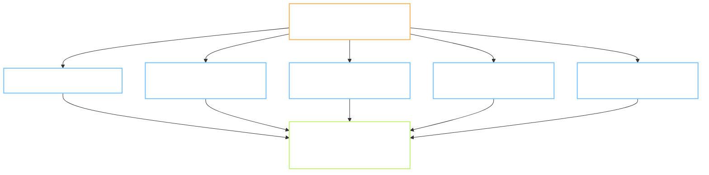
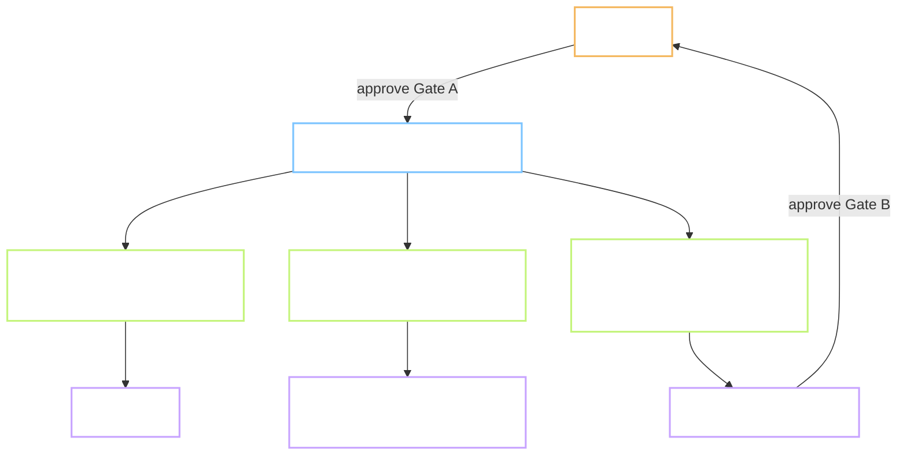

# Analysis - Can a network of AI agents build MoonEgg end to end, and should it be set up machine-wide?

Owner: Claude Code session, on behalf of the project owner.
Reviewer: `self`.
Date: 2026-10-08.
Status: **Accepted** 2026-10-08.

**Decisions log (2026-10-08):**
1. 2026-10-08 - First version. Lane chosen: Analysis, not Plan. The question is "does this work", so
   the recommendation feeds a Plan later.
2. 2026-10-08 - **Accepted by the owner, with four answers.** (1) No token budget can be named
   yet; measure first, follow-up 5 stays. (2) Gate requests are approved one by one, never as a
   batch. The lead reports each task on its own. (3) The global skill serves every repo from day
   one, but the Plan must check for conflicts with the other repos and skills on this machine.
   (4) A terminal with three live panes is acceptable, so Option C stays on the list for later.

> **Language rule (B1/B2):** short sentences, 20 words or fewer. Common words. Active voice.
> One idea per sentence. Diagrams carry the content.

Short names. **Agent** is one AI worker with its own fresh context. **Lead** is the session that
talks to the owner and hands out work. **Gate** is a stop where the owner approves, see
`CLAUDE.md` section 7. **Worktree** is a second copy of the repo on its own branch.

---

## 1. Question

Can a network of AI agents on this machine develop MoonEgg as a whole package, under the
two-gate workflow, faster than one session at a time? And can that setup live at the global
level, `~/.claude`, so other repos get it too?

**Why it matters:** 192 of 196.5 planned work-days are still open. The schedule in `docs/09`
assumes two people. Today there is one owner and one session.

**Out of scope:** picking a paid tool, changing the two-gate workflow itself, any task content.

---

## 2. Method - how we looked

| What we looked at | Tool / source | Depth |
| --- | --- | --- |
| Tools already on this machine | `ls ~/.claude/agents ~/.claude/skills`, `command -v ccb` | shallow scan |
| Agent definitions | `~/.claude/agents/*.md` front matter | read all 10 |
| The task cycle and its stops | `CLAUDE.md` sections 2, 7, 7.8; `prompts/00-START.md` | deep read |
| Which steps need a human | `grep` over `prompts/*/*.md` | count only |
| Dependencies between tasks | `docs/09-ke-hoach.md` section 8.1 and 8.2 | deep read |
| Work left | `records/TRACKING.md`, summed by phase | script |
| How the last three tasks really ran | `records/P.1.md`, `P.2.md`, `P.3.md` | deep read |

Not looked at: token cost per agent run, because nothing on this machine records it yet. Not
tested: any multi-agent run. This report reasons from the tools and the rules, not from a trial.

---

## 3. Findings

Agents can run every step a machine can run. The stops that need the owner do not go away.

| # | Finding | Evidence | Checked or inferred |
| --- | --- | --- | --- |
| 1 | Ten role agents exist globally, all with write and shell access, none tied to a workflow | `~/.claude/agents/`: `frontend-developer.md`, `mobile-developer.md`, `backend-developer.md` and 7 more; each has `tools: Read, Write, Edit, Bash, Glob, Grep` | Checked |
| 2 | No project agents, no workflows, no hooks in settings | `.claude/agents` absent; `.claude/workflows` absent; `settings.json` key `hooks` absent | Checked |
| 3 | The Agent tool can give a worker its own worktree | Agent tool parameter `isolation: "worktree"` | Checked |
| 4 | The CCB pane-team tool has a skill here but is not installed | `~/.claude/skills/ccb-config/SKILL.md` exists; `command -v ccb` finds nothing; `~/.ccb` absent | Checked |
| 5 | The Workflow tool runs scripted multi-agent pipelines, but only when the owner asks for it by name | Workflow tool description: "ONLY call this tool when the user has explicitly opted into multi-agent orchestration" | Checked |
| 6 | Every task has two stops where the owner must read and approve | `CLAUDE.md` section 2 steps 3 and 9; `prompts/00-START.md` steps 5 and 11 | Checked |
| 7 | 13 of 57 task prompts contain a step only a person can do: listen, grade, film, test with users, click a dashboard | `grep -lE 'người duyệt\|nghe thử\|chấm\|quay video\|Google Play\|3 người\|5 người\|10 người' prompts/*/*.md` = 13 files | Checked |
| 8 | The last two tasks needed the owner inside the task, not only at the gates | `records/P.2.md` B6, B7: owner clicks Supabase and Cloudflare; `records/P.3.md` B10: owner listens; licence decision mid-task | Checked |
| 9 | The rules forbid two open tasks at once | `CLAUDE.md` section 7.8: "Một task chưa gộp thì chưa đóng, và chưa mở task kế tiếp" | Checked |
| 10 | Several tasks do not depend on each other and could run side by side | `docs/09` section 8.2: 1.4 waits for P.3, P.4, P.5, P.8, 1.3; 3.1 waits for P.6, 1.8, 1.9. Phase P: P.4, P.5, P.6, P.7 share no input. Phase 1: 1.8 to 1.11 (core) share nothing with 1.2 to 1.7 (content) | Checked |
| 11 | 192 work-days remain: P 10, phase 1 39, phase 2 32, phase 3 32, phase 4 15, phase 5 64 | `records/TRACKING.md`, estimate column summed for rows not "Xong" | Checked |
| 12 | A fresh session needs the record to resume; a fresh agent needs the same | This session opened by reading `records/P.2.md` and the session log; the Agent tool description: "It knows only what you put in the prompt" | Checked |
| 13 | An agent given a hypothesis tends to confirm it | Agent tool description, same source | Inferred from the tool's own warning, not measured here |
| 14 | The local gate takes 3 to 8 seconds and the merge gate refuses a dirty tree | `records/P.3.md`, closing step: merge refused on untracked `.pyc` files; `gate.sh full` 5 to 8 s | Checked |
| 15 | Phase 5 is 64 of the 192 days and is mostly the content pipeline run at scale | `records/TRACKING.md` rows 5.1 to 5.4 | Checked |

What the findings add up to: the machine work is a small part of the stop-and-wait. One owner
must approve 2 stops per task, 114 stops for 57 tasks, plus 13 tasks with a human step inside.
Parallel agents multiply the approvals that land on the owner at once. They do not reduce them.

---

## 4. Options considered

| # | Option | Effort | Risk | Why it is on the list |
| --- | --- | --- | --- | --- |
| A | **Specialists inside one task.** One lead per task. It sends an Explore agent for evidence at Gate A, a role agent for the build, and a read-only review agent before Gate B. No rule change | S | S | Works today. Fixes finding 13: the reviewer is not the author |
| B | **Parallel tasks in worktrees.** One lead session runs 2 or 3 task agents, each in its own worktree and branch, each following the 10 steps. The lead collects Gate A and Gate B requests and hands them to the owner in batches. Merges go one at a time through `gate.sh merge` | M | M | Uses finding 10. Needs rule 7.8 rewritten. Risk: three Gate A requests in one hour for one owner |
| C | **Pane team with CCB.** Main, workers, reviewer as live panes with their own memory | M | L | Skill is here, tool is not. Windows and tmux untested. Same human bottleneck as B |
| D | **Scripted Workflow pipelines** for the review and verify stages only | S | S | Fits "review the diff, verify each finding". Owner must ask for it by name each time |
| Z | **Do nothing.** One session, one task at a time | S | S | Baseline: 192 work-days at the current pace, with one session idle while the owner reads |

Options A and D combine. Option B builds on A. Option C replaces B, not A.

---

## 5. Recommendation

**Chosen:** Option A now, as a global skill. Approved 2026-10-08, see decision 2. Then a timed trial of Option B on three Phase P
tasks. Option C only if the trial shows the lead cannot juggle three agents from one console.

One lead keeps the context. Three helpers do the parts that benefit from a fresh pair of eyes.

**Why it wins:**

- It changes no rule. Finding 9 stays as it is until the trial says it should change.
- It attacks the real quality risk, finding 13. The author of a plan should not be its only reader.
  Today `Reviewer: self` means a 15-minute wait. A read-only agent is a second reader at once.
- It is global by nature. The skill reads the repo's `CLAUDE.md` for the gates, the templates in
  `~/.claude/templates`, and the hub flags. Nothing MoonEgg-specific goes into `~/.claude`.
- The trial of Option B measures the thing nobody has measured: how many approvals per hour the
  owner can give, and the token cost of a fresh agent per task.

**What it costs:**

- Tokens. Each helper reads the same files again. Expect 2 to 3 times the tokens of one session
  per task. Not measured yet, see section 7.
- The owner's reading time does not drop. Under Option B it goes up per hour, down per week.
- The lead must write a full brief for each helper. A thin brief gives a confident wrong answer.

**What would change our mind:**

- The trial shows the owner approving three tasks in a batch without quality loss. Then Option B
  becomes the default and rule 7.8 is rewritten to "one open branch per agent, each in a worktree".
- The trial shows helpers re-reading so much that a task costs 4 times the tokens. Then stay at A.
- CCB installs cleanly on Windows and the owner prefers live panes. Then try C for Phase 1.

**What is not feasible, and should be said plainly:** "agents develop the app as a whole package"
without the owner. The 13 human-only steps and the 114 gate stops are the design, not a gap. The
feasible shape is: agents do every machine step and prepare every approval; the owner approves
in batches and does the human steps.

---

## 6. Follow-ups

Each row here is a candidate ticket.

| # | Follow-up | Type | Owner | Notes |
| --- | --- | --- | --- | --- |
| 1 | Global skill `task-lead`: the 10-step cycle with three helpers (Explore, role agent in a worktree, read-only reviewer). Briefs as templates. Lives in `~/.claude/skills` | FEATURE, INFRA, L2 | session | Option A. Reads `CLAUDE.md` of the repo; no project names inside |
| 2 | Global agent `gate-reviewer.md`: read-only, Opus, runs the four cold-read questions on a Plan and a diff review before Gate B | FEATURE, L1 | session | Pairs with 1. Tools: Read, Grep, Glob only |
| 3 | Timed trial of Option B on P.4, P.6, P.7 together, in three worktrees. Measure: tokens per task, owner minutes per approval, merge conflicts | POC | owner + session | `docs/_POC/ParallelTasks.md`. P.4 needs the owner's ears; P.6 and P.7 do not |
| 4 | Rewrite `CLAUDE.md` section 7.8 if the trial passes: one open branch per agent, worktrees, merges serial through `gate.sh merge` | docs | owner | Only after 3 |
| 5 | Record token use per task in `records/<id>.md`, a new line in the header | docs, L1 | session | Needed before any cost claim |
| 6 | Install CCB on Windows and run one dry task | POC | owner | Only if 3 shows the single console is the limit |
| 7 | Use the Workflow tool for the Gate B diff review on L2 tasks, by name | docs | owner | Option D; one line in `CLAUDE.md` 7.4 |

---

## 7. Open questions

1. What token budget per task is acceptable? Nothing is measured today, see follow-up 5.
2. When two Gate A requests arrive in the same hour, does the owner want them as one message or
   two? The batch shape decides how the lead reports.
3. Does the owner want the global skill to also serve non-MoonEgg repos from day one, or MoonEgg
   first and generalise after one trial?
4. Is a Windows terminal with three live panes acceptable to the owner at all? This decides
   whether Option C is ever worth a trial.
