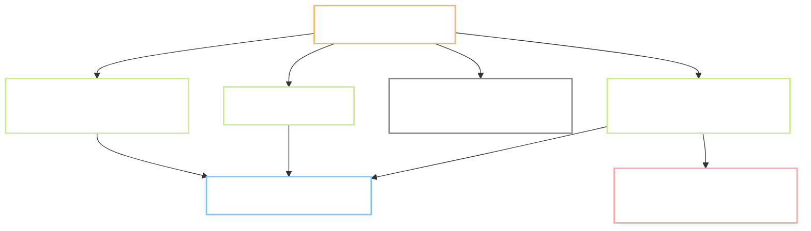

# Plan - P.1 Repo, CI, licence scan

Status: **not started**, stopped at Gate A, waiting for review.
Task: `P.1` · Prompt: `prompts/phase-P/P.1.md` · Record: `records/P.1.md`
Branch: `chore/p1-repo-ci`, cut from `main` at `cf4c66a`.
Reviewer: `self`
Type: **INFRA** - build tooling, no product behaviour
Level: **L2** - adds logic branches in CI and a gate that can block every later task
Repro: not applicable, this is not an ISSUE
User-visible behaviour: no Flow.md. INFRA, nothing a learner sees changes.
Refs: `docs/09` section 3P.1 row P.1 · `docs/07` section 2 · `docs/01` section 13.2 · Tests TC-CP-01, TC-CP-02
Depends on: none. First task of phase P.

**Decisions log:**
1. 2026-09-24 - Step 1 of the prompt (`git init`, first commit) is already done, outside the
   process, at commit `1736b31`. Agreed with the reviewer: this Plan records it as done and P.1
   covers only what is left. The repo is not re-initialised.
2. 2026-09-24 - Commit tag set fixed at `feature` / `bug` / `docs`. This task uses `feature`.
3. 2026-09-24 - CI pins Python to **3.11**, not the 3.14 on this machine. Reviewer chose the safe
   option: Kokoro and torch, needed at P.3, may not have wheels for 3.14 yet. CI should run the
   version the pipeline tasks can certainly use.
4. 2026-09-24 - Vitest goes into `sdk-allowlist.md` with a **dev only** note. The file stays the
   single list, and the note says the package never reaches the bundle.
5. 2026-09-24 - Branch protection stays off, reason recorded. Instead, a task closes by merging its
   branch into `main` after the tests pass, before the next task starts. Added to `CLAUDE.md`
   section 7.4.
6. 2026-09-24 - Closing a task now goes through a **pull request**, not a local merge: open the PR
   after Gate B, wait for CI, merge with a merge commit, delete the branch. Written as
   `CLAUDE.md` section 7.8 with a PR template at `.github/pull_request_template.md`.
7. 2026-09-24 - This branch carries the process changes as well as P.1 itself, because the rules
   were written while the branch was already open. From P.2 on, a process change gets its own branch.
8. 2026-09-24 - **The gate moves off GitHub and onto this machine.** GitHub Actions refused to run
   every job: `The job was not started because recent account payments have failed or your spending
   limit needs to be increased`. Rather than wait on an account fix, the reviewer chose to run the
   checks locally through git hooks, which is also faster. Section 4.4 is rewritten below. The
   workflow file stays but only runs when a human presses the button.
9. 2026-09-24 - No pull request. The branch is merged on this machine after the gate passes, then
   pushed. Review happens on the hub through Plan and Result, not through a diff on GitHub. The PR
   template added earlier is removed.
10. 2026-09-24 - The gate is built as a **machine-wide** tool at `~/.config/devgate/`, not as a
   MoonEgg script, so later projects on this machine reuse it. A repo opts in by having
   `tools/checks/gate.sh`; a repo without one is ignored.

Out of scope: any content pipeline work (P.3), the Supabase and R2 setup (P.2), writing real tests.
CI runs empty test suites on purpose; real tests arrive with the tasks that need them.

> **Language rule (B1/B2):** short sentences, 20 words or fewer. Active voice. One idea per sentence.

---

## 0. Does this task need a Flow.md?

No. Type is INFRA and no screen exists yet. Any deliberate behaviour note goes in section 5.

## 1. Goal

A change that breaks a rule should fail before a human reads it. After this task, every push runs
the data checker, the web test runner and a licence scan, and a package with a licence outside the
allowlist stops the build. Phase P can then move without anyone remembering to check by hand.

## 2. Starting point, checked today

Commands were run today on this machine; the output below is real, not remembered.

| Thing | State today | Evidence |
| --- | --- | --- |
| Repo | exists, private, 3 commits on `main` | `git log --oneline`, `gh repo view` |
| `.github/` | does not exist | `ls -A .github` returns "No such file or directory" |
| `web/`, `mobile/` | both empty directories | `ls -A web mobile` prints nothing |
| node, npm | v24.13.0, 11.6.2 | `node --version`, `npm --version` |
| python | 3.14.2 | `python --version` |
| flutter, dart | **not installed** | `command -v flutter` finds nothing |
| `tools/checks/verify_pack.py` | works, 30 rows, 0 errors, 2 warnings | see the bug below |
| `tools/checks/license-allowlist.txt` | 17 licence strings | `grep -c . tools/checks/license-allowlist.txt` |
| `tools/checks/sdk-allowlist.md` | 11 package rows | `grep -c '^| [a-z@]' tools/checks/sdk-allowlist.md` |
| Branch protection | **not available on this plan** | `gh api .../rulesets` returns `403 Upgrade to GitHub Pro or make this repository public` |

**Bug found while checking:** `verify_pack.py:41` prints Vietnamese text. On a Windows console the
default code page is cp1252, so the print raises `UnicodeEncodeError` and the script exits 1 even
when the data has no errors. With `PYTHONIOENCODING=utf-8` the same file reports
`30 bản ghi · 0 lỗi · 2 cảnh báo` and exits 0. `CLAUDE.md` section 3 requires this script before
closing any data task, so every data task on Windows would report a false failure.

## 3. Flow



Four jobs, one of them dormant until Flutter is installed.

## 4. Plan of work

### 4.1 `tools/checks/verify_pack.py` - required, fix first

Force UTF-8 on the script's own output, so the exit code reports the data and not the console code
page. One line near the top, guarded so it does nothing on a platform that is already UTF-8. Fixed
before CI is written, because CI will call this script.

### 4.2 `web/` - required

`npm create vite@latest web -- --template react-ts`, then add Vitest with one test that asserts
`true`. Dependencies must stay inside `tools/checks/sdk-allowlist.md`: react, react-dom, vite,
typescript are listed. Vitest gains a row in the same file marked **dev only**, so the allowlist
stays the single list and a reader can see at a glance that it never reaches the bundle.

### 4.3 `mobile/` - placeholder only

Flutter is not installed, so `flutter create` cannot run. `mobile/README.md` records what the
folder will hold and which task fills it. The CI job exists but is skipped by a guard, so turning
it on later is one line, not a new job.

### 4.4 The gate - rewritten, see Decisions log 8

The checks run on this machine, not on a runner. Two layers:

**Machine layer**, `~/.config/devgate/` - shared by every repo on this machine:

| Piece | What it does |
| --- | --- |
| `gate.sh` | finds the repo, runs its gate file, prints a pass or fail line with timing |
| `hooks/pre-commit` | runs the gate at `quick` level before every commit |
| `hooks/pre-push` | runs the gate at `full` level before every push |
| `gate.sh merge <branch>` | pull, merge with `--no-ff`, run the gate, undo the merge if it fails, push if it passes |
| `gate.sh doctor` | prints the current configuration |

`git config --global core.hooksPath` points at those hooks, so every repo passes through. A repo
with no gate file is ignored without a word. A repo's own `.git/hooks/` still runs afterwards, so
the global setting takes nothing away.

**Project layer**, `tools/checks/gate.sh` - what MoonEgg actually checks:

| Level | Runs | Measured |
| --- | --- | --- |
| `quick` | pytest, then `verify_pack` on the sample data | about 2 seconds |
| `full` | quick, plus `npm ci` if needed, vitest, and the licence gate | about 5 seconds |

`.github/workflows/ci.yml` stays in the repo with `on: workflow_dispatch`, so it never runs by
itself and never shows red. Switching back to cloud CI means editing one line.

### 4.5 Branch protection - record the reason, do not buy

The API refuses rulesets on a private repo on this plan. The prompt allows "protected, or write
down why not". Written down here and in the record. The gate that matters right now is the human
one at Gate B; protection can be turned on later if the repo goes public or the plan changes.

### Options considered, not chosen

- Make the repo public to get branch protection. Rejected: the repo holds unreleased content plans
  and the team default is private.
- Write the licence check as a shell pipeline inside the workflow. Rejected: it belongs in
  `tools/checks/` where a person can run it locally before pushing.
- Install Flutter now to fill `mobile/`. Rejected: it is P.3 and phase 3 work, and it would add an
  hour to a 1.5 day task for nothing usable today.

### Do not touch

- `docs/01..09`, `golden/`, `content/`, `prompts/`.
- `tools/pipeline/build_lexicon.py`. Only the checker changes, and only its output encoding.
- The three commits already on `main`.

## 5. Situations and edge cases

| # | Situation | Expected behaviour |
| --- | --- | --- |
| 1 | Windows console, cp1252 | checker prints correctly and exits on the data, not the encoding |
| 2 | `mobile/` still empty | mobile job skips, whole run still reports green |
| 3 | A GPL package is added to `web/` | licence job fails, and says which package and which licence |
| 4 | `license-checker` reports `UNKNOWN` | treated as a failure, not a warning |
| 5 | A licence string is new but acceptable | the allowlist file is edited in the same pull request, so the change is visible in review |
| 6 | No test files exist yet | pytest and vitest must still exit 0 on an empty suite |
| 7 | Vitest started in watch mode | CI calls `vitest run`, never bare `vitest`, or the job hangs until it times out |
| 8 | `npm ci` without a lock file | the scaffold commits `package-lock.json` in the same change, or `npm ci` fails |

## 6. Impact - who else touches this

| Thing changed | Consumer | Effect |
| --- | --- | --- |
| `~/.config/devgate/` | every repo on this machine | new, machine-wide |
| `core.hooksPath` (global git config) | every repo on this machine | now points at the shared hooks |
| `verify_pack.py` output encoding | every DATA task, and `CLAUDE.md` section 3 | fixed for all of them |
| `tools/checks/license-allowlist.txt` | the new licence job, P.7 source records | read, not changed |
| `tools/checks/sdk-allowlist.md` | the new licence job, every later web task | gains one row for vitest |
| `web/package.json` | tasks 1.10 onward | created here, extended later |
| `.github/workflows/ci.yml` | every push from now on | new |

Found by reading `CLAUDE.md` section 3, `tools/checks/`, and `prompts/phase-P/P.1.md`.

## 7. Tests and Definition of Done

| # | Test | How to run | Expected result |
| --- | --- | --- | --- |
| 1 | TC-CP-01 | `node tools/checks/check_licenses.mjs` | 0 packages outside the allowlist |
| 2 | TC-CP-02 | compare `web/package.json` with `sdk-allowlist.md` | every dependency has a row |
| 3 | Licence gate really bites | run the checker against an offline GPL fixture | exit 1, and the message names the package and its licence |
| 4 | Checker on Windows | `python tools/checks/verify_pack.py content/lexicon/lexicon_raw_test.csv` | `30 bản ghi · 0 lỗi · 2 cảnh báo`, exit 0, no traceback |
| 5 | Checker inside the gate | `bash tools/checks/gate.sh quick` | same output, exit 0 |
| 6 | Empty suites pass | `pytest tools/checks -q`, `npm test` | both exit 0 |
| 7 | The gate refuses a bad commit | add a failing test, try to commit | commit rejected, `HEAD` unchanged |

**Definition of done:**

- [ ] `bash tools/checks/gate.sh full` passes and takes under 30 seconds
- [ ] The gate refuses a commit that breaks a test, proven once, with the output recorded
- [ ] Test 3 shows the licence gate rejecting a GPL package, as an automated test, not by hand
- [ ] `verify_pack.py` exits 0 on Windows with no traceback
- [ ] `web/` builds and `npm test` passes
- [ ] `mobile/README.md` says what is missing and which task fills it
- [ ] Branch protection: the refusal is recorded in `records/P.1.md` with the API message
- [ ] `records/P.1.md` carries a result line per step and the table above with real numbers
- [ ] `~/.config/devgate/` works for a repo that is not MoonEgg, or is proven to ignore it silently
- [ ] `chore/p1-repo-ci` is merged into `main` with `gate.sh merge`, and the branch deleted

## 8. After Gate B

Planned commit messages:

```
feature(P.1): force utf-8 output in verify_pack
feature(P.1): scaffold web app with vitest
feature(P.1): add ci workflow with licence gate
docs(P.1): record mobile placeholder and branch protection limit
```

Then close the task on this machine: `bash ~/.config/devgate/gate.sh merge chore/p1-repo-ci`,
which pulls, merges with `--no-ff`, runs the gate, and pushes only if it passes. Delete the branch
locally and on the remote. The next task then starts from a trunk that already has the gate.

Record note: `records/P.1.md` gets the CI run links, the licence-checker output, the red run from
test 3, and the branch-protection refusal message. `records/TRACKING.md` gets status, real effort
and the test result.

## 9. Open questions for the reviewer

None. All three were answered on 2026-09-24 and moved into the Decisions log above.

One note, not a question: the machine runs Python 3.14 and CI will run 3.11. A check can pass in
one place and fail in the other. Test 4 runs the checker locally on 3.14 and test 5 runs it in CI
on 3.11, so the gap is covered by the test list rather than assumed away.
