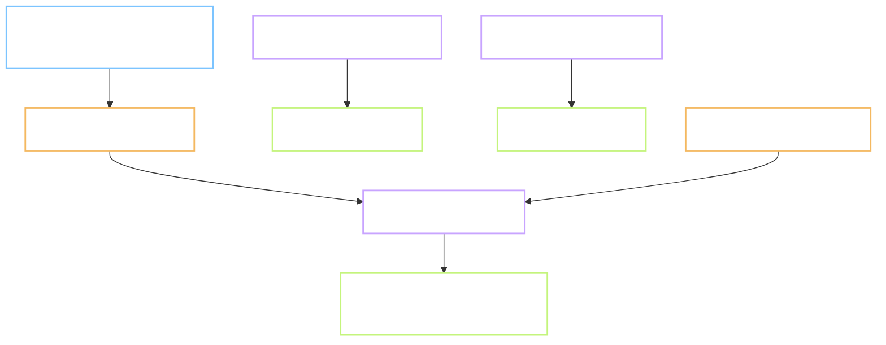

# Plan - P.2 Supabase, R2, Pages

Status: **not started**, stopped at Gate A, waiting for review.
Task: `P.2` · Prompt: `prompts/phase-P/P.2.md` · Record: `records/P.2.md`
Branch: `chore/p2-supabase-r2-pages`, cut from `main` at `789b9c4`.
Reviewer: `self`
Type: **INFRA** - servers, storage and a static site. No product behaviour yet.
Level: **L2** - see the note below on why this is not L3
Repro: not applicable, this is not an ISSUE
User-visible behaviour: no Flow.md. INFRA, nothing a learner sees changes.
Refs: `docs/09` section 3P.1 row P.2 · `docs/07` sections 2 and 7.2 · `docs/01` sections 11 and 14 ·
Test TC-AU-04 · FR-30, FR-44 to FR-47
Depends on: P.1, done on 2026-09-24.

**Level note.** This task creates the server tables that every later sync task reads and writes, so
it touches shared infrastructure, which normally forces L3 and a report instead of code. It stays
L2 because the schema is not being designed here: `docs/07` section 7.2 already fixed the tables,
the columns and the access rules, and this task only puts that decided design onto a server. If
anything in the schema turns out to need a change, that change is L3 and gets its own task.

**Decisions log (2026-09-24):**
1. 2026-09-24 - Reviewer confirmed they already hold Cloudflare and Supabase accounts, so this task
   configures existing accounts rather than creating them.
2. 2026-09-24 - **The reviewer clicks the dashboards.** No access token and no API token change
   hands. This task writes the SQL file and a numbered click list; the reviewer runs them.
3. 2026-09-24 - Supabase region stays **Singapore, `ap-southeast-1`**.
4. 2026-09-24 - Names: Supabase project `moonegg`, Pages project `moonegg`, R2 bucket
   `vocab-content` as the task prompt already fixes it.
5. 2026-09-24 - **Keep-alive runs from Windows Task Scheduler on this machine**, not from GitHub
   Actions. Section 4.7 rewritten. The task prompt asks for a GitHub Action, so this is a
   deliberate deviation, taken because Actions is blocked at the account level (P.1 record).

Out of scope: writing any sync code (task 2.9), the backup file format (2.10), image sync, the
analytics pipeline, buying an Apple Developer account.

> **Language rule (B1/B2):** short sentences, 20 words or fewer. Active voice. One idea per sentence.

---

## 0. Does this task need a Flow.md?

No. Type is INFRA and no screen exists yet. Any deliberate behaviour note goes in section 5.

## 1. Goal

After this task the project has three addresses that later tasks can point at: a database that
stores one user's events and refuses to show them to anyone else, a bucket that serves content
files for free, and a web address that serves the app. A learner sees none of it today, but tasks
1.11, 2.9 and 2.10 cannot start without it.

## 2. Starting point, checked today

Commands were run today on this machine; the output below is real, not remembered.

| Thing | State today | Evidence |
| --- | --- | --- |
| `supabase` CLI | not installed | `command -v supabase` finds nothing |
| `wrangler` CLI | not installed | `command -v wrangler` finds nothing |
| `psql` | not installed | `command -v psql` finds nothing |
| `npx` | 11.6.2 | `npx --version` |
| `supabase/` in repo | does not exist | `ls -A supabase` returns "No such file or directory" |
| `.env.example` | does not exist | same command |
| Schema design | already decided | `docs/07-kien-truc.md:491` onward: 7 tables, RLS rule, delete rule |
| Sync contract | already decided | `docs/07-kien-truc.md:255` event enum, `:293` sync section |
| P.1 gate | in place | `tools/checks/gate.sh`, runs on every commit |

No CLI tool is installed, and none is required: Supabase SQL runs in the dashboard's SQL editor,
and the R2 bucket plus the Pages project are made in the Cloudflare dashboard. The work is mostly
reading a written script and clicking, which is why section 4.5 decides who clicks.

## 3. Flow



Three addresses, one proof each, plus a heartbeat that stops the free project pausing.

## 4. Plan of work

### 4.1 `supabase/schema.sql` - required, written before anything is clicked

The whole schema lives in one file in the repo, not in the dashboard's history. It is written to be
run twice with the same result: `create table if not exists`, `create index if not exists`, and
policies dropped before they are created. The reason is section 5 row 3: a schema that only exists
in a dashboard cannot be reviewed, and cannot be rebuilt if the project is lost.

Tables, exactly as `docs/07` section 7.2 fixes them: `profile`, `device`, `review_event`,
`user_content`, `settings`, `sync_cursor`, `analytics_daily`. On `review_event`: `event_id` text
primary key, `server_seq` as `bigserial`, an index on `(user_id, server_seq)`, and a unique
constraint on `event_id`. `item_state`, `session_state` and the counter tables are deliberately not
here: `docs/07` says the server never needs them.

### 4.2 Row level security - required, the part that carries the risk

Every user table gets RLS enabled and a policy `user_id = auth.uid()` for select and insert.
`analytics_daily` gets insert only and holds no raw `user_id`. Enabling RLS and then forgetting one
policy is the mistake that looks fine and leaks everything, so section 7 tests it with two real
users rather than by reading the SQL.

**One more hole, found while reading this plan back.** A select and insert policy of
`user_id = auth.uid()` lets a client insert any value it likes into `server_seq`. That column is
the sync cursor: every device asks for "events after sequence N". A client that writes its own
sequence number, by accident or on purpose, can hide its events from its own next pull, or push
another device into re-reading everything. The column must be server-assigned only. The fix is a
`bigserial` default plus a `before insert` trigger that overwrites whatever the client sent, and a
test that proves it. Test 9 in section 7.

### 4.3 Auth providers - required

Google and email magic link get switched on. Apple is left off with a written reason: it needs an
Apple Developer account at 99 USD a year, which `docs/02` section 4 records as not bought. The
prompt for this task already allows this. A one-line TODO goes in the record, not a silent gap.

### 4.4 Cloudflare R2 and Pages - required

Bucket `vocab-content`, public read, proven with one `curl` against a real uploaded file. Pages
project pointing at `web/dist`, deployed empty, proven by a URL that answers 200. Nothing else is
configured: caching, custom domains and cache headers belong to task 1.11 and 2.11.

### 4.5 Who clicks - decided, the reviewer does

No access token and no API token change hands. This task produces two things the reviewer runs:

- `supabase/schema.sql` - pasted into the Supabase SQL editor, run twice to prove it repeats.
- `docs/tasks/P.2/click-list.md` - numbered steps for the Supabase dashboard and for the Cloudflare
  dashboard, each step naming what to click and what should be on screen afterwards.

The click list also carries the two test-user steps for test 1, and the step that deletes them at
the end. Anything the reviewer copies back to me is a URL or the public anon key, never a secret.

### 4.6 `.env.example` and secret handling - required

`.env.example` holds variable names and empty values only: `VITE_SUPABASE_URL`,
`VITE_SUPABASE_ANON_KEY`, `R2_PUBLIC_BASE`. The real `.env` is already ignored by `.gitignore:10`.
No real key goes into the repo, into a task record, into a drop, or into this conversation.

### 4.7 Keep-alive - runs on this machine, not on GitHub

A free Supabase project sleeps after a week with no activity.
`docs/03-bang-chung-xac-thuc.md:34` records it: 500 MB and 50,000 monthly users, but the project
pauses when idle.

- `tools/ops/ping-supabase.sh` - one REST read of a single row with the anon key. Prints the HTTP
  code and the date, and appends one line to a log so a missed run is visible later.
- `tools/ops/register-ping-task.ps1` - registers a Windows scheduled task that runs the ping every
  three days. Written as a script, not as a list of clicks, so the machine can be rebuilt.
- `.github/workflows/ping-supabase.yml` - committed with `on: workflow_dispatch` only, the same way
  `ci.yml` was handled in P.1. It never runs by itself and never shows red. If the billing is fixed
  one day, the trigger is one line. This keeps the task prompt's requirement visible rather than
  quietly dropped.

The ping reads through the anon key and through RLS, so it proves the public path still works, not
only that the server is awake.

### Options considered, not chosen

- Run the schema through the `supabase` CLI. Rejected: it would mean installing a tool and holding
  an access token, for one SQL file that the dashboard editor runs just as well.
- Skip `schema.sql` and click the tables together. Rejected: the schema would then exist only
  inside a service, with no review and no way to rebuild it.
- Turn on Apple sign-in now. Rejected: 99 USD a year for a provider no one can test until there is
  an iOS build.

### Do not touch

- `docs/07` section 7.2. If the schema is wrong, that is an L3 task, not a quiet edit here.
- `web/`, `tools/`, `golden/`, `content/`.
- Anything to do with sync logic. This task creates the place, not the traffic.

## 5. Situations and edge cases

| # | Situation | Expected behaviour |
| --- | --- | --- |
| 1 | `schema.sql` run twice | second run changes nothing and raises no error |
| 2 | RLS on, one policy missing | test in section 7 must fail, not pass quietly |
| 3 | Supabase project lost or rebuilt | `schema.sql` from the repo rebuilds it without the dashboard |
| 4 | Free project pauses after a week idle | the ping brings it back; if the ping cannot run, the record says so |
| 5 | Anon key leaks | it is a public key by design; RLS is what protects the data, not the key |
| 6 | The machine is off when the ping is due | the scheduled task is set to run at the next start-up if a run was missed. A ping three hours late still beats a project that slept a week |
| 6b | The scheduled task stops without saying so | the ping appends to a log, so a gap between dates is visible. The task record carries the first two lines |
| 7 | Apple sign-in asked for later | one provider switched on, no schema change |
| 8 | Two test users are needed for test 1 | created by hand in the Supabase dashboard with email and password, not through magic link, so no real mailbox is involved |
| 9 | Test users left behind after testing | both deleted at the end of the task, and the record says so. A test account in a real project is a real account |
| 10 | A client sends its own `server_seq` | the trigger overwrites it; test 9 proves the stored value is the server's, not the client's |

## 6. Impact - who else touches this

| Thing created | Consumer | Effect |
| --- | --- | --- |
| `supabase/schema.sql` | tasks 2.9, 2.10, 4.3 | new; the server contract for all of them |
| Supabase project URL, anon key | `web/` from task 2.9 | new; read from `.env` |
| R2 bucket `vocab-content` | tasks P.10, 1.7, 1.11 | new; content packs are uploaded there |
| Pages project | task 2.11 | new; the PWA is deployed there |
| `.env.example` | every later web task | new |
| `tools/ops/ping-supabase.sh` | the scheduled task on this machine | new |
| `.github/workflows/ping-supabase.yml` | nobody yet, dormant | new, `workflow_dispatch` only |
| `docs/tasks/P.2/click-list.md` | the reviewer, and anyone rebuilding the project | new |

Found by reading `prompts/phase-P/P.2.md`, `docs/07` section 7.2, and the P.10, 1.11 and 2.9 rows
of `records/TRACKING.md`.

## 7. Tests and Definition of Done

| # | Test | How to run | Expected result |
| --- | --- | --- | --- |
| 1 | TC-AU-04 | create two test users, insert one event each, read with user A's token | 0 rows belonging to B, and no 500 error |
| 2 | RLS really on | query `pg_tables` and `pg_policies` for the 7 tables | every user table has RLS on and at least one policy |
| 3 | Schema is repeatable | run `schema.sql` twice on a clean project | no error, same tables |
| 4 | R2 is readable | `curl -I` a file uploaded to the bucket | HTTP 200 and the right content type |
| 5 | Pages answers | `curl -I` the Pages URL | HTTP 200 |
| 6 | Unique event id | insert the same `event_id` twice | second insert rejected |
| 7 | Ping works by hand | `bash tools/ops/ping-supabase.sh` | HTTP 200, one row, one line added to the log |
| 7b | The scheduled task fires | register it, then run it on demand from Task Scheduler | the log gains a second line with the right date |
| 8 | No secret in the repo | the gate, plus a grep for key patterns | 0 findings |
| 9 | `server_seq` cannot be set by a client | insert an event with `server_seq = 999999` using a user token | the stored row has the server's next sequence, not 999999 |
| 10 | Test users cleaned up | list auth users at the end | the two test accounts are gone |

**Definition of done:**

- [ ] `supabase/schema.sql` in the repo, run twice on the real project with no error
- [ ] 7 tables exist, with the index and the unique constraint on `review_event`
- [ ] RLS on for every user table, proven by test 1 with two real users, not by reading SQL
- [ ] `server_seq` is server-assigned: a client value is overwritten, proven by test 9
- [ ] The two test users are deleted before the task closes
- [ ] Google and magic link sign-in work; Apple is off with a written reason
- [ ] R2 bucket answers a public `curl`; Pages URL answers 200
- [ ] `.env.example` has names and no values; no real key anywhere in the repo
- [ ] The ping runs by hand and from the scheduled task, proven by two log lines
- [ ] `click-list.md` is complete enough that someone else could rebuild the project from it
- [ ] `records/P.2.md` has a result line per step and the test table with real output
- [ ] The branch is merged into `main` with `gate.sh merge`, and deleted

## 8. After Gate B

Planned commit messages:

```
feature(P.2): add supabase schema with row level security
docs(P.2): add env example and the dashboard click list
feature(P.2): add supabase keep-alive ping and scheduled task
```

Then close on this machine with `bash ~/.config/devgate/gate.sh merge chore/p2-supabase-r2-pages`,
delete the branch on both sides, and update `records/TRACKING.md`.

## 9. Open questions for the reviewer

None. All four were answered on 2026-09-24 and moved into the Decisions log above.

Two notes, not questions:

- The keep-alive now depends on **this machine** being switched on now and then. That is fine while
  there are no users. Once there are, the ping belongs somewhere that does not sleep, and that is a
  task of its own, not a quiet change here.
- The reviewer pastes the Supabase URL and the anon key into a local `.env`. Both are public values
  by design, but they still do not belong in the repo, in a task record, or in chat.
