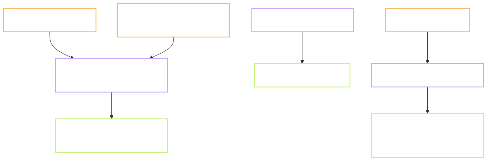

# P.2 - a database, a content bucket and a web address, all three live

Task: `P.2` · Plan: https://hub.yawasa.com/app/p/moonegg-p2-plan · Flow: skipped, Type is INFRA
Record: `records/P.2.md` · Delivery: https://hub.yawasa.com/app/p/moonegg-p2-delivery
Commits: `f5c9f0c`, `975fbc6`, `2dd673e`, `c67fc6f`, `f7d0059`, `89c75bc`, plus 12 record and plan
commits · Branch: `chore/p2-supabase-r2-pages`, merged into `main` with `gate.sh merge` and deleted on both sides
Effort: not measured (estimate: 1.5 nd) · Finished: 2026-10-08 · Checked by: `self`, Gate B approved 2026-10-08

---

## What the task produced

The project now has three live addresses. Each one is proven by a real call, not by a dashboard.

- `supabase/schema.sql` - 7 tables, 13 access policies, 1 trigger. It can be run again safely.
- `.env.example` - three variable names with empty values.
- `docs/tasks/P.2/click-list.md` - the dashboard steps, enough to rebuild all three services.
- `tools/ops/ping-supabase.sh` and `register-ping-task.ps1` - the keep-alive and its schedule.
- `.github/workflows/ping-supabase.yml` - dormant, runs only when started by hand.
- `web/wrangler.jsonc` - tells Cloudflare to serve `web/dist` as a static site.

## Before and after

| Observable | Before | After |
| --- | --- | --- |
| A place to store a user's events | none | Supabase project in Singapore, 7 tables |
| User A asks for user B's events | not testable | 0 rows of B, HTTP 200 |
| A visitor with no account reads a table | not testable | 6 tables refuse with 401, the event table returns an empty list |
| A client sends its own sequence number | not testable | the server overwrites it |
| Sign-in methods | none | email link and Google on, Apple off |
| A place for content files | none | bucket `vocab-content`, public read |
| A web address for the app | none | `https://moonegg.hieunn-bkict.workers.dev` |
| The free database after a quiet week | it would pause | pinged every 3 days, 4 scheduled runs logged |
| A file with real keys at the repo root | one `git add .` away from a commit | every `.env.*` file is ignored |

## Tests

| # | Test | Command | Real output | Pass |
| --- | --- | --- | --- | --- |
| 1 | TC-AU-04 | user A's token reads the event table | HTTP 200, 1 row owned by A, 0 rows of B | yes |
| 2 | RLS really on | query `pg_class` and `pg_policy` | 7 of 7 tables on, 13 policies | yes |
| 3 | Schema is repeatable | run `schema.sql` in the SQL editor | 3 runs, each `Success. No rows returned` | yes |
| 4 | R2 is readable | `curl -I` on `ping.txt` | HTTP 200, `text/plain`. The file is empty, 0 bytes | yes |
| 5 | The web address answers | `curl -I` on the `workers.dev` URL | HTTP 200, `text/html`, 453 bytes. A deep link also gives 200 | yes |
| 6 | Unique event id | post the same `event_id` twice | HTTP 409, duplicate key | yes |
| 7 | Ping works by hand | `bash tools/ops/ping-supabase.sh` | `http=200 ok`, exit 0, empty list | yes |
| 7b | The scheduled task fires | Task Scheduler | `LastTaskResult 0`. Then it ran alone on 09-29, 10-02, 10-05 and 10-08 | yes |
| 8 | No secret in the repo | gate plus a pattern search | 0 findings | yes |
| 9 | `server_seq` cannot be set by a client | post `999999` three times | stored 8, 9, 10 | yes |
| 10 | Test users cleaned up | sign in as each test user | both refused, HTTP 400 `invalid_credentials` | yes |

Tests 1, 2, 3, 6 and 9 were measured on 2026-09-25 with the two test users. Those users are now
deleted, so the five cannot be run again without creating new ones.

Output checks from `CLAUDE.md` section 3: full gate green, no new dependency in `web/package.json`,
no content data produced so the `source` and `license` check does not apply.

## Deviations from the plan

- **The web address is a Cloudflare Worker, not a Pages project.** The reviewer built it under
  Workers Builds and chose to keep it. The repo gained `web/wrangler.jsonc`. Plan decision 7.
- **The keep-alive runs from Windows Task Scheduler, not from a GitHub Action.** Actions is blocked
  at the account level. Plan decision 5.
- **R2 needed a payment card.** Cloudflare asks for one even on the free plan. The reviewer added
  it and kept R2.
- **Test 7 expected one row; the right answer is zero.** A visitor with no account must see no
  event. Plan decision 6.
- **Test 10 was checked by sign-in, not by listing users.** Listing users needs the dashboard. The
  reviewer deleted the two users there, and a refused sign-in confirms it from outside.
- **Commits were made step by step, before Gate B.** The gate runs on each commit, so a break shows
  early. The branch still waits for Gate B before the merge.
- **The first Cloudflare build reads the task branch.** The config file reaches `main` only at the
  merge. The branch setting goes back to `main` right after.

## Points that need a decision

- **Effort is not measured.** The work ran in four sittings over two weeks. The record needs a real
  figure from the reviewer.
- **After the merge, set Branch control back to `main`** in the Worker's build settings. Until then
  a push to `main` builds nothing.
- **The test file in the bucket is empty.** It proves the read path. Remove it, or leave it, before
  P.10 uploads real content.
- **A Google client secret file sat at the repo root on 2026-09-28.** It was never committed, and
  the reviewer deleted it. Rotating it in Google Cloud is cheap and removes all doubt.

## Faults found, fixed or left

| Fault | Where | Fixed? |
| --- | --- | --- |
| `.env.local` with real keys was not ignored by git | `.gitignore` | yes, `.env.*` is ignored, `.env.example` stays tracked |
| Each insert used two sequence numbers | `supabase/schema.sql` | yes, the trigger is the only writer; steps of 1 measured |
| A client could write its own `server_seq` | plan review | yes, the trigger overwrites it, test 9 |
| Build command entered the `web` folder twice | Cloudflare build settings | yes |
| Deploy command had no config file to read | repo | yes, `web/wrangler.jsonc` |
| Every commit, even documents, started a build | Cloudflare build settings | yes, watch path is `web/*` |
| Plan said "one row" for the ping | Plan section 7 | yes |
| `docs/09` and the task title still say "Pages" | docs | left, kept as the task's history |

## Known limitations

- The keep-alive depends on this machine being switched on. Fine with no users. It needs a home
  that does not sleep before launch.
- Apple sign-in is off. It needs a paid developer account and an iOS build.
- No caching rules, no custom domain. Tasks 1.11 and 2.11 own those.
- No sync code. Task 2.9 writes it against these tables.
- `sync_cursor` has no owner column. Its access rule goes through the device table. Adding the
  column would change the data contract, which is a task of its own.

## Where it stands

Later tasks can point at real addresses. Task 2.9 gets tables that already refuse the wrong reader.
Tasks P.10, 1.7 and 1.11 get a bucket that serves files for free. Task 2.11 gets a web address
that rebuilds from the repo. Nothing a learner sees has changed. P.3 is next, once this branch is
merged.
