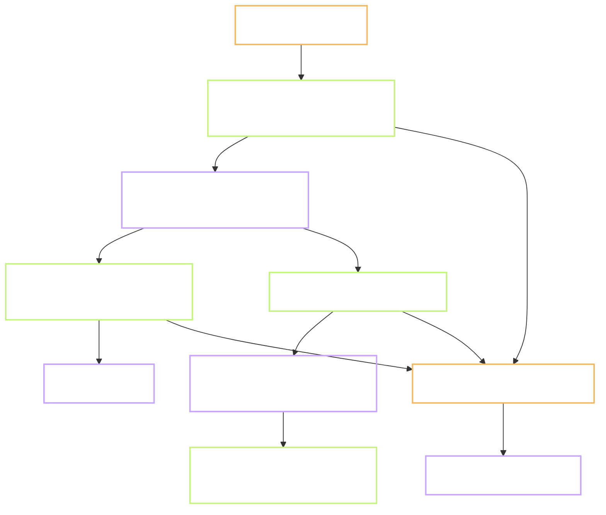

# Plan - P.3 a machine that can make audio, timing and images

Status: **in progress**. Gate A approved 2026-10-08. Gate B not reached.
Task: `P.3` · Prompt: `prompts/phase-P/P.3.md` · Record: `records/P.3.md`
Branch: `chore/p3-pipeline-env`, cut from `main` at `4963232`.
Reviewer: `self`
Type: **INFRA** - tools installed on one machine. No product behaviour.
Level: **L2** - several new files and a few logic branches. No shared contract changes.
Repro: not applicable, this is not an ISSUE
User-visible behaviour: no Flow.md. INFRA, nothing a learner sees changes.
Refs: `docs/09` section 3P.1 row P.3 · `docs/07` section 5.5 · `docs/01` sections 8.3 and 9.3 ·
Tests TC-CT-02 and TC-CT-04 as thresholds only
Depends on: P.1, done on 2026-09-24. P.2 is not needed here, done on 2026-10-08.

**Decisions log (2026-10-08):**
1. 2026-10-08 - Plan written. No review round yet.
2. 2026-10-08 - **Gate A approved.** Miniforge may be installed at `D:\tools\miniforge3`, outside
   the repo and not on PATH.
3. 2026-10-08 - **Stable Diffusion is skipped on this machine.** The record carries the reason.
   Task P.5 uses a free hosted service.
4. 2026-10-08 - **GPL part of Kokoro.** Run Kokoro without the `espeak-ng` fallback first. List
   the real licences after install, before any use.
5. 2026-10-08 - **Downloads go to drive D:.** The 5 to 6 GB estimate is accepted.
6. 2026-10-08 - **The reviewer listens to the 10 files** for test 11.

Out of scope: choosing the final two voices (task P.4), the content workshop (P.5), downloading
any source data (P.7), the full 30-word run (P.10), drawing mouth shapes, any upload to R2.

> **Language rule (B1/B2):** short sentences, 20 words or fewer. Active voice. One idea per sentence.

Short names used below. **TTS** is text to speech. **MFA** is Montreal Forced Aligner, the tool
that finds when each sound starts in a recording. **LUFS** is the unit for loudness.
**GPU** is a graphics card that can run image models.

---

## 0. Does this task need a Flow.md?

No. Type is INFRA and no screen is involved. Deliberate notes go in section 5.

## 1. Goal

After this task, one command chain on this machine turns a word into a spoken file, a small
compressed file, and a list of sound timings. We also know how many seconds each step costs per
word. Tasks P.4, P.10 and 1.4 cannot be scheduled without those numbers.

## 2. Starting point, checked today

Commands were run on 2026-10-08 on this machine. The output below is real, not remembered.

| Thing | State today | Evidence |
| --- | --- | --- |
| Default Python | 3.14.2 | `python --version` |
| Python 3.12 | 3.12.14, installed by `uv`, starts | `py -V:Astral/CPython3.12.14 -c ...` prints `3.12.14` |
| `py -3.12` | does **not** start it | `No suitable Python runtime found` |
| `conda`, `mamba`, `micromamba` | not installed | `command -v` finds nothing |
| `mfa` | not installed | `command -v mfa` finds nothing |
| `ffmpeg`, `ffprobe` | 9.0.2 full build | `ffmpeg -version` |
| `espeak-ng` | not installed | `command -v espeak-ng` finds nothing |
| Graphics card | AMD Radeon integrated, 512 MB | `Win32_VideoController` |
| NVIDIA card | none | `nvidia-smi: command not found` |
| Processor and memory | Ryzen 7 5800U, 31.3 GB | `Win32_Processor`, `Win32_ComputerSystem` |
| Free disk | **C: 7.9 GB**, D: 161.4 GB | `Get-PSDrive C,D` |
| Model cache already on C: | 3.3 GB | `du -sh ~/.cache/huggingface` |
| `tools/pipeline/` | one file | `tools/pipeline/build_lexicon.py`, 71 lines |
| `cmudict`, `nltk` | not installed | `ModuleNotFoundError` for both |
| Sample word list | 30 rows | `content/lexicon/lexicon_raw_test.csv`, 31 lines |
| The word "wind" | two rows, two sounds | `lexicon_raw_test.csv:9` `W IH1 N D`, `:10` `W AY1 N D` |
| Ignore rules | audio and venv covered | `.gitignore:3` `content/pack/audio*/`, `:5` `*.opus`, `:6` `*.wav`, `:7` `tools/pipeline/.venv/` |
| Lexicon script writes a file | no encoding given | `tools/pipeline/build_lexicon.py:61` `open('lexicon_raw_test.csv','w',newline='')` |

**Still assumptions, not checked yet:**

- Kokoro installs and runs on Python 3.12 on Windows with a processor-only build of `torch`.
- MFA installs through conda on Windows. MFA has no supported `pip` install there.
- `build_lexicon.py:61` will fail on Windows, because the file holds phonetic letters and the
  default encoding is cp1252. P.1 fixed the same fault in `verify_pack.py`.
- Download sizes. My estimate is 5 to 6 GB in total. That is a guess until measured.

Three facts shape the whole plan. There is no usable graphics card. Drive C: is almost full.
The default Python is too new for the speech tools.

## 3. Flow



One input, three outputs, one table of timings. The image step is separate, see 4.6.

## 4. Plan of work

### 4.1 Two environments, both on drive D: - required

The speech tools and the aligner cannot share one environment. Kokoro installs with `pip`. MFA
needs conda.

- `tools/pipeline/.venv` - Python 3.12.14, made from the `uv` install that is already here.
  Holds `kokoro`, `misaki`, `soundfile`, `cmudict`, `nltk` and a processor-only `torch`.
- `tools/pipeline/.mfa` - a conda environment that holds only MFA. Needs question 1 answered.
- `tools/pipeline/.cache/` - every download cache goes here: `pip`, the model cache, MFA models.
  Set through `PIP_CACHE_DIR`, `HF_HOME` and `MFA_ROOT_DIR`.

All three folders are ignored by git. `.gitignore` gains two lines for `.mfa/` and `.cache/`.

Nothing new may land on C:. 7.9 GB free is less than the install needs. A full system drive
breaks more than this task.

### 4.2 `tools/pipeline/env/tts_sample.py` - required

Speaks hello, market, reluctant, think and wind with voices `af_heart` and `am_michael`. Both
voices are temporary; P.4 picks the final pair. Writes 10 WAV files to
`content/pack/audio_test/`. Prints the seconds for each file, and the model load time on its own
line. Load time is paid once per run, so it must not be counted per word.

One speed only. Slow playback is done in the app, never as a second file.

### 4.3 `tools/pipeline/env/encode_opus.py` - required

Calls `ffmpeg` twice per file. The first pass measures loudness. The second pass corrects to
-16 LUFS and writes Opus at 24 kbps. Then it measures the result again and prints the number.
A printed target is not proof; the measured output is.

### 4.4 `tools/pipeline/env/align_sample.py` - required

Downloads the `english_us_arpa` dictionary and acoustic model into the cache on D:. Aligns the
10 WAV files. Writes one TextGrid file per recording. A TextGrid is a text file that lists each
sound with its start and end time.

### 4.5 `tools/pipeline/env/check_textgrid.py` - required

Reads each TextGrid. Checks that a tier named `phones` exists, that times only go up, and that
the last time is not after the end of the audio. Then compares the sounds with the CMUdict entry
for that word, from `lexicon_raw_test.csv`. Writes `mismatch.csv`, even when it is empty.

This file has no heavy import. So it gets tests in `tools/checks/`, and the gate runs them with
the default Python.

### 4.6 Stable Diffusion - skipped on this machine, with a written reason

The prompt allows this. An image model needs a graphics card with several GB of memory. This
machine has an integrated card with 512 MB. On the processor alone one image takes many minutes,
and the install is several GB more. The record gets the reason and an open question. Task P.5
uses a free hosted service instead. Needs question 2 confirmed.

### 4.7 `tools/pipeline/ENV.md` and `requirements.txt` - required

`ENV.md` holds the versions, the exact install commands, the three cache variables, and the
timing table. It is written so that a second machine can be set up from it. `requirements.txt`
pins the versions that were measured. Both are tracked in git.

`tools/checks/sdk-allowlist.md` gains rows in its dev-tools block for each new package. None of
them ships to a learner.

### 4.8 `tools/pipeline/build_lexicon.py` - run again, fix only if it fails

The prompt asks that this script runs without error inside the new environment. I run it in a
scratch folder, so `content/lexicon/lexicon_raw_test.csv` is not overwritten. If line 61 fails
as expected, the fix is one argument, `encoding='utf-8'`, plus a test. Nothing else in that file
changes. The output must match the tracked file row for row.

### Options considered, not chosen

- Install everything into the default Python 3.14. Rejected: `torch` and Kokoro do not support
  it yet, and it would mix project tools into the system install.
- Install MFA with `pip`. Rejected: on Windows its Kaldi parts come only through conda.
- Run MFA in Docker or WSL. Rejected for now: one more layer to keep alive for a single tool.
  It stays the fallback if conda fails, see section 5 row 4.
- Run Stable Diffusion on the processor to tick the box. Rejected: slow, large, and P.5 would
  not use the result.
- Use Piper instead of Kokoro. Not now: `docs/01` section 8.3 keeps Piper as the backup voice.

### Do not touch

- `golden/`, `web/`, `supabase/`, `docs/07`.
- `content/lexicon/lexicon_raw_test.csv`. It is read, never rewritten.
- Any source download. That is task P.7.
- The default Python 3.14 and its packages. The gate keeps using it.

## 5. Situations and edge cases

| # | Situation | Expected behaviour |
| --- | --- | --- |
| 1 | "wind" has two sounds | The sample is the noun, `w:wind#1`, `W IH1 N D`. If Kokoro says the other one, the check fails and the record says so. P.10 then needs a way to force the sound |
| 2 | A clip shorter than 0.4 seconds | Loudness cannot be measured on it. The script reports "too short to measure". It does not print a made-up number |
| 3 | A word is missing from the MFA dictionary | Reported by name. Not expected for these 5 words |
| 4 | conda install of MFA fails on Windows | Stop. Record the real error. Bring the Docker or WSL option back as a plan change, with a new line in the Decisions log |
| 5 | A download is cut off | The cache keeps what arrived. The scripts can be run again and overwrite their own output |
| 6 | Drive C: fills up anyway | The scripts check free space on C: first and stop below 5 GB |
| 7 | A package turns out to carry a GPL licence | Stop before using it. See question 3 |
| 8 | Scripts run twice | Same 10 files, same names, no duplicates |
| 9 | MFA sound differs from CMUdict by stress mark only | Counted as a match for the sound, listed separately for stress |
| 10 | The gate runs on Python 3.14 | New tests import nothing heavy, so the gate stays near 5 seconds |

Nothing here changes behaviour that already exists, apart from the possible one-argument fix in 4.8.

## 6. Impact - who else touches this

| Thing created | Consumer | Effect |
| --- | --- | --- |
| `tools/pipeline/.venv`, `.mfa`, `.cache` | tasks P.4, P.10, 1.4 | new; not in git |
| `tools/pipeline/ENV.md` | anyone setting up a second machine | new |
| `tools/pipeline/requirements.txt` | tasks P.10, 1.4 | new |
| `tools/pipeline/env/*.py`, four scripts | P.10 reuses the steps | new |
| Timing table | `docs/09` schedule, tasks 1.4 and 5.1 to 5.4 | new; the schedule may need new numbers |
| `tools/checks/sdk-allowlist.md` | the licence gate | new rows in the dev-tools block |
| `tools/pipeline/build_lexicon.py:61` | task P.8 | unchanged, or one argument added |
| `.gitignore` | everyone | two new lines |
| `content/pack/audio_test/` | task P.4 listens to it | new; not in git |

Found with: `ls tools tools/pipeline tools/checks`, `cat -n .gitignore`,
`grep -n 'P\.3\|P\.4\|P\.10' docs/09-ke-hoach.md`, `grep -n "open(" tools/pipeline/build_lexicon.py`.

## 7. Tests and Definition of Done

| # | Test | How to run | Expected result |
| --- | --- | --- | --- |
| 1 | 10 recordings exist | `tts_sample.py`, then list the folder | 10 WAV files, each 300 to 4,000 ms long |
| 2 | Compressed and level | `encode_opus.py` | 10 Opus files, each measured between -18 and -14 LUFS, bitrate near 24 kbps |
| 3 | Timings exist | `align_sample.py` | 10 TextGrid files, each with a `phones` tier |
| 4 | Timings are sane | `check_textgrid.py` | times only go up; last time is not after the audio ends |
| 5 | Sounds match CMUdict | `check_textgrid.py` | 5 of 5 words match; `mismatch.csv` exists |
| 6 | The "wind" case | same script | the noun is `W IH1 N D`, or the failure is recorded |
| 7 | Lexicon script still runs | `build_lexicon.py` in a scratch folder | exit 0, 30 words, same rows as the tracked file |
| 8 | Nothing landed on C: | free space before and after | C: loses less than 0.5 GB |
| 9 | No audio in git | `git status` after the run | no WAV, Opus or environment file is listed |
| 10 | Gate still green | `bash tools/checks/gate.sh full` | exit 0 |
| 11 | Listening check | the reviewer plays all 10 files | one note per file in the record |
| 12 | Licences | list the licences of every installed package | each one is in `license-allowlist.txt`, or question 3 decides |

Output checks from `CLAUDE.md` section 3 that apply: audio duration and loudness, two voices per
word, timings rising and inside the duration, sounds compared with CMUdict with a `mismatch.csv`,
code tests green, no dependency outside the allowlist.

Test 11 is the only one I cannot run. It needs ears.

**Definition of done:**

- [ ] `tools/pipeline/.venv` runs Kokoro on Python 3.12, with every cache on D:
- [ ] 10 WAV files, 5 words by 2 voices, each 300 to 4,000 ms
- [ ] 10 Opus files, each measured between -18 and -14 LUFS
- [ ] 10 TextGrid files with a `phones` tier and rising times
- [ ] 5 of 5 words match CMUdict, or each mismatch is listed in `mismatch.csv` and explained
- [ ] The reviewer has listened to all 10 files, with a note for each
- [ ] One test image, or a written reason why not
- [ ] `ENV.md` has versions, install commands and a table of seconds per word for each step
- [ ] `ENV.md` gives an estimate for 5,000 words and 15,000 sentences, built from measured numbers
- [ ] `build_lexicon.py` runs clean in the environment and its output matches the tracked file
- [ ] Every new package has a row in `sdk-allowlist.md` and a licence in the allowlist
- [ ] Drive C: lost less than 0.5 GB
- [ ] `records/P.3.md` has a result line per step and the test table with real output
- [ ] The branch is merged into `main` with `gate.sh merge`, and deleted

## 8. After Gate B

Planned commit messages:

```
feature(P.3): add pipeline environment scripts and pinned requirements
feature(P.3): check aligned sounds against cmudict
docs(P.3): add ENV.md with versions and measured timings
```

Record note: step results and the test table go into `records/P.3.md`. `records/TRACKING.md` gets
status, real effort, test result and date. If the timings change the schedule, `docs/09` is
edited and the record says which section.

## 9. Open questions for the reviewer

All five were answered on 2026-10-08 and moved into the Decisions log above. Kept for the record:

1. **May I install Miniforge on D: for MFA?** Miniforge is the free conda installer. It would go
   to `D:\tools\miniforge3`, outside the repo, and would not be added to PATH. This installs a
   program on your machine, so I ask first. I recommend yes.
2. **Skip Stable Diffusion on this machine?** No usable graphics card. The prompt allows a
   written reason and a free service in P.5. I recommend skip.
3. **A GPL part may come with Kokoro.** Kokoro turns text into sounds with `misaki`. For words it
   does not know, `misaki` can fall back to `espeak-ng`, which is GPL-3.0. GPL is not in
   `license-allowlist.txt`. It would be a build tool on this machine only. Nothing of it ships in
   the app, and the audio it helps make is not covered by its licence. I will list the real
   licences after install, before any use. If a GPL part is present, do you accept it as a
   build-only tool, or must I run Kokoro without the fallback? I recommend without the fallback
   first: all 5 words are ordinary dictionary words.
4. **Expect 5 to 6 GB of downloads on D:.** This is an estimate. Fine to proceed?
5. **Who listens to the 10 files?** Test 11 needs a person. I assume you.
