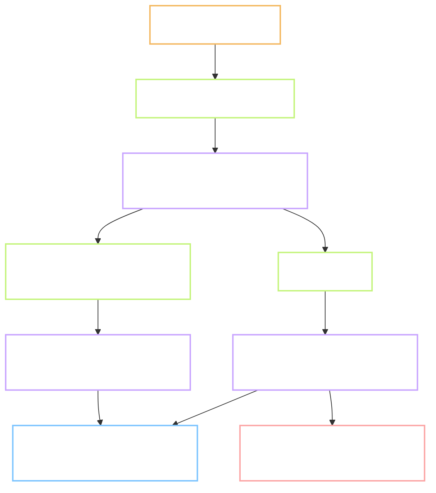

# P.3 - this machine can now turn a word into speech, a small file and sound timings

Task: `P.3` · Plan: https://hub.yawasa.com/app/p/moonegg-p3-plan · Flow: skipped, Type is INFRA
Record: `records/P.3.md` · Delivery: https://hub.yawasa.com/app/p/moonegg-p3-delivery
Commits: `5509ead`, `afe2f81`, `bb052b9`, plus record, plan and rule commits
Branch: `chore/p3-pipeline-env`, merged into `main` with `gate.sh merge` and deleted on both sides
Effort: not measured (estimate: 1.5 nd) · Finished: 2026-10-08 · Checked by: `self`, Gate B approved 2026-10-08

Short names. **TTS** is text to speech. **MFA** is Montreal Forced Aligner, the tool that finds
when each sound starts. **LUFS** is the unit for loudness. **GPL** is a licence that asks any
program built on it to share its own code.

---

## What the task produced

The whole chain runs on this machine, and each step has a measured cost. One word does not match.

- `tools/pipeline/.venv`, `.mfa`, `.cache` - two environments and one cache, all on drive D:.
- `tools/pipeline/env/tts_sample.py` - speaks the sample words and times them.
- `tools/pipeline/env/encode_opus.py` - sets the loudness and writes Opus at 24 kbps.
- `tools/pipeline/env/align_sample.py` - runs MFA and collects the timing files.
- `tools/pipeline/env/check_textgrid.py` - checks the timings and compares sounds with CMUdict.
- `tools/pipeline/ENV.md` and `requirements.txt` - how to rebuild this on another machine.
- `tools/checks/test_textgrid.py`, `test_lexicon_encoding.py` - 9 new tests in the gate.
- A written licence rule in `CLAUDE.md` section 5.

## Before and after

| Observable | Before | After |
| --- | --- | --- |
| Speech from a word | not possible on this machine | 10 files, about 0.65 seconds of machine time per word |
| Loudness of the result | not measured | -16.5 to -16.0 LUFS, measured on the Opus file |
| Sound timings | not possible | 10 timing files, times rising, inside the audio length |
| Time to align | unknown | about 89 seconds to start, then about 0.1 seconds per file |
| Time for the full content set | a guess of "1 to 2 days" | about 23 machine hours, an estimate from measured steps |
| `build_lexicon.py` on Windows | crashes on phonetic letters | runs, output identical to the tracked file |
| Licence rule for build tools | not written; GPL tools already in use | two zones, written down |
| Free space on drive C: | 9.17 GB | not reduced; MFA left a 2 KB file |

## Tests

| # | Test | Command | Real output | Pass |
| --- | --- | --- | --- | --- |
| 1 | 10 recordings exist | `tts_sample.py` | 10 WAV files, 1,225 to 1,550 ms; limit is 300 to 4,000 | yes |
| 2 | Compressed and level | `encode_opus.py` | 10 Opus files, -16.5 to -16.0 LUFS, 21.3 to 24.9 kbps | yes |
| 3 | Timings exist | `align_sample.py` | `10 of 10 files aligned in 89.9 s` | yes |
| 4 | Timings are sane | `check_textgrid.py` | 0 files with falling times, 0 files past the audio end | yes |
| 5 | Sounds match CMUdict | `check_textgrid.py` | 4 of 5 words. "market": `AH0` in CMUdict, `IH0` from MFA | no, listed and explained |
| 6 | The "wind" case | same script | `W IH1 N D` for both voices, the noun | yes |
| 7 | Lexicon script runs | `build_lexicon.py` in a scratch folder | exit 0, 30 words, byte-identical to the tracked file | yes |
| 8 | Nothing landed on C: | free space before and after | 9.17 GB before, 12.63 GB after; 2 KB left by MFA | yes |
| 9 | No audio in git | `git ls-files` | 0 audio or environment files tracked | yes |
| 10 | Gate still green | `gate.sh full` | 4 steps pass, `14 passed`, exit 0 | yes |
| 11 | Listening check | the reviewer played the 10 files | "sounds very good", one verdict for all 10 | yes |
| 12 | Licences | `pip-licenses`, conda licence fields | speech: 96 packages, 1 GPL kept on purpose. MFA: 204 packages, 28 GPL family | yes, under the new rule |

Output checks from `CLAUDE.md` section 3: audio length and loudness in range, two voices per word,
timings rising and inside the audio, `mismatch.csv` written, code tests green.

## Deviations from the plan

- **The loudness step does not use `loudnorm`.** Run as the task prompt says, 7 of 10 files landed
  between -18 and -20 LUFS. A single word has tall peaks, so the filter could add only half the
  gain. The script now adds gain, limits the peaks, and measures the result.
- **Three packages were removed from the speech environment.** Two are GPL-3.0 and one is LGPL.
  Kokoro loads them on import. Two small stand-ins in `tts_sample.py` replace them.
- **Test 5 is 4 of 5, not 5 of 5.** MFA's own dictionary writes one vowel of "market" differently.
  The reviewer chose to leave the fix for task P.10.
- **The lexicon fix is three lines, not one argument.** The console output also needed UTF-8.
- **The listening check has one verdict, not ten notes.** The reviewer judged all files together.
- **No test image.** No usable graphics card. Decided at Gate A.
- **A licence rule was added to `CLAUDE.md`.** It was not in the plan. The reviewer approved it.

## Points that need a decision

- **Effort is not measured.** The reviewer confirmed "not measured" on 2026-10-08.
- **The rule for build tools is new.** What ships to a learner must be on the licence allowlist.
  Tools that only run on the build machine may be GPL, if they are listed and never copied into
  the product. This is a project rule, not legal advice.
- **One script still imports a GPL package.** `build_lexicon.py` imports `cmudict`. The data inside
  is BSD and stays clean. The script itself must not leave this private repo. Task P.8 can read the
  data file directly and drop the package.

## Faults found, fixed or left

| Fault | Where | Fixed? |
| --- | --- | --- |
| `loudnorm` misses the target on single words | task prompt step 3 | yes, gain plus limiter |
| `build_lexicon.py` crashes on Windows | `build_lexicon.py:61` and its `print` lines | yes, with two tests |
| GPL and LGPL packages arrive with Kokoro | speech environment | yes, removed |
| The `cmudict` package is GPL-3.0 | task prompt step 1 | left, kept under the new rule |
| MFA's dictionary differs from CMUdict | "market", both voices | left for P.10, in `mismatch.csv` |
| `py -3.12` cannot start the installed 3.12 | this machine | left, `ENV.md` gives the working command |
| `mfa.exe` fails when called directly | missing folders on PATH | yes, the script sets them |
| Compiled test caches are tracked in git | `tools/checks/__pycache__/` | left, out of scope |

## Known limitations

- A word outside Kokoro's dictionary is skipped, not guessed. The script stops and names it.
- Text with digits makes Kokoro fail. Example sentences must spell numbers out.
- There is no way yet to force the verb sound of "wind". Task P.10 needs one.
- The 23 hour estimate assumes a 4 second sentence. That length is not measured.
- The voices are temporary. Task P.4 picks the final pair.
- MFA costs 89 seconds per start. It must run on large batches, never word by word.

## Where it stands

Tasks P.4, P.10 and 1.4 can be scheduled with real numbers. P.4 can generate its listening
samples today. P.10 inherits two open problems, both small and both written down: a dictionary
for MFA built from CMUdict, and a way to force one sound of a word with two sounds.
