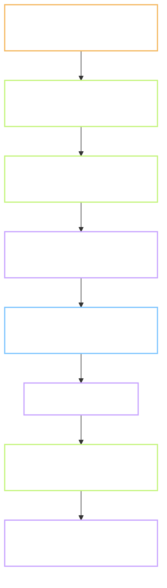

# Plan - P.4 pick the final two voices

Status: **not started**, stopped at Gate A, waiting for review.
Written during the `task-lead` dry run on 2026-10-08. P.4 opens as its own task after `task-lead` closes.
Task: `P.4` · Prompt: `prompts/phase-P/P.4.md` · Record: `records/P.4.md`
Branch: not cut yet. Will be `chore/p4-voices`, from `main`. This file reaches `main` inside the
`task-lead` merge, by that task's decision 3, approved by the owner on 2026-10-08.
Reviewer: `self`, plus the `gate-reviewer` agent as second reader
Type: **DATA** - sample audio and a score sheet. The product does not change.
Level: **L2** - two new scripts, one shared module, one page, one test file, one row edited in `docs/01`. No shared contract changes.
Repro: not applicable, this is not an ISSUE
User-visible behaviour: no Flow.md. DATA, nothing a learner sees changes.
Refs: `docs/09` section 3P.1 row P.4 · `docs/01` section 8.3 · TC-CT-02 and TC-CT-05 as thresholds
Depends on: P.3, done on 2026-10-08.

**Decisions log (2026-10-08):**
1. 2026-10-08 - Plan written by the lead from the scout's table. No review round yet.
2. 2026-10-08 - **Second reader, `gate-reviewer`, found 15 defects. All fixed in this version.**
   The big ones: three line numbers in `docs/01` were off by one, the scout had counted them
   from a `sed` window and said so; the plan both changed `VOICES` and required P.3's files to
   stay the same; the "wind" note went to a file that is rewritten and never committed; raters
   would have heard raw audio, so a louder voice could win on clarity; rater names would have
   reached the delivery drop; a short score sheet had no rule; 20 words were counted from a
   list with only 9 distinct headwords. Each fix is marked "(decision 2)" below.
3. 2026-10-08 - **A second run of the reader, on a variant of this plan (test 5 of `task-lead`),
   found five more defects that apply here. Fixed:** Kokoro prints misaki symbols, where /aɪ/
   is the single letter `I`, so test 6 compares misaki strings; `score.py` and the shared Kokoro
   code get a pytest in `tools/checks/`; a path to Piper when every Kokoro voice scores badly;
   the Level line counts the real files; the `docs/08:55` claim is worded as the file says.

Out of scope: Piper (the backup set, not installed; used only if a Kokoro voice fails to load),
sentences for the real content (task 1.3), timing files (P.10), switching the pipeline to the
chosen voices (P.10 does that, see 4.5).

> **Language rule (B1/B2):** short sentences, 20 words or fewer. Active voice. One idea per sentence.

Short names. **Voice** is one Kokoro voice file such as `af_heart`. **Rater** is a person who
listens and gives a score. **Blind** means the rater does not know which voice they hear.
**LUFS** is the unit for loudness.

---

## 0. Does this task need a Flow.md?

No. Type is DATA and no screen exists. Deliberate notes go in section 5.

## 1. Goal

After this task the project has one female and one male voice, chosen blind by three people
from a score sheet, and the choice is written where every later audio task reads it:
`docs/01` section 8.3. Task 1.4 cannot generate 40,000 files on a guess.

## 2. Starting point, checked today

Facts from the `evidence-scout` helper, run on 2026-10-08. Line numbers in `docs/01` were then
confirmed with `grep -n` by the lead (decision 2).

| Thing | State today | Evidence |
| --- | --- | --- |
| Candidate voices | 3 female, 2 male, named in the requirements | `docs/01-yeu-cau.md:366`: `af_heart, af_bella, af_sarah` and `am_michael, am_adam` |
| Chosen voice | none yet | `docs/01-yeu-cau.md:357` row "Giọng đọc" names no voice; `:362` says "cần nghe thử rồi chọn" |
| Voice files on this machine | 2 of 5 | `ls tools/pipeline/.cache/hf/.../voices/` prints `af_heart.pt`, `am_michael.pt` only |
| Test words | 30 rows, 29 distinct headwords, no sentence column | `head -1 content/lexicon/lexicon_raw_test.csv`; `wc -l` = 31; "wind" has two rows |
| Example sentences in the repo | none as data; one sentence in prose | `docs/08-kiem-thu.md:52` `"I went to the market yesterday."`; `:55` says the mock pack gives each word 2 example sentences; none are in the repo today |
| Speech script | speaks a bare word, two fixed voices | `tools/pipeline/env/_paths.py:20` `WORDS`, `:22` `VOICES`; `tts_sample.py:59`, `:65` |
| Who reads `VOICES` | two scripts | `tts_sample.py:14,51,56`; `align_sample.py:16,63` |
| Kokoro import | fails without `num2words` unless a stand-in is placed first | `misaki/en.py:4`; `tts_sample.py` places the stand-in; a bare `import kokoro` printed `ModuleNotFoundError` |
| Loudness and Opus step | exists, proven on 10 files | `tools/pipeline/env/encode_opus.py`, P.3 test 2: -16.5 to -16.0 LUFS |
| `mismatch.csv` | rewritten on every run of `check_textgrid.py`, inside an ignored folder | `check_textgrid.py:8`; `.gitignore:3` |
| A rating page or score CSV | none exists | grep for `rating|chấm|score` hits only `.md` files |
| Piper | not installed | `pip list \| grep -i piper` printed nothing |
| Evidence the schedule asks for | score sheet and the decision | `docs/09-ke-hoach.md:105`: `Bảng điểm, quyết định` |
| The two-sound word | `w:wind#1` noun /wɪnd/, `w:wind#2` verb /waɪnd/ | `docs/08-kiem-thu.md:48-49`; `prompts/phase-P/P.4.md:22`; TC-CT-05 at `docs/08-kiem-thu.md:260` |
| How Kokoro writes the two sounds | misaki symbols: noun `wˈɪnd`, verb `wˈInd` (`I` is /aɪ/) | P.3 `tts_timing.json` phonemes `wˈɪnd`; `misaki/en.py` maps aɪ to `I` |
| Audio length rule | words 300 to 4,000 ms, sentences 800 to 8,000 ms | TC-CT-02, `docs/08-kiem-thu.md:257` |
| Record template | has the token line | `records/TEMPLATE.md:4` |

**Still assumptions:**

- The three missing voice files download from the same Hugging Face repo as the first two, into
  the cache on drive D:. Each is under 1 MB, by the size of the two present. Not measured.
- Three raters are available: the owner and two others. The owner confirms who, question 1.
- Kokoro reads "wind" as the noun when alone (P.3 measured this). What it does inside a verb
  sentence is not measured. Test 6 measures it.
- The winners may not be P.3's pair. Nothing in this task depends on them being the same.

## 3. Flow



Raters hear what learners will hear: levelled Opus, not raw WAV (decision 2).

## 4. Plan of work

### 4.1 Twenty words and five sentences - required

Twenty **distinct** headwords from the 29 in `lexicon_raw_test.csv`, "wind" once, as a bare
word (decision 2). Five short sentences, 6 to 12 words, no digits, written here from the same
words; one uses "wind" as the verb, so test 6 has an input. They go in `_paths.py` as
`SAMPLE_WORDS` and `SENTENCES`, next to `WORDS`. `WORDS` and `VOICES` are not touched.
The sentences are for listening only; task 1.3 writes the real ones.

### 4.2 `tools/pipeline/env/voice_samples.py` - required

Reuses the stand-ins and the pipeline from `tts_sample.py`; the shared part moves into a small
`_kokoro.py` so the two scripts do not copy code. Speaks 20 words and 5 sentences with each of
the 5 voices: 125 WAV files. Loads the three missing voices on first run. Then calls the same
gain-and-limit step as `encode_opus.py` on all 125, so every sample sits at -16 ±2 LUFS
(decision 2). Writes the Opus files under blind names `s001.opus` to `s125.opus`, in a random
order fixed by a seed. Writes `key.csv` (blind name, voice, text) to a separate folder,
`content/pack/audio_test/voices/_key/`, never next to the samples. Prints seconds per file.

### 4.3 `tools/pipeline/env/rate.html` - required

One static page, no build, no server: opened from disk next to the 125 Opus files. It plays
them in a random order per rater, shows two sliders 1 to 5 ("rõ ràng", "tự nhiên") and a field
for a **rater code**, `R1`, `R2` or `R3`, never a name (decision 2). It offers the result as CSV
text to copy out. The page never reads `_key/`. A rater who stops early sees how many rows are
done and can continue later from the same browser.

### 4.4 `tools/pipeline/env/score.py` - required

Joins the three sheets with `key.csv`. Refuses a sheet with fewer than 125 rows and names it;
that rater finishes before scoring runs (decision 2). Prints the mean of each score per voice,
with the count, and the two winners: highest sum of means, one female, one male. On a tie the
owner decides by ear and the record says it was a tie. If the best voice of a sex has a mean
below 3 of 5 on either score, the script says so and Piper enters as a plan change for that sex
(decision 3). Writes `scores.csv` next to `key.csv`.

### 4.4b `tools/checks/test_voice_scores.py` - required

Tests for `score.py` on a 6-row fixture (join, mean, winner, short-sheet refusal) and one test
that `_kokoro.py` places the two stand-ins before Kokoro is imported. No heavy import, so the
gate runs them on the default Python (decision 3).

### 4.5 `docs/01-yeu-cau.md:357` - required, one row

The "Giọng đọc" row gets the two names and the date. The candidate table at line 366 stays as
history. **`_paths.py` `VOICES` is not changed here** (decision 2): P.3's two scripts read it,
and P.3's record names their 10 files. Task P.10 switches the pipeline to the chosen pair.

### 4.6 The two-sound check - required, with a real threshold

With each of the two winners, speak "wind" alone and the verb sentence. Keep Kokoro's phoneme
string for each, in misaki symbols (decision 3). Pass: alone contains `wˈɪnd` and the verb
sentence contains `wˈInd`. Fail: either does not. The result, pass or fail, goes to `docs/tasks/P.4/wind-check.md`, a tracked
file, so P.10 can read it (decision 2). `mismatch.csv` is not used: it is rewritten by
`check_textgrid.py` and lives in an ignored folder.

### Options considered, not chosen

- Rate inside the existing `web/` app. Rejected: a build and a server for a one-day task.
- Skip the blind step. Rejected: a rater who knows the name rates the name.
- Rate raw WAV. Rejected after review: a louder voice wins on clarity for being louder.
- Change `VOICES` now. Rejected after review: P.3's scripts and record depend on it.
- Install Piper now. Rejected: the prompt names it as a backup only.

### Do not touch

- `content/lexicon/lexicon_raw_test.csv`, `golden/`, `web/`, `supabase/`.
- `_paths.py` `WORDS` and `VOICES`; `tts_sample.py` and `align_sample.py` behaviour.
- `encode_opus.py` thresholds; the new script calls it, it does not copy it.

## 5. Situations and edge cases

| # | Situation | Expected behaviour |
| --- | --- | --- |
| 1 | A voice file does not download | the script stops and names it; the record says so; Piper enters as the backup for that sex, as a plan change with a log line |
| 2 | A rater stops at row 60 | the page keeps the 60 rows; `score.py` refuses the sheet; the rater finishes; the task waits. DoD stays at 375 |
| 3 | Two voices tie | the owner decides by ear; the record says it was a tie |
| 4 | A word is outside Kokoro's dictionary | the script stops and names it; the lead swaps the word and re-runs; the record says which |
| 5 | Script run twice | same 125 names, same order, because the seed is fixed |
| 6 | The audio folder is tracked by mistake | `content/pack/audio*/` is ignored; `key.csv`, `scores.csv` and the three sheets are copied into the delivery, then scanned |
| 7 | "wind" as the verb comes out as the noun | test 6 fails; `wind-check.md` says so; task P.10 owns the fix |
| 8 | A rater is not at this machine | they get a zip of the 125 Opus files and `rate.html` only; `_key/` is a separate folder and never zipped |
| 9 | A sample is 6 seconds long for one word | test 1 fails for that file; it is a broken sample and is regenerated |

Nothing here changes behaviour that already exists.

## 6. Impact - who else touches this

| Thing changed | Consumer | Effect |
| --- | --- | --- |
| `docs/01` section 8.3, row 357 | tasks 1.4, 5.1 to 5.4, P.10 | the chosen voices |
| `_paths.py`: new `SAMPLE_WORDS`, `SENTENCES`; `VOICES` unchanged | `tts_sample.py`, `align_sample.py` | unchanged |
| `_kokoro.py` (shared stand-ins and pipeline) | `tts_sample.py`, `voice_samples.py` | `tts_sample.py` imports it; output unchanged, test 7 |
| `voice_samples.py`, `rate.html`, `score.py`, `tools/checks/test_voice_scores.py` | task 5.x if voices are ever re-judged; the gate | new |
| `content/pack/audio_test/voices/` and `voices/_key/` | the three raters | new, ignored by git |
| `docs/tasks/P.4/wind-check.md` | task P.10 | new, tracked |

Found with: the scout's table, `grep -n VOICES tools/pipeline/env/*.py`.

## 7. Tests and Definition of Done

| # | Test | How to run | Expected result |
| --- | --- | --- | --- |
| 1 | 125 samples exist, right length | `voice_samples.py`, then `ffprobe` each | 125 Opus, 25 per voice; words 300 to 4,000 ms, sentences 800 to 8,000 ms |
| 2 | Samples are level | `ebur128` on each file | every file -18 to -14 LUFS |
| 3 | Names are blind | read `rate.html`, list the samples folder | no voice name in any file name or in the page; `key.csv` only under `_key/` |
| 4 | Three full sheets | the raters | 3 CSV files, 125 rows each, 375 in total; two scores per row, each 1 to 5; rater codes only |
| 5 | Means are computed | `score.py` | one table, 5 rows, count 75 each; two names printed, one female, one male |
| 6 | The two-sound check | the two winners on "wind" alone and in the verb sentence | alone contains `wˈɪnd`; verb sentence contains `wˈInd`; result in `wind-check.md` |
| 7 | Decision is written | `git diff docs/01-yeu-cau.md` | one row changed, line 357, two names and the date |
| 8 | P.3's scripts still work | `tts_sample.py` | 10 files, same names as `records/P.3.md` |
| 9 | Nothing heavy in git | `git status` | no audio, no CSV from `audio_test/` |
| 10 | Delivery is clean | scan `docs/Delivery/<date>_P.4/evidence/` | 0 names, 0 keys; rater codes only |
| 11 | Gate still green, new tests included | `bash tools/checks/gate.sh full` | exit 0; `test_voice_scores.py` passes |

Output checks from `CLAUDE.md` section 3 that apply: audio length, loudness -16 ±2, every word
has every voice under test, a listening check (three raters hear 100 percent, so the 5 percent
spot check is covered and the sheets are the written list), code tests green.

**Definition of done:**

- [ ] 125 blind, levelled samples, 25 per voice, with `key.csv` kept apart
- [ ] 3 full sheets, 375 rows, means per voice printed by `score.py`
- [ ] One female and one male voice named in `docs/01` line 357, with the date
- [ ] `VOICES` unchanged; `tts_sample.py` still produces P.3's 10 files
- [ ] The "wind" check measured for both readings, result in `wind-check.md`
- [ ] Delivery scanned: rater codes only, no names
- [ ] `records/P.4.md` has a result line per step, the score table, and the token line
- [ ] The branch is merged into `main` with `gate.sh merge`, and deleted

## 8. After Gate B

Planned commit messages:

```
feature(P.4): generate blind, levelled voice samples and a rating page
feature(P.4): score the three rating sheets and pick the two voices
docs(P.4): record the chosen voices in the requirements and the wind check
```

Record note: `records/TRACKING.md` row P.4 gets status, real effort, "bảng điểm" and the date.

## 9. Open questions for the reviewer

1. Who are the two raters besides the owner? Three people at this machine, or a zip of the
   125 files and the page sent to them.
