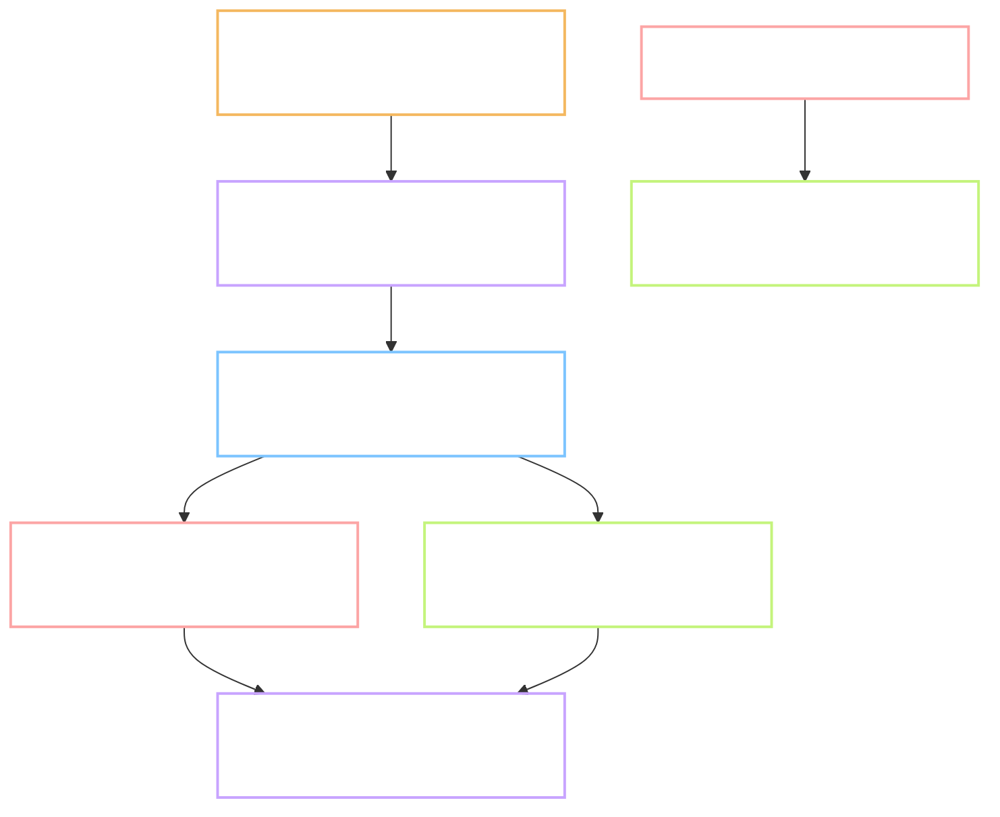

# P.4 - the two voices are chosen: `af_heart` and `am_adam`

Task: `P.4` · Plan: https://hub.yawasa.com/app/p/moonegg-p4-plan · Flow: skipped, Type is DATA
Record: `records/P.4.md` · Delivery: https://hub.yawasa.com/app/p/moonegg-p4-delivery
Commits: `455d5ff`, `1427e07`, `a6e6cc7`, `859a022`, plus record and plan commits
Branch: `chore/p4-voices`, merged into `main` with `gate.sh merge` and deleted
Effort: not measured (estimate: 0.5 nd) · Finished: 2026-10-09 · Checked by: `self`, Gate B approved 2026-10-09

Short names. **Voice** is one Kokoro voice file. **Sitting** is one pass through all 125 samples.
**Blind** means the listener does not know which voice a sample is. **LUFS** is the unit for
loudness.

---

## What the task produced

The male choice is clear. The female choice is close, and one sitting is doubtful.

- `docs/01-yeu-cau.md` line 357 names the two voices and the date.
- `tools/pipeline/env/voice_samples.py` - makes the blind, levelled listening set.
- `tools/pipeline/env/rate.html` - the rating page, opened from disk, no server.
- `tools/pipeline/env/score.py` - joins the sheets with the key and names the winners.
- `tools/pipeline/env/_kokoro.py` - one place that loads Kokoro; it now stops on an unknown word.
- `docs/tasks/P.4/wind-check.md` - the two readings of "wind", for task P.10.
- `tools/checks/test_voice_scores.py` - 19 tests in the gate.

## Before and after

| Observable | Before | After |
| --- | --- | --- |
| Voices for all later audio | a temporary pair, `af_heart` and `am_michael` | `af_heart` and `am_adam`, chosen by ear |
| Basis of the choice | none | 375 blind scores, means per voice and per sitting |
| "wind" as noun and as verb | noun measured, verb unknown | both sound strings correct, for every voice |
| A word Kokoro does not know, inside a sentence | dropped silently | the run stops and names the word |
| Loudness difference between raw voices | unknown | up to 4.6 dB; removed before rating |
| A copied or misnamed score sheet | counted as a sitting | refused, with the reason |
| A look at the scores between sittings | showed which voice led | shows nothing until three sheets are in |

## Tests

| # | Test | Command | Real output | Pass |
| --- | --- | --- | --- | --- |
| 1 | 125 samples, right length | `voice_samples.py` | 125 files, 25 per voice; words 856 to 2,031 ms; sentences 2,232 to 3,756 ms | yes |
| 2 | Samples are level | measured on each Opus file | -16.8 to -15.9 LUFS | yes |
| 3 | Names are blind | list the folder, search the page | 0 voice names in file names or in the page | yes |
| 4 | Three full sheets | the owner, three sittings | 3 files, 125 rows each, 375 in total, all scores 1 to 5 | yes, with a doubt on the third |
| 5 | Means are computed | `score.py` | 5 voices, 75 rows each; `af_heart` and `am_adam` named | yes |
| 5b | Measurement sheet | `measures.csv` | 125 rows, all fields filled | yes |
| 6 | Two readings of "wind" | sound strings from Kokoro | alone `wˈɪnd`; in the verb sentence `wˈInd`; same for all 5 voices | yes for the strings; by ear still open |
| 7 | Decision is written | `git diff docs/01-yeu-cau.md` | one row changed, line 357 | yes |
| 8 | P.3's scripts still work | `tts_sample.py`, `encode_opus.py` | the same 10 file names; 0 outside the loudness target | yes |
| 9 | Nothing heavy in git | `git ls-files` | 0 audio files tracked | yes |
| 10 | Delivery is clean | scan the delivery folder | 0 findings; sheets carry codes only | yes |
| 11 | Gate still green | `gate.sh full` | 4 steps pass, `33 passed`, exit 0 | yes |

Output checks from `CLAUDE.md` section 3: audio length and loudness in range, every text has all
five voices, the listener heard 100 percent of the samples, code tests green.

## The scores

| Voice | Sex | Clarity | Natural | Sum | Sitting 1 | Sitting 2 | Sitting 3 |
| --- | --- | --- | --- | --- | --- | --- | --- |
| `af_heart` | female | 4.48 | 4.11 | **8.59** | 8.60 | 9.00 | 8.16 |
| `af_sarah` | female | 4.40 | 4.01 | 8.41 | 8.28 | 8.60 | 8.36 |
| `af_bella` | female | 4.29 | 3.81 | 8.11 | 8.36 | 8.40 | 7.56 |
| `am_adam` | male | 4.04 | 3.41 | **7.45** | 8.00 | 7.80 | 6.56 |
| `am_michael` | male | 3.59 | 2.87 | 6.45 | 6.40 | 6.72 | 6.24 |

`am_adam` leads in every sitting. `af_heart` leads in sittings 1 and 2; `af_sarah` leads in 3.

## Deviations from the plan

- **One listener, three sittings, not three people.** The owner's decision. The sheets show how
  steady one pair of ears is. They do not show whether other people agree.
- **The session gave no scores.** It cannot hear. It gave a measurement sheet instead.
- **Sitting 3 is doubtful.** 101 of 125 rows carry the same number for both scores, against 41
  and 52 in the first two. It was saved 7 minutes after sitting 2. The page had a fault: a held
  digit key filled both scores. Whether that happened here is not proven.
- **The result does not depend on sitting 3.** Sitting 1 alone, sitting 2 alone, the two
  together, and all three give the same two winners. Only sitting 3 alone puts `af_sarah` first.
- **The second reader found 24 defects before this gate.** 20 are fixed, 4 are left with a
  reason. The list is in the delivery.
- **The sound-string check needed no CMUdict match.** The string is the same for all voices.
- **`VOICES` in the pipeline is unchanged.** Task P.10 switches it to the chosen pair.

## Decided at Gate B, 2026-10-09

- **Female voice: `af_heart`.** The owner approved the script's choice.
- **Sitting 3 stands.** The owner says the male voices really are harder to hear, so the low
  scores of that sitting are meant, not a key fault. The 375 rows are kept as they are.
- **The direct listen to "wind" was not done.** The sound strings are right for both readings.
  The check by ear moves to task P.10, which makes the real audio for both cards.
- **Effort: not measured.**

## Points that were open before the gate

- **Female voice: `af_heart` or `af_sarah`?** The margin is 0.17 of 10. The script picks
  `af_heart`. Sentences are level between the two; the gap is in single words.
- **Does sitting 3 stand, or is it redone on the fixed page?** Redoing it costs about 15 minutes.
  It cannot change the male result, and the female result holds without it.
- **One direct listen to "wind".** Play `s037` and `s090` (the verb sentence) and `s025` and
  `s121` (the word alone). Confirm the verb sounds like "wined" and the noun like "winned".
- **The limiter works harder on male voices.** It gave back 2.6 dB on `am_michael` words and
  1.8 dB on `am_adam`, against 0.7 to 1.0 dB on the female voices. Learners will hear the same
  processing, so the test is fair to the product. Task P.10 should look at the peak ceiling.
- **Effort is not measured.**

## Faults found, fixed or left

| Fault | Where | Fixed? |
| --- | --- | --- |
| A held digit key fills both scores | `rate.html` | yes |
| Enter or Space could press a score button again | `rate.html` | yes |
| The keyboard could not correct the first score | `rate.html` | yes |
| Saved scores could attach to new audio | `rate.html` | yes, an id of the audio |
| A copied or misnamed sheet counted as a sitting | `score.py` | yes |
| Voice results visible before three sittings | `score.py` | yes |
| A thin lead looked like a plain win | `score.py` | yes, per-sitting columns and a flag |
| An unknown word inside a sentence was dropped | `_kokoro.py` | yes |
| The record gave mean length per voice before sittings 2 and 3 | `records/P.4.md` | left, cannot be undone; it could hint at `af_sarah` |
| The limiter is uneven across voices | levelling step | left, for P.10 |
| The verb reading of "wind" is not confirmed by ear | `wind-check.md` | left, asked at this gate |

## Known limitations

- One listener. A second person may hear the female voices the other way round.
- Alone, "wind" is always the noun. Task P.10 needs a way to get the verb for its own card.
- Two sentences with "wind" are not proof for every sentence.
- The rating page was fixed after the sittings. The fixed page has not been used for a sitting.

## Where it stands

Task 1.4 and task P.10 have their two voices. The male one is safe. The female one is a close
call between two good voices, and the owner's ear decides at this gate. Nothing a learner sees
has changed yet.
