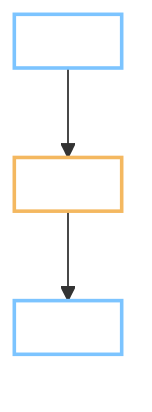
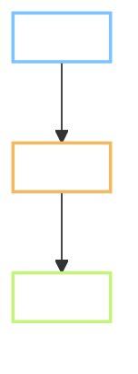

<!--
  Flow TEMPLATE - copy, do NOT edit in place.
  Output : docs/tasks/<task-id>/Flow.md   (same folder as Plan.md)
  When   : Gate A, in the same turn as the Plan. Both files must always agree.
  For    : the reviewer, the tester, whoever writes the user guide.
  Rule   : screen names and button labels exactly as the learner sees them, in bold.
           No file names, no class names, no method names anywhere in this file.
  Skip   : allowed only for INFRA, DATA and behaviour-preserving REFACTOR tasks.
           NEVER skip it for a FEATURE or for an ISSUE that changes a screen.
  Later  : this file becomes the Before-and-after section of Result.md, so it is
           written once, not twice.
-->

# Flow - <task-id> <what the learner sees, in their words>

Task: `<task-id>` · Plan: `Plan.md` in this folder · Reviewer: `<name, or self>`
Screens touched: **<Screen 3 Word card>**, **<Screen 4 Practice>** - <mockup numbers>

> **Language rule (B1/B2):** short sentences, 20 words or fewer. Diagrams carry the content.

---

## 1. The problem, from the learner's side

<Two or three sentences. What the learner is trying to do, and what stops them
or what is missing today.>

## 2. Flow today

<One or two lines. Nothing more.>

## 3. Flow after the change

<Same diagram type, same colours, same node layout as section 2. Only the changed
nodes differ, so the reviewer can compare them side by side.>

<One or two lines.>

## 4. Behaviour by situation

Include rows that deliberately do NOT change, marked "Unchanged", so nobody
hunts for a difference that is not there.

| Situation | Before | After |
| --- | --- | --- |
| <the main situation> | <what happened> | <what happens now> |
| <no network> | <...> | Unchanged |
| <first ever session> | <...> | <...> |
| <comes back after 12 days away> | <...> | Unchanged |

## 5. What does not change

- <the nearby thing a reader would expect to change and which stays as it is>

## 6. How to test by hand

1. <step the tester performs>
2. <what they should see>

Matching test IDs: TC-xx-nn.
