<!--
  Plan TEMPLATE - copy, do NOT edit in place.
  Output : docs/tasks/<task-id>/Plan.md   (same folder as Flow.md and Result.md)
  When   : Gate A, before any code, any download, any generated file.
  Pair   : Flow.md, unless the skip rule in section 0 says otherwise.
  Drop   : publish to yawasa the moment Gate A is presented; re-publish with
           --update after every review round so the link never changes.
  Rule   : every claim about existing code or data carries File.ext:line taken
           from a grep run TODAY, never from memory.
-->

# Plan - <task-id> <task name in plain words>

Status: **not started**, stopped at Gate A, waiting for review.
Task: `<task-id>` · Prompt: `prompts/<phase>/<task-id>.md` · Record: `records/<task-id>.md`
Branch: `<feature|fix|chore>/<task-id>-<slug>`, or "not cut yet".
Reviewer: `<name, or self>`
Type: **<INFRA | DATA | FEATURE | ISSUE | REFACTOR>** - <why, in one line>
Level: **<L1 | L2 | L3>** - <why: how many files, shared infrastructure, contract change>
Repro (ISSUE only): **<Confirmed | Trace-confirmed | Unconfirmed>** - <where, how many times>
User-visible behaviour: see `Flow.md` in this folder - OR "skipped, see section 5" when the skip rule applies.
Refs: FR-xx · Architecture SS<x.y> · Tests TC-xx-nn · Depends on: `<task ids, or none>`

**Decisions log (<YYYY-MM-DD>):**
1. <one dated line per review round. Never delete an older line.>

Out of scope: <what this task will NOT do, so nobody hunts for it>

> **Language rule (B1/B2):** short sentences, 20 words or fewer. Common words. Active voice.
> One idea per sentence. Define an acronym the first time. Diagrams carry the content;
> prose is one or two lines under each diagram.

---

## 0. Does this task need a Flow.md?

| Type | Flow.md |
| --- | --- |
| FEATURE, ISSUE that changes a screen | **required** |
| INFRA, DATA, REFACTOR, behaviour-preserving | may be skipped - put deliberate deltas in section 5 |

<Say which applies and why, in one line.>

## 1. Goal

<One or two sentences. What becomes possible after this task that is not possible now.
Not a list of steps - the checklist in the prompt already holds those.>

## 2. Starting point, checked today

<What exists right now, with File.ext:line or a command and its real output.
Split clearly: **checked** versus **still an assumption**.
For DATA tasks: row counts, coverage percentages, licence fields - real numbers, or "not measured yet".>

## 3. Flow

```mermaid
graph TB
    A["<input or current state>"]:::amber --> B["<step>"]:::green
    B --> C["<output, with the path it lands in>"]:::purple

    classDef amber fill:transparent,stroke:#f4b860,stroke-width:2px,color:#fff
    classDef green fill:transparent,stroke:#c4f47c,stroke-width:2px,color:#fff
    classDef purple fill:transparent,stroke:#c8a4ff,stroke-width:2px,color:#fff
```



<One or two lines under the diagram. Nothing more.>

## 4. Plan of work

### 4.1 `<path>` - <what changes, required / recommended / optional>

<What the change is. A short snippet only if it saves a paragraph.>

### Options considered, not chosen

- <Option B> - <why not>

### Do not touch

- <file, table, golden fixture, or behaviour left alone>

## 5. Situations and edge cases

| # | Situation | Expected behaviour |
| --- | --- | --- |
| 1 | <offline, empty input, re-run, partial data, homograph, missing licence> | <...> |

<When Flow.md is skipped, add the deliberate behaviour deltas here with
Situation | Before | After columns, and say what was deliberately left alone.>

## 6. Impact - who else touches this

| Thing changed | Call site or consumer | Effect |
| --- | --- | --- |
| `<file, table, column, item_id shape>` | `<File.ext:line, or task id>` | <unchanged / needs update> |

Found with: `<the grep or query that was actually run>`

## 7. Tests and Definition of Done

| # | Test | How to run | Expected result |
| --- | --- | --- | --- |
| 1 | TC-xx-nn | `<command>` | <real threshold, a number, not "OK"> |

Output checks from `CLAUDE.md` section 3 that apply: <name them>.

**Definition of done** (written now, before any work, so it cannot bend later):

- [ ] <acceptance threshold>
- [ ] <acceptance threshold>

## 8. After Gate B

Planned commit message:

```
<type>(<task-id>): <short description>
```

Record note: <what goes into records/<task-id>.md and TRACKING.md when this closes>

## 9. Open questions for the reviewer

1. <unresolved question. When answered, move it into the Decisions log at the top.>

Or: "None."
