<!--
  Result TEMPLATE - copy, do NOT edit in place.
  Output : docs/tasks/<task-id>/Result.md   (same folder as Plan.md and Flow.md)
  When   : as soon as the tests pass, BEFORE the commit gate. It holds no evidence
           files, so there is nothing to scan and no reason to hold it back.
  For    : the reviewer reading the hub to see where the product stands.
  Not    : a test sheet. Raw numbers live in records/<task-id>.md. The QC package
           lives in docs/Delivery/<YYYY-MM-DD>_<task-id>/.
  Rule   : flowcharts carry the content; one or two sentences under each diagram.
           Screen names as the learner sees them. No class or method names.
-->

# <task-id> <what was delivered, in plain words>

Task: `<task-id>` · Plan: <hub link> · Flow: <hub link, or "skipped">
Record: `records/<task-id>.md` · Delivery: `docs/Delivery/<YYYY-MM-DD>_<task-id>/`
Commits: `<sha>`, `<sha>` · Branch: `<branch>` · Effort: <real> nd (estimate: <est> nd)
Finished: <YYYY-MM-DD> · Checked by: `<name, or self>` on <YYYY-MM-DD>

---

## What the task produced

```mermaid
graph TB
    A["<input>"]:::amber --> B["<what now exists, with its path>"]:::purple

    classDef amber fill:transparent,stroke:#f4b860,stroke-width:2px,color:#fff
    classDef purple fill:transparent,stroke:#c8a4ff,stroke-width:2px,color:#fff
```

<One or two lines. Then a short list of the files or capabilities that now exist.>

## Before and after

<For a FEATURE or ISSUE: point at section 4 of Flow.md, do not copy the table -
two copies drift. For INFRA or DATA: one table row per observable that changed.>

## Tests

| # | Test | Command | Real output | Pass |
| --- | --- | --- | --- | --- |
| 1 | TC-xx-nn | `<command>` | <a real number, never "OK"> | yes / no |

Output checks from `CLAUDE.md` section 3: <which ones ran, and their result>.

## Deviations from the plan

- <what changed> - <why>

Or: "None."

## Points that need a decision

<Choices that are not defects but that someone should confirm: a threshold picked
by hand, a source dropped for licence reasons, a fallback used because a tool was
missing. Delete this section rather than inventing filler.>

## Faults found, fixed or left

| Fault | Where | Fixed? |
| --- | --- | --- |
| <what went wrong> | <file or step> | yes / left, and why |

## Known limitations

- <what this task does not cover, and which later task covers it>

## Where it stands

<One short paragraph: what a reader can rely on now, and what the next task needs
from this one.>
