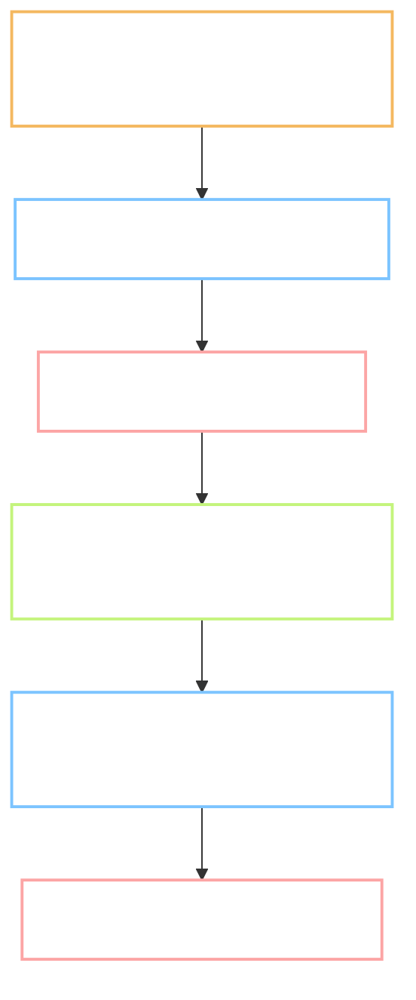

# Plan - setup-yawasa: two gates for every MoonEgg task

Status: **in revision**, Gate A, waiting for review.
Task: `_setup-yawasa` (workflow setup, not a P/1-5 task) · Record: none - this predates the process it installs
Branch: none - done on `main` before the branch rule existed. See Decisions log line 5.
Reviewer: `self`
Type: **INFRA** - changes how work is run, not what the product does
Level: **L2** - touches the standing rules every later task reads
Repro: not applicable, this is not an ISSUE
User-visible behaviour: no Flow.md. Type is INFRA and no learner-facing screen changes.
Refs: team standard "Product Issue Workflow - Plan / Flow / Result"

**Decisions log:**
1. 2026-09-24 - Two published moments per task: plan before work, outcome after tests.
2. 2026-09-24 - Drops in English B1/B2; `docs/01..09` and `records/` stay Vietnamese.
3. 2026-09-24 - First upload used `--folder`, which files into a personal library folder, not a
   project. Corrected to `--project "moonegg"`. See Result, Deviations.
4. 2026-09-24 - Reviewer asked for an audit against the team standard. Three findings changed this
   plan: the standard has **three** artifacts, not two (Plan, Flow, Result); the artifacts live in
   one folder per task; Gate B also builds a Delivery package for QC. Scope below rewritten.
   Earlier wording kept in this log, not deleted.
5. 2026-09-24 - Task work moves onto a branch. This setup itself stays on `main` because it was
   already pushed; the rule starts at P.1.

Out of scope: running any P/1-5 task; changing `docs/01..09`; the CI that P.1 builds.

> **Language rule (B1/B2):** short sentences, 20 words or fewer. Active voice. One idea per sentence.

---

## 0. Does this task need a Flow.md?

INFRA, no screen changes, so Flow.md is skipped. There is no learner-facing delta to record.

## 1. Goal

Every MoonEgg task should leave a readable record outside the terminal, at the two moments that
matter: the design before work starts, and the result after the checks pass. A reviewer who is not
at the keyboard should be able to stop a task before it runs, and see what it produced after.

## 2. Starting point, checked today

- `CLAUDE.md` section 2 held an 8-step process. It wrote `records/<task-id>.md` and stopped there.
  No artifact left the repo.
- `prompts/00-START.md` held the same process as a session script, with three pause marks.
- 61 task prompts quote `CLAUDE.md` section 3 and section 4 by number, so those numbers cannot move.
- `records/TEMPLATE.md` had no field for reviewer, branch, task type or risk level.
- The team templates live in `~/.claude/templates/_TEMPLATE_{Plan,Flow,Result}.md`.

## 3. Flow



Two stops. Nothing runs before the first, nothing is committed before the second.

## 4. Plan of work

### 4.1 `CLAUDE.md` - required

A new section 7 carries the gate process: the three artifacts, the classification rules (Type,
Level, Repro), when Flow may be skipped, the cold-read gate with the solo-mode wait, the hub
target, and the Delivery step. It is a NEW section on purpose, because sections 3 and 4 are quoted
by number inside all 61 task prompts. Section 2 grows from 8 steps to 10, with the gates at steps 3
and 9. Section 5 gains the branch rule, the commit format, the no-tool-attribution rule and the
no-emoji rule.

### 4.2 `prompts/00-START.md` - required

The same process as an 11-step session script with four pause marks, worded so it cannot drift from
section 2. The short prompt for later sessions is corrected to match.

### 4.3 `docs/tasks/` - required

Three templates copied down from the team templates and trimmed for this project. The Type list
gains INFRA and DATA, because most of phase P produces data and infrastructure, not screens. Each
task gets one folder holding its own three files.

### Options considered, not chosen

- Keep the two-artifact shape. Rejected: the standard names three, and the missing one is the
  learner-facing half, which matters most for the screen tasks in phases 2 and 3.
- Put the artifacts in `records/<task-id>/`. Rejected: `records/` is the step log in Vietnamese;
  the gate artifacts are review documents in English. Different readers, different tree.

### Do not touch

- `docs/01..09`, the nine specification documents.
- `golden/`, `tools/`, `content/`.
- The numbering of `CLAUDE.md` sections 1 to 6.

## 5. Situations and edge cases

| # | Situation | Expected behaviour |
| --- | --- | --- |
| 1 | Task is INFRA or DATA | Flow.md skipped, deliberate deltas go in Plan section 5 |
| 2 | Task is a screen, phases 2 and 3 | Flow.md required, no exception |
| 3 | Reviewer asks for changes at Gate A | edit both files, add a dated Decisions log line, re-publish with `--update` |
| 4 | Plan changes mid-work | same as row 3, and say so out loud; never edit quietly |
| 5 | Task turns out to be Level 3 | stop, write the report, open a separate task, do not code |
| 6 | Local `exp-publish` lacks `--project` | run the `update-yawasa` skill, do not work around it |

## 6. Impact - who else touches this

| Thing changed | Consumer | Effect |
| --- | --- | --- |
| `CLAUDE.md` section 2 | every session, loaded automatically | needs update |
| `CLAUDE.md` sections 3 and 4 | quoted by all 61 files under `prompts/` | unchanged on purpose |
| `records/TEMPLATE.md` | every task record | needs update |
| `records/TRACKING.md` | the 60-row status table | unchanged; the links live in the record |

Found with a read of `records/TRACKING.md` and a grep for `CLAUDE.md` across `prompts/`.

## 7. Tests and Definition of Done

| # | Test | How to run | Expected result |
| --- | --- | --- | --- |
| 1 | Publish reaches the project | publish, then open the project page | both drops listed |
| 2 | Link stays stable on revision | re-publish with `--update` | same URL, hub keeps the old version |
| 3 | The two process files agree | read section 2 against `00-START.md` | same gates, same order, same names |
| 4 | No stale paths | grep the repo for the old `records/drops` path | no hits |

**Definition of done:**

- [ ] `CLAUDE.md` section 7 covers three artifacts, classification, both gates, Delivery, hub target
- [ ] Section 2 and `00-START.md` describe the same process with no contradiction
- [ ] Three templates exist under `docs/tasks/`
- [ ] `records/TEMPLATE.md` carries Type, Level, Repro, Reviewer, Branch and the three hub links
- [ ] This Plan and its Result are published and open at their URLs
- [ ] Both appear at `https://hub.yawasa.com/app/projects/moonegg`

## 8. After Gate B

Planned commit message:

```
chore(setup-yawasa): add Plan/Flow/Result gates and hub target
```

Record note: none. This task predates the record convention it installs.

## 9. Open questions for the reviewer

1. Drop language is English, following the team standard for hub artifacts. Switching to Vietnamese
   is a one-line change in section 7.6 if you prefer.
2. The second drop's slug ends in `-outcome`, written before the naming rule said `-result`.
   Renaming it would strand the link already sent. Proposal: leave it, start the rule at P.1.
3. Commit format is now `<type>(<task-id>): <what>`, which satisfies both the project rule
   (`<task-id>: <what>`) and the team rule (a conventional prefix). Confirm this is the shape
   you want.
