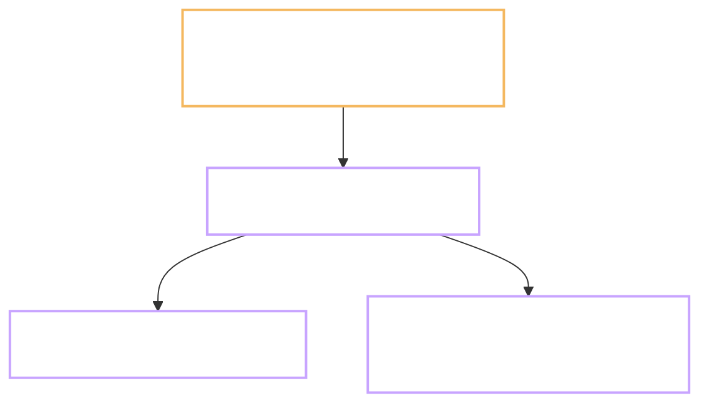

# setup-yawasa - two gates installed

Task: `_setup-yawasa` · Plan: https://hub.yawasa.com/app/p/moonegg-yawasa-gate-plan
Flow: skipped - Type is INFRA, no learner-facing change
Record: none - this task predates the record convention it installs
Commits: `1736b31` (kit import), plus one more at the commit gate · Branch: `main` - see Plan, Decisions log line 5
Finished: 2026-09-24 · Checked by: `self`, audit run the same day at the reviewer's request

---

## What the task produced

Every MoonEgg task now has two hard stops, and three named documents to fill.

- `CLAUDE.md` section 7: three artifacts, the Type / Level / Repro classification, the rule for
  skipping Flow, the cold-read gate with the 15-minute solo-mode wait, both gates, the Delivery
  package with its secret scan, the hub target and the publish command.
- `CLAUDE.md` section 2: 8 steps became 10. Gate A is step 3, Gate B is step 9. Nothing is
  committed before step 10.
- `CLAUDE.md` section 5: branch prefixes limited to `feature/`, `fix/`, `chore/`; commit format
  `<type>(<task-id>): <what>`; no tool attribution in commits; no emoji anywhere.
- `prompts/00-START.md`: the same process as an 11-step session script with four stops.
- `docs/tasks/_TEMPLATE_Plan.md`, `_TEMPLATE_Flow.md`, `_TEMPLATE_Result.md`.
- `records/TEMPLATE.md`: now carries Type, Level, Repro, Reviewer, Branch, the three hub links and
  a line confirming the Delivery scan.
- `docs/Delivery/` created for the Gate B packages.

## Before and after

| Observable | Before | After |
| --- | --- | --- |
| Artifacts per task | 1, `records/<task-id>.md`, repo only | 4: the record plus Plan, Flow, Result on the hub |
| Stops before work starts | 1, confirm which task | 2, confirm the task and approve the plan |
| Stops before a commit | none | 1, approve the result and the commit message |
| Risk classification | none | Type, Level, Repro written at the top of every Plan |
| Branch rule | none | task work never on `main` |

## Tests

| # | Test | Command | Real output | Pass |
| --- | --- | --- | --- | --- |
| 1 | Hub reachable, token valid | publish this pair | `hub reachable: https://hub.yawasa.com`, HTTP 200 | yes |
| 2 | First attempt with `--folder` | open the project page | project page empty, wrong mechanism | no |
| 3 | Second attempt with `--project` | re-publish both with `--update` | accepted, no `unknown-project` error | yes |
| 4 | Link stable across revision | publish three times to the same slug | same two URLs throughout | yes |
| 5 | Drops readable back | read each drop over the hub API | HTTP 200, 3757 and 4494 bytes | yes |
| 6 | No stale paths | grep the repo for `records/drops` | 0 hits | yes |
| 7 | Both drops on the project page | open `/app/projects/moonegg` | **needs a human with a browser session** | pending |
| 8 | Commit carries no tool attribution | read author, committer and body of `1736b31` | both `hieudelfi`, 0 attribution trailers | yes |

## Deviations from the plan

- **The plan was written with two artifacts. The standard has three.** The audit found Flow.md
  missing altogether, and with it the learner-facing half of Gate A. For phase P this changes
  little, because INFRA and DATA tasks may skip Flow. For the thirteen screen tasks in phases 2
  and 3 it is the difference between reviewing a design and reviewing only its plumbing.
- **The first publish used the wrong mechanism.** `--folder "MoonEgg" --create-folders` files a drop
  into a folder of the uploader's own library. A project is a different object. The hub answered
  `200 uploaded successfully` both times, so nothing in the terminal looked wrong; the reviewer
  found the empty project page. The flag that links a drop to a project is `--project "moonegg"`,
  added to `exp-publish` on 2026-09-19. The local copy of the skill was eight days behind and did
  not have it. Fixed by fast-forwarding `~/.claude/skills`, then re-publishing with `--update`.
- **Paths moved once.** The first shape was `records/drops/<task-id>-plan.md`. It is now
  `docs/tasks/<task-id>/{Plan,Flow,Result}.md`: one folder per task, so the three files that must
  agree sit next to each other, and `records/` stays purely the Vietnamese step log.
- **The second drop's slug still ends in `-outcome`.** The naming rule was written after that URL
  was already sent. Renaming would strand the link. The rule starts at P.1.

## Points that need a decision

- **Drop language.** English now, following the team standard for hub artifacts, while `docs/01..09`
  and `records/` stay Vietnamese. One line in section 7.6 flips it.
- **Commit format.** `<type>(<task-id>): <what>` was chosen because the project rule asks for
  `<task-id>: <what>` and the team rule asks for a conventional prefix. Neither rule alone produces
  this shape; it satisfies both.
- **P.1 overlaps work already done.** The repo was created and pushed before the gates existed, and
  that is step 1 of P.1. Proposal: P.1's Plan records `git init` as already done at commit
  `1736b31`, and P.1 covers only CI, the licence scan and branch protection.

## Faults found, fixed or left

| Fault | Where | Fixed? |
| --- | --- | --- |
| Uploads went to a library folder, not the project | first two publishes | yes, re-published with `--project` |
| Local skill eight days behind the hub API | `~/.claude/skills` | yes, fast-forwarded one commit |
| Flow.md absent from the process | first version of section 7 | yes, added with a skip rule |
| No Delivery package at Gate B | first version of section 7 | yes, added with a secret scan |
| No Type / Level / Repro classification | first version of section 7 | yes, added as section 7.1 |
| No solo-mode wait before the cold read | first version of section 7 | yes, 15 minutes, in section 7.3 |
| No branch rule, no commit format | `CLAUDE.md` section 5 | yes |
| Empty `MoonEgg` folder left in the personal library | hub | left; harmless, deletable in the UI |

## Known limitations

- The hub API cannot say which project a drop belongs to. Only a human with a browser session can
  confirm a publish landed correctly, which is why section 7.5 makes that check part of the ritual.
- Nothing enforces the gates mechanically. They hold because `CLAUDE.md` is read at the start of
  every session. A pre-commit hook could check that a task's Plan exists before its first commit;
  not built, and not needed until the process has been used a few times.
- `records/TRACKING.md` has no column for the hub links. They live in each record instead, so there
  is one place to update, not two.

## Where it stands

The process is installed, documented in the one file every session reads, and demonstrated on
itself: this pair of drops was planned, published, corrected twice, and re-published without the
links changing. The first real use is P.1, whose remaining scope is CI, the licence scan and branch
protection. Nothing else in the repo changes until its Plan is approved.
