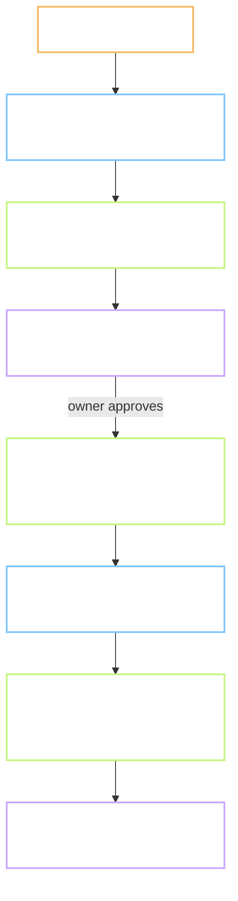

# Plan - task-lead: a global skill that runs one task with three helper agents

Status: **done**. Gate A and Gate B approved 2026-10-08.
Task: `task-lead` · Source: `docs/_Analysis/AgentNetwork.md` follow-ups 1, 2 and 5 · Record: `records/task-lead.md`
Branch: `chore/task-lead-skill`, cut from `main` at `852d94b`.
Reviewer: `self`
Type: **INFRA** - a skill and an agent file on this machine. No product code.
Level: **L2** - new files in `~/.claude`, one rule line and one record line in this repo. No shared contract changes.
Repro: not applicable, this is not an ISSUE
User-visible behaviour: no Flow.md. INFRA, nothing a learner sees changes.
Refs: Analysis https://hub.yawasa.com/app/p/moonegg-an-agent-network, decision 2 ·
`CLAUDE.md` sections 2, 7, 7.8 · `~/.claude/CLAUDE.md` "Which workflow / skill for which use case"
Depends on: the Analysis, accepted 2026-10-08.

**Decisions log (2026-10-08):**
1. 2026-10-08 - Plan written. No review round yet.
2. 2026-10-08 - **Gate A approved.** The global files are backed up in a private repo
   `hieudelfi/claude-local`; it holds the skill and the two agents, with an install script
   that copies them into `~/.claude`. The repo is the source; `~/.claude` holds copies.
3. 2026-10-08 - **The dry run writes the real `docs/tasks/P.4/Plan.md`.**
4. 2026-10-08 - **Reviewer runs on Opus, scout on Sonnet.**

Out of scope: running tasks in parallel (that is the POC in the Analysis, follow-up 3), installing
CCB, changing any gate, changing `sprint-loop`, changing the 10 role agents that already exist.

> **Language rule (B1/B2):** short sentences, 20 words or fewer. Active voice. One idea per sentence.

Short names. **Lead** is the session that talks to the owner. **Helper** is an agent the lead
starts with the Agent tool; it has a fresh context and reports back once. **Brief** is the text
the lead gives a helper. **Gate** is a stop where the owner approves.

---

## 0. Does this task need a Flow.md?

No. Type is INFRA and no screen exists. Deliberate behaviour notes go in section 5.

## 1. Goal

After this task, any repo on this machine can run a task with a second reader that did not
write the plan, and with evidence gathered by a helper instead of from memory. The skill reads
the repo's own rules for what the gates are. It adds helpers; it adds no gate and no path.

## 2. Starting point, checked today

Commands were run on 2026-10-08 on this machine. The output is real, not remembered.

| Thing | State today | Evidence |
| --- | --- | --- |
| Global skills folder | a git clone of `ltivn/yawasa-skills`; local-only skills sit untracked next to it | `cd ~/.claude/skills && git status --short`: `?? sprint-loop/`, `?? dwk-ui/`, `?? logtime-*`, `?? update-yawasa/`, `?? synced/` |
| Update rule for that folder | untracked folders are kept, never cleaned | `~/.claude/skills/update-yawasa/SKILL.md:71-72` |
| Global agents | 10 role agents, all with `tools: Read, Write, Edit, Bash, Glob, Grep`, model sonnet or opus | `~/.claude/agents/*.md` front matter |
| Those agents expect a "context-manager" that does not exist | 2 files ask for it; no such agent anywhere | `grep -l context-manager ~/.claude/agents/*.md` = 2; `ls ~/.claude/agents \| grep context` = 0 |
| Project-level agents in other repos | 4 repos, 22 agent files, none named `gate-reviewer` or `evidence-scout` | `BreeceDesigner-Display-dev`: `change-scope-auditor`; `bartender`: 2; `VirtualModals`: 14 Vietnamese film roles; `claude-code-action`: 5 reviewers |
| A workflow skill already mandated for Delfi repos | `sprint-loop`: Plan, Drop, Review-Gate, Execute, Publish; its own paths and publisher | `~/.claude/skills/sprint-loop/SKILL.md`, "When the loop applies" |
| `sprint-loop` triggers by words, not by name | `feature:`, `fix:`, `build`, "let's build", first coding task of a session | same file, "When the loop applies" |
| MoonEgg's gates | section 2 steps 3 and 9; section 7.3 and 7.4; the four cold-read questions in 7.3 | `CLAUDE.md:19`, `:78`, `:114`, `:129` |
| The Agent tool | can start a helper in its own worktree; the helper knows only the brief | Agent tool: `isolation: "worktree"`; "It knows only what you put in the prompt" |
| The gate in a fresh worktree | `web/node_modules` is 91 MB and absent in a new worktree, so `gate.sh full` runs `npm ci` once there | `tools/checks/gate.sh:26-28`; `du -sh web/node_modules` = 91M |
| Global git hooks | one hooks path for every repo and every worktree | `git config --global core.hooksPath` = `~/.config/devgate/hooks` |
| Token use per task | not recorded anywhere | no line for it in `records/TEMPLATE.md` |

**Still assumptions:**

- A helper started with `model: opus` and read-only tools can read a 300-line Plan and a diff
  in one turn. Not tried yet.
- The owner's hub flags and the repo's language rule are enough for a helper to write a correct
  drop. The skill will not let helpers publish; only the lead publishes.

Three facts shape the plan. `sprint-loop` already owns the word triggers, so this skill must be
called by name. Other repos have their own agents, so the new agent names must be unusual. The
skill folder must be untracked in `~/.claude/skills`, like `sprint-loop`, or the next update of
the clone would be refused.

## 3. Flow



The lead keeps the context and talks to the owner. Helpers do one thing each and report once.

## 4. Plan of work

### 4.1 `~/.claude/skills/task-lead/SKILL.md` - required

One skill, called by name only: `/task-lead <task-id>` or "task-lead". It never triggers on
words like `feature:` or `build`, so it cannot collide with `sprint-loop`.

What it holds:

- **The rule of deference.** The skill does not define a workflow. It reads the repo's
  `CLAUDE.md` for the gates, the paths, the publisher flags and the language rule. If the repo
  names `sprint-loop`, the lead follows `sprint-loop` for the drops and uses only the helpers
  from here. If the repo has no workflow file, the skill stops and says so.
- **Three helper briefs as templates.** Each brief states the goal, what is already known,
  the files to read, the exact output shape, and what the helper must not do. A thin brief
  gives a confident wrong answer, so the templates are long on purpose.
- **Who may write what.** Only the lead publishes to the hub, commits, and talks to the owner.
  The scout and the reviewer are read-only. The builder writes code in a worktree and never
  touches `records/`, `docs/tasks/`, or `main`.
- **A token line.** After each helper returns, the lead writes one line in the record:
  helper name, model, and the token count the tool reports. Analysis follow-up 5.
- **Where it stops.** The same two stops the repo already has. The skill adds none and removes
  none.

### 4.2 `~/.claude/agents/gate-reviewer.md` - required

A read-only agent, model opus, `tools: Read, Grep, Glob`. Its instructions: read the Plan cold,
answer the four questions from `CLAUDE.md` section 7.3 with one line each, then read the diff
and list only defects with `File.ext:line`. It is told it is the second reader, and told not to
agree by default. Name chosen so it collides with no project agent on this machine today.

### 4.3 `~/.claude/agents/evidence-scout.md` - required

A read-only agent, model sonnet, `tools: Read, Grep, Glob, Bash` with Bash limited by the brief
to `grep`, `ls`, `git log` and `wc`. Returns a table of `File.ext:line` facts and a list of
"could not find". It is told never to infer, only to report what a command printed.

### 4.4 Builder: no new agent file - decided

The builder is one of the 10 role agents that already exist, picked by the lead per task
(`frontend-developer` for a screen, `backend-developer` for the schema, `mobile-developer`
for Flutter, `general-purpose` when none fits). They are started with `isolation: "worktree"`.
The brief tells them to ignore the "context-manager" step their file asks for, because no such
agent exists. Changing those 10 files is out of scope.

### 4.5 `records/TEMPLATE.md` and `CLAUDE.md` section 2 - required, one line each

- `records/TEMPLATE.md`: a new header line `Token: <helper: model, count> ... (tổng: <n>)`.
- `CLAUDE.md` section 2, step 1: one sentence that says the task may be run with `/task-lead`,
  and that the gates and paths do not change when it is.

### 4.6 A dry run on a real task - required, part of this task

The skill is proven by running it once, on the next open task, P.4. P.4 is small (0.5 days)
and has a human step (the owner listens), so it tests both the helpers and the stop. The dry
run goes only to Gate A: the scout runs, the lead writes P.4's Plan, the reviewer reads it cold,
and the lead reports. P.4 itself then continues as its own task after this one closes.

### Options considered, not chosen

- Make `task-lead` trigger on words. Rejected: `sprint-loop` owns those words on this machine,
  and two skills firing on one message is the conflict the owner asked to avoid.
- Put the skill in this repo under `.claude/skills`. Rejected: the owner asked for every repo.
- Put the skill inside the `yawasa-skills` clone and push it. Rejected: that repo belongs to the
  team; this skill is one owner's tool until it has run on more than one repo.
- Let helpers publish to the hub. Rejected: the three flags and the private default are easy to
  get wrong, and a wrong drop cannot be pulled back.
- Write the builder as a new agent. Rejected: 10 role agents exist; the gap is a reviewer and a
  scout, not a builder.

### Do not touch

- The 10 role agents in `~/.claude/agents/`. Their odd "context-manager" step is noted, not fixed.
- `sprint-loop`, `exp-publish`, the `yawasa-skills` clone and its tracked files.
- Any project `.claude/agents` in another repo.
- The gates, paths and language rule in `CLAUDE.md` section 7.
- `prompts/`, `golden/`, `web/`, `supabase/`, `tools/pipeline/`.

## 5. Situations and edge cases

| # | Situation | Expected behaviour |
| --- | --- | --- |
| 1 | The repo has no `CLAUDE.md`, or one with no gates | The skill stops and says which file it looked for. It does not invent a workflow |
| 2 | The repo names `sprint-loop` | Drops follow `sprint-loop`; helpers come from here; no second plan file is written |
| 3 | A project agent has the same name as `gate-reviewer` | The project one wins, by Claude Code's own rule. The skill says which one it got, so the owner sees it |
| 4 | The reviewer finds nothing | It must still answer the four questions with one line each. "Looks fine" alone is a failed review |
| 5 | The builder's worktree has no `node_modules` | The gate runs `npm ci` once, about a minute. Expected, not a failure |
| 6 | The builder edits `records/` or `docs/tasks/` | The brief forbids it. The lead checks the worktree diff and reverts those paths |
| 7 | A helper returns with no token count | The record line says "chưa đo" for that helper, never a guess |
| 8 | The `yawasa-skills` clone is updated | The `task-lead` folder is untracked and survives, same as `sprint-loop` |
| 9 | Two tasks run at once | Out of scope. The skill refuses a second `/task-lead` while one is open, and points to the POC |
| 10 | The owner says "go" in the middle of a helper's run | Helpers cannot hear the owner. The lead waits for the report, then acts |

Nothing here changes behaviour that already exists. The gates stay where they are.

## 6. Impact - who else touches this

| Thing created or changed | Consumer | Effect |
| --- | --- | --- |
| `~/.claude/skills/task-lead/` | every repo on this machine, by name only | new; untracked in the clone |
| `~/.claude/agents/gate-reviewer.md`, `evidence-scout.md` | any session on this machine | new; names unused today |
| `records/TEMPLATE.md` | every later MoonEgg task | one new header line |
| `CLAUDE.md` section 2 step 1 | every later MoonEgg task | one sentence |
| `docs/tasks/P.4/Plan.md` | task P.4 | written during the dry run, section 4.6 |
| `sprint-loop`, other repos' agents | unchanged | the skill is called by name and defers to the repo |

Found with: `ls ~/.claude/agents ~/.claude/skills`, `git status --short` in the clone,
`ls */.claude/agents` under `D:\Projects`, `grep -n` over `CLAUDE.md` and `sprint-loop/SKILL.md`.

## 7. Tests and Definition of Done

| # | Test | How to run | Expected result |
| --- | --- | --- | --- |
| 1 | The skill loads by name | `/task-lead P.4` in a fresh session | the skill text appears; no other skill fires |
| 2 | Word triggers do not fire it | a message "feature: add X" in this repo | `task-lead` does not load; `sprint-loop` rules are untouched |
| 3 | The scout returns only facts | brief for P.4 | every row has `File.ext:line` or a command; 0 rows without |
| 4 | The reviewer answers the four questions | brief with P.4's Plan | 4 lines, one per question, plus a defect list that may be empty |
| 5 | The reviewer is not a yes-man | brief with a Plan that hides one assumption on purpose | the hidden assumption is named |
| 6 | Helpers cannot publish or commit | read the three briefs | no `exp-publish`, no `git commit` in any helper brief |
| 7 | The clone survives an update | `cd ~/.claude/skills && git status --short` | `?? task-lead/` listed; update-yawasa dry check passes |
| 8 | No name collision | `ls D:/Projects/*/.claude/agents` | 0 files named `gate-reviewer.md` or `evidence-scout.md` |
| 9 | Token line present | `records/P.4.md` after the dry run | one line per helper with a number or "chưa đo" |
| 10 | The gate stays green | `bash tools/checks/gate.sh full` | exit 0 |

Output checks from `CLAUDE.md` section 3 that apply: code tests green, no new dependency. No
data and no audio are produced by this task.

**Definition of done:**

- [ ] `~/.claude/skills/task-lead/SKILL.md` exists, is untracked in the clone, and loads by name
- [ ] `gate-reviewer.md` and `evidence-scout.md` exist in `~/.claude/agents`, read-only tools
- [ ] The three helper briefs name goal, known facts, files, output shape and forbidden actions
- [ ] The skill defers to the repo's `CLAUDE.md` and stops when there is none
- [ ] Dry run on P.4 reached Gate A with a scout table, a Plan, and a reviewer report
- [ ] Test 5 passed: the reviewer named the planted assumption
- [ ] `records/TEMPLATE.md` and `CLAUDE.md` section 2 carry their one-line changes
- [ ] `records/task-lead.md` has a result line per step, the test table, and a token line
- [ ] The branch is merged into `main` with `gate.sh merge`, and deleted

## 8. After Gate B

Planned commit messages:

```
feature(task-lead): add token line to the record template, name the skill in the task cycle
docs(task-lead): record the dry run on P.4 and the helper token counts
```

The skill and agent files live outside this repo, in `hieudelfi/claude-local` (decision 2).
They are not in any MoonEgg commit. Record note: `records/TRACKING.md` gets a
new row `task-lead` under phase P, status and date.

## 9. Open questions for the reviewer

1. **Where should the global files be backed up?** They are outside every repo. Options: a
   private repo `hieudelfi/claude-local` for `~/.claude/skills/task-lead` and the two agents,
   or a copy under `docs/_Project/` here. I recommend the private repo; it serves all repos.
2. **May the dry run write `docs/tasks/P.4/Plan.md`?** It is P.4's Plan, written one task early.
   If not, the dry run uses a scratch copy and P.4 starts from zero. I recommend yes.
3. **Opus for the reviewer, sonnet for the scout.** Fine, or both sonnet to save cost?
