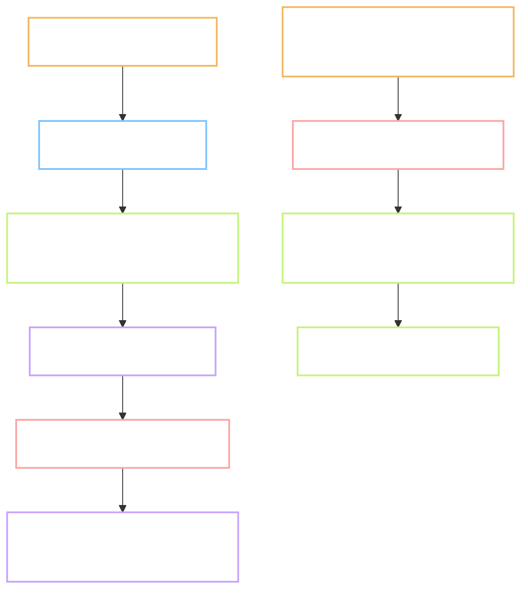

# task-lead - a second reader for every task, on every repo of this machine

Task: `task-lead` · Plan: https://hub.yawasa.com/app/p/moonegg-task-lead-plan · Flow: skipped, Type is INFRA
Record: `records/task-lead.md` · Delivery: https://hub.yawasa.com/app/p/moonegg-task-lead-delivery
Commits: MoonEgg `0ba70b0`, `37c956e`, `c39988a` plus record commits; `hieudelfi/claude-local` `579d46d`, `4e548f2`
Branch: `chore/task-lead-skill`, merged into `main` with `gate.sh merge` and deleted
Effort: not measured · Tokens: 269,604 across five helper runs · Finished: 2026-10-08 · Checked by: `self`, Gate B approved 2026-10-08

Short names. **Lead** is the session that talks to the owner. **Helper** is an agent with a
fresh context that does one job and reports once. **Cold read** is reading a plan as if you
had not written it.

---

## What the task produced

A plan the lead had just written went to a reader that did not write it. The reader found 15
defects, three of them line numbers off by one. The plan is now the one P.4 will start from.

- `hieudelfi/claude-local` - a private repo with the skill, two agents and an install script.
- `~/.claude/skills/task-lead/SKILL.md` - the rule of deference, who may do what, three brief
  templates, the token line, the refusals, the lead's checklist. Called by name only.
- `~/.claude/agents/gate-reviewer.md` - read-only, Opus, four cold-read questions, a resource
  inventory, defects with `File.ext:line`, and a "looked for, found none" list.
- `~/.claude/agents/evidence-scout.md` - read-only, Sonnet, facts with `File.ext:line`.
- `records/TEMPLATE.md` - one token line. `CLAUDE.md` section 2 - one sentence.
- `docs/tasks/P.4/Plan.md` - the dry run's output, reviewed twice, ready for P.4's Gate A.

## Before and after

| Observable | Before | After |
| --- | --- | --- |
| Who reads a plan before the owner | its author, after a 15-minute wait | an agent that did not write it, with a fixed output shape |
| Facts in a plan's "starting point" | from the lead's memory or its own greps | from a helper that must name the command for every row |
| A hidden resource in a plan | nothing looks for it | the reviewer lists what the plan needs and checks each on this machine |
| Token cost of a task | unknown | one line per helper in the record; first data point 269,604 for five runs |
| Other repos on this machine | no shared helper roles | the same skill, by name, with their own `CLAUDE.md` in charge |
| Clash with `sprint-loop` | possible if a new skill used word triggers | none: name only; `sprint-loop` keeps its words |
| Where the global files live | nowhere but `~/.claude` | a private repo, copied in by `install.sh`; the team clone stays untracked and clean |

## Tests

| # | Test | Command | Real output | Pass |
| --- | --- | --- | --- | --- |
| 1 | Skill loads by name | Skill tool `task-lead P.4` | `Unknown skill` first, then `Launching skill: task-lead` once the harness listed it; agents likewise | yes, mid-session; fresh session not tried |
| 2 | Word triggers do not fire it | type `feature: add X` in a fresh session | not run | not measured |
| 3 | Scout returns only facts | brief for P.4 | every row has `File.ext:line` or a command; 2 gaps named, 3 line numbers flagged as unconfirmed | yes |
| 4 | Reviewer answers the four questions | brief with the P.4 plan | 4 lines with `strong` or `weak`; 15 defects; 8 "looked for" lines | yes |
| 5 | Reviewer is not a yes-man | variant with one hidden assumption | run 1 missed it; after a resource-inventory step, run 2 named it in answer 4 and defect 1 | yes, after one fix |
| 6 | Helpers cannot publish or commit | read the three briefs | 0 hits for `exp-publish` or `git commit`; builder brief says "Do not commit" | yes |
| 7 | The team clone survives | `git status --short` in `~/.claude/skills` | one line, `?? task-lead/` | yes |
| 8 | No name collision | `ls D:/Projects/*/.claude/agents` | 22 files, 0 named `gate-reviewer.md` or `evidence-scout.md` | yes |
| 9 | Token line present | `records/task-lead.md` line 4 | five counts from the tool, total 269,604 | yes |
| 10 | Gate still green | `gate.sh full` | 4 steps pass, exit 0 | yes |

Output checks from `CLAUDE.md` section 3: code tests green, no new dependency. No data, no audio.

## Deviations from the plan

- **The first scout ran as a stand-in.** The new agent was not loaded when first called, so
  `general-purpose` ran with the agent's text in its brief. The real agent ran the second time.
- **The reviewer definition was changed inside the task.** Test 5 failed once. The agent now
  inventories the resources a plan needs. The second run passed. The brief carried the step;
  whether the edited file alone is enough needs a fresh session.
- **Test 2 was not run.** It needs a fresh session. Recorded as not measured.
- **Agent transcripts were empty.** The delivery holds the reports copied from the session,
  with "verbatim" and "summary" marked per file.
- **The P.4 plan sits on this branch.** Decision 3 of Gate A, approved by the owner. The
  reviewer called it a rule break, which is right by `CLAUDE.md` 7.8; it is a recorded exception.

## Points that need a decision

- **Cost.** Three Opus reads of one 209-line plan cost 167,000 tokens. The Analysis guessed
  "2 to 3 times one session". This is the first real number; follow-up 5 of the Analysis holds it.
- **The reviewer file edit is unproven on its own.** One fresh-session run of the variant,
  with no resource step in the brief, settles it. Ten minutes, about 57,000 tokens.
- **Two raters for P.4.** The P.4 plan's only open question. Nothing in P.4 can finish without
  them.

## Faults found, fixed or left

| Fault | Where | Fixed? |
| --- | --- | --- |
| Three `docs/01` line numbers off by one in the P.4 plan | scout counted from a `sed` window | yes, `grep -n` by the lead; the scout had flagged them |
| P.4 plan changed `VOICES` and required P.3's file names unchanged | P.4 plan 4.5 | yes, `VOICES` stays; P.10 switches |
| "wind" note sent to a file that is rewritten and ignored | P.4 plan 4.6 | yes, `wind-check.md`, tracked |
| Raters would hear raw WAV | P.4 plan 4.2 | yes, levelled Opus |
| Rater names would reach a delivery | P.4 plan 4.3 | yes, codes R1 to R3 and a scan step |
| Reviewer did not look for unmentioned resources | `gate-reviewer.md` | yes, step 3 and a table |
| New agents and skills load only when the session lists them | Claude Code | left; a fresh session is the clean test |
| Agent transcript files are empty | harness `tasks/` folder | left; reports copied from the session |

## Known limitations

- One helper at a time, one task at a time. Parallel tasks are the POC in the Analysis.
- The builder role was not exercised: the dry run stopped at Gate A, as planned.
- The skill has run on one repo. The rule of deference is written for others, not yet tried.
- Token counts cover helpers only. The lead's own use is not reported by the tool.

## Where it stands

Any repo on this machine can call `/task-lead <id>` and get a fact-finder before its plan and a
second reader before its gates, with the repo's own rules in charge. P.4 has a reviewed plan
and can open the day this task closes. The next proof is a fresh session: test 2, and the
reviewer file on its own.
